\newpage

## Tóm tắt

**Mục tiêu.** Nghiên cứu đánh giá các chiến lược xây dựng hệ sinh truyện ngụ ngôn tiếng
Anh có điều kiện, với yêu cầu triển khai cục bộ và tuân thủ năm trường đầu vào: nhân vật,
bối cảnh, thử thách, kết quả và bài học đạo đức.

**Phương pháp.** Nghiên cứu khảo sát ba nhóm phương pháp: (i) tiền huấn luyện từ khởi
tạo ngẫu nhiên; (ii) PEFT/QLoRA trên mô hình đã tiền huấn luyện; và (iii) kiểm soát đầu
ra bằng validation, hậu xử lý và sửa lỗi có điều kiện. Trong mỗi hướng, đánh giá nội bộ
được dùng để chọn cấu hình đại diện, không dùng để so sánh liên hướng do khác biệt về
tập đề và giám khảo. Năm hệ thống đại diện sau đó được chạy trên cùng 25 đề, tạo 125
truyện và chấm mù bằng
`gemma-4-26b-a4b-it`. Ba thí nghiệm bóc tách không huấn luyện lại đo độ phủ điều kiện,
**counterfactual sensitivity** (mức đầu ra đổi đúng hướng khi chỉ một điều kiện được
thay) và đóng góp của bước sửa lỗi.

**Kết quả.** Giao thức chung phân tách rõ hai nhóm kết quả: E4 đạt 9,20/10 và E5 đạt
8,44/10, trong khi E1–E3 nằm trong khoảng 2,81–3,30. Tuy nhiên, chênh lệch điểm tổng
hợp không thể quy trực tiếp cho số tham số vì năm hướng còn khác nhau về dữ liệu tiền
huấn luyện, giao diện điều kiện, kỹ thuật tinh chỉnh và hậu xử lý. Các phép bóc tách cho
thấy nguyên nhân cụ thể hơn. Khi chuyển từ hai lên năm trường đầu vào, E5 tăng độ phủ
3,68/5 và điểm nhất quán với chuỗi sự kiện được yêu cầu 7,28/10. E1 chỉ tăng độ phủ
0,44/5 và vẫn gần mức sàn; điểm nhất quán nội tại gần như không đổi, cho thấy mô hình
có thể tạo một câu chuyện tự hợp lý nhưng không phụ thuộc vào đề bài. Trong mười cặp
counterfactual, E5 điều chỉnh lựa chọn hoặc cách giải quyết đúng theo biến thể tính cách hay
kết quả ở 10/10 cặp, so với 1/10 của E1. Đối với E4, repair nâng tỷ lệ bài học đúng
nguyên văn từ 20% lên 100% và tăng điểm nhất quán theo yêu cầu từ 9,00 lên 9,64, nhưng
không thay đổi hai liên kết trait→choice (92%) và choice→outcome (100%). Quan hệ giữa
điều kiện và diễn biến vì vậy đã có trong đầu ra thô; repair chủ yếu sửa hợp đồng đầu
ra và các sai lệch cục bộ.

**Kết luận.** Đóng góp chính của nghiên cứu không nằm ở nhận định đơn giản rằng mô hình
lớn đạt điểm cao hơn, mà ở việc phân biệt ba mức độ tuân thủ: nhắc lại trường đầu vào,
tổ chức diễn biến phù hợp với toàn bộ điều kiện, và thay đổi diễn biến đúng hướng khi
một điều kiện bị can thiệp. Độ trôi chảy, loss hoặc tính hợp lý nội tại chỉ đo chất lượng
bề mặt và không thể thay thế ba phép kiểm tra này. Trong phạm vi thí nghiệm, E5 cung cấp
bằng chứng mạnh nhất về khả năng kết hợp các điều kiện ngay trong một lượt sinh; E4 cho
thấy validator/repair có thể nâng độ tin cậy của sản phẩm khi nội dung gốc đã đúng về
ngữ nghĩa. Hai kết quả dẫn đến hai ưu tiên thiết kế khác nhau: nếu truyện chưa dùng điều
kiện để chi phối diễn biến, cần cải thiện mô hình, dữ liệu hoặc mục tiêu điều kiện hóa;
nếu diễn biến đã đúng nhưng định dạng và bài học chưa ổn định, repair là lớp kiểm soát
phù hợp. Kết luận này chỉ áp dụng cho tập kiểm thử hiện tại và chưa xác lập một ngưỡng
tham số phổ quát cho năng lực suy luận nhân quả.

## 1. Giới thiệu

### 1.1 Mục tiêu và câu hỏi nghiên cứu

Mục tiêu của nghiên cứu là xác định can thiệp nào cải thiện chất lượng và độ tuân thủ
điều kiện của mô hình sinh truyện ngụ ngôn khi tài nguyên huấn luyện và suy luận bị giới
hạn. Bốn câu hỏi nghiên cứu được đặt ra:

- **RQ1 — Năng lực nền:** tiền huấn luyện từ đầu ở quy mô 60M–63M khác mô hình đã tiền
  huấn luyện 135M–3B như thế nào về độ trôi chảy và tuân thủ điều kiện?
- **RQ2 — Can thiệp huấn luyện:** ngân sách token, phân bố dữ liệu, vị trí LoRA và số
  chu kỳ huấn luyện ảnh hưởng như thế nào đến chất lượng đầu ra?
- **RQ3 — Sử dụng điều kiện:** mô hình có dùng điều kiện để thay đổi diễn biến hay chỉ
  tái tạo từ khóa và mô-típ quen thuộc?
- **RQ4 — Kiểm soát lúc suy luận:** validation, chuẩn hóa định dạng và rewrite đóng góp
  bao nhiêu so với năng lực của checkpoint gốc?

E1–E5 biểu diễn năm thiết kế thực nghiệm với biến can thiệp khác nhau. Kết luận nhân
quả chỉ được rút ra từ các phép bóc tách nội hướng có kiểm soát. Giao thức chung ở Mục
4 đo hiệu năng hệ thống đầu-cuối; do không kiểm soát đồng thời kiến trúc, dữ liệu, quy
mô và hậu xử lý, kết quả này không được dùng để quy tác chênh lệch cho một yếu tố riêng
lẻ.

### 1.2 Tác vụ và dữ liệu

Nguồn dữ liệu chính là `klusai/ds-tf1-en-3m` (TF1-EN-3M), kho truyện ngụ ngôn tổng hợp
có đề bài cấu trúc và nội dung truyện. Hai giao diện điều kiện được sử dụng:

- E2 sử dụng `Nhân vật` và `Bài học`, phù hợp với hợp đồng huấn luyện của V16;
- E1, E3, E4 và E5 sử dụng năm trường `Nhân vật`, `Bối cảnh`, `Thử thách`, `Kết quả` và `Bài học`.

Ứng dụng chung cung cấp FastAPI, React, hệ phục vụ Ollama/MLX, truyền kết quả theo thời
gian thực và chế độ so sánh. Hệ thống đại diện của mỗi hướng được đăng ký như một backend độc lập để có
thể kiểm tra khả năng chạy thực tế trước khi đánh giá.

### 1.3 Biến đánh giá

Bốn biến đầu ra chính được định nghĩa như sau:

| Trục | Câu hỏi |
|---|---|
| Ngôn ngữ | Truyện có đúng ngữ pháp, mạch lạc và dễ đọc với trẻ em? |
| Nội dung | Truyện có sáng tạo nhưng vẫn giữ cấu trúc ngụ ngôn? |
| Bài học | Bài học đạo đức có rõ, hợp với diễn biến và xuất hiện đầy đủ? |
| Điều kiện | Nhân vật và các trường yêu cầu có thực sự chi phối truyện? |

Các thước đo tự động dưới đây được dùng để chẩn đoán chất lượng bề mặt:

| Thước đo | Cách tính và ý nghĩa | Chiều mong muốn | Giới hạn |
|---|---|---|---|
| Distinct-1 | số unigram khác nhau chia cho tổng số unigram trong tập truyện; đo độ đa dạng từ vựng | cao hơn | văn bản ngẫu nhiên hoặc kém mạch lạc cũng có thể đạt cao |
| Distinct-2 | số bigram khác nhau chia cho tổng số bigram; nhạy hơn với việc lặp cụm từ | cao hơn | phụ thuộc tokenizer, cỡ mẫu và độ dài truyện |
| Self-BLEU | độ chồng lặp n-gram trung bình giữa các truyện do cùng hệ thống sinh; đo mức giống nhau trong tập đầu ra | thấp hơn | thấp không đồng nghĩa truyện hay; nhiễu cũng làm điểm thấp |
| Flesch Reading Ease | `206,835 − 1,015·(từ/câu) − 84,6·(âm tiết/từ)`; ước lượng độ dễ đọc của tiếng Anh | cao hơn; khoảng 80–100 thường dễ đọc với trẻ em | không đo logic, nội dung hay độ đúng của bài học |

Trong mã E1, Distinct được tính trên token tách theo khoảng trắng; Self-BLEU là trung
bình độ chính xác 4-gram trên mọi cặp truyện; Flesch được tính cho từng truyện rồi lấy
trung bình. Vì các giá trị phụ thuộc cách tách token, cỡ mẫu và hiện thực hóa BLEU,
chúng chỉ được so sánh trong cùng một protocol. Tỷ lệ khớp trường và tỷ lệ có dòng bài
học đo hợp đồng đầu ra, không thay thế đánh giá quan hệ nhân quả. Điểm do LLM chấm cũng
chỉ được so sánh khi giám khảo, thang điểm, đề bài, cấu hình lấy mẫu và cỡ mẫu được giữ
cố định.

### 1.4 Thiết kế đánh giá

Nghiên cứu sử dụng hai tầng đánh giá. **Đánh giá nội bộ** so sánh các biến thể bên trong
một hướng tiếp cận dưới quy trình của thành viên phụ trách; các điểm này không được dùng để
xếp hạng E1–E5 vì khác tập đề, giám khảo và thang đo.

**Đánh giá thống nhất** sinh lại đầu ra của hệ thống đại diện cho mỗi hướng trên cùng 25
đề, cố định seed và cấu hình giải mã, làm mù danh tính mô hình và chấm bằng cùng một
Gemma judge. Thiết kế này cung cấp phép so sánh ngang hàng ở cấp hệ thống nhưng không
biến năm hướng thành các điều kiện thực nghiệm tương đương, đồng thời chưa cô lập hoàn
toàn ảnh hưởng của kích thước mô hình và chi phí suy luận.

## 2. Vật liệu và phương pháp

| Hướng tiếp cận | Mô hình nền | Câu hỏi/can thiệp chính | Hệ thống đại diện |
|---|---|---|---|
| E1 · Lê Hải Triều (20252611M) | khởi tạo ngẫu nhiên, kiểu Llama 30M/60M | ngân sách token, can thiệp dữ liệu, hậu huấn luyện, tăng quy mô | `slm-60m` |
| E2 · Đào Đức Tùng (20252612M) | khởi tạo ngẫu nhiên, kiểu GPT 63M | bộ tách từ, tiền huấn luyện, điều kiện hóa có cấu trúc | `v16-conditioned` |
| E3 · Nguyễn Công Thanh (20252610M) | SmolLM2-135M | vị trí LoRA theo tầng/mô-đun | `tsv3-smollm135-best` |
| E4 · Nguyễn Thị Phương Liên (20252130M) | Llama 3.2 3B Instruct | SFT/LoRA so với tăng cường đề bài, hậu xử lý và repair | Base + Repair |
| E5 · Nguyễn Đình Lê Hoàng (20252737M) | Llama 3.2 3B Instruct | QLoRA 1 so với 3 chu kỳ, GGUF Q4 | `llama3-fable-1000-q4` |

### 2.1 Tổng quan bằng chứng thực nghiệm

Mức độ lưu trữ artifact không đồng đều giữa các hướng. Bảng dưới phân biệt số liệu
thực chạy với thông tin chỉ xuất hiện trong mô tả cấu hình:

| Cấu hình | Dữ liệu/chia tập | Cấu hình train | Truyện do model sinh |
|---|---|---|---|
| E1 · Lê Hải Triều (20252611M) | có log xây corpus | có script + nhật ký | mẫu local + 25 attempt global |
| E2 · Đào Đức Tùng (20252612M) | có manifest + corpus đã lưu | có manifest V16 + script | 100 output local + 25 output global |
| E3 · Nguyễn Công Thanh (20252610M) | có mô tả seed/split | có cấu hình + base/best đã merge/GGUF | trích đoạn local + 25 output global |
| E4 · Nguyễn Thị Phương Liên (20252130M) | có manifest cho 300/10k | công thức Failure-LoRA có tài liệu; Drive có bốn GGUF | CSV local + 25 output global, gồm raw/repair |
| E5 · Nguyễn Đình Lê Hoàng (20252737M) | có train/val JSONL | có notebook + checkpoint/adapter/GGUF | 25 output global |

Artifact trên Drive được dùng để đối chiếu dữ liệu, cấu hình và đầu ra của từng hướng.
Báo cáo chỉ dựng biểu đồ từ số đo thực được lưu, không nội suy các đường cong còn thiếu.

**Hồ sơ kiến trúc của năm hệ thống đại diện.** Cả năm đều là mô hình ngôn ngữ nhân quả
kiểu decoder-only: tại mỗi vị trí, mô hình nhận các token trước đó và dự đoán phân bố
xác suất của token kế tiếp. Các hướng kiểu Llama (E1, E3–E5) dùng một chuỗi khối
`RMSNorm → attention nhân quả có RoPE → residual → RMSNorm → SwiGLU MLP → residual`.
E2 dùng khối kiểu GPT-2 với `LayerNorm → multi-head attention → residual → LayerNorm →
GELU MLP → residual` và embedding vị trí học được. “GPT 63M” và “Llama 60M” vì vậy là
tên rút gọn của hai mô hình tự thiết kế theo hai họ kiến trúc; chúng không phải model
GPT hoặc Llama phát hành sẵn.

| Hướng | Tham số của hệ thống sinh | Số khối × hidden | Attention | FFN |
|---|---:|---:|---|---:|
| E1 · Llama-style 60M | 59.560.704 | 8 × 768 | GQA: 12 query head / 4 KV head; 64 chiều/head | SwiGLU, 2.048 |
| E2 · GPT-2-style 63M | 62.985.984 | 7 × 768 | MHA: 12 head; 64 chiều/head | GELU-new, 3.072 |
| E3 · SmolLM2-135M + LoRA C | 134.515.008 nền + 4.884.480 adapter | 30 × 576 | GQA: 9 query head / 3 KV head; 64 chiều/head | SwiGLU, 1.536 |
| E4 · Llama 3.2 3B Base + Repair | 3.212.749.824; không có adapter trong hệ thống đại diện | 28 × 3.072 | GQA: 24 query head / 8 KV head; 128 chiều/head | SwiGLU, 8.192 |
| E5 · Llama 3.2 3B + QLoRA | 3.212.749.824 sau merge; 24.313.856 tham số LoRA khi train | 28 × 3.072 | GQA: 24 query head / 8 KV head; 128 chiều/head | SwiGLU, 8.192 |

Embedding đầu vào đồng thời được dùng làm ma trận chiếu đầu ra trong cả năm artifact
đại diện. Vì vậy, sau khối chuẩn hóa cuối, mỗi trạng thái ẩn được chiếu thành một vector
logit có kích thước đúng bằng vocabulary; token có phân bố xác suất cao được lấy mẫu để
tạo tiếp chuỗi.

| Hướng | Tokenizer và vocabulary | Cửa sổ ngữ cảnh | Hợp đồng input → output | Trọng số học và artifact chạy |
|---|---|---|---|---|
| E1 | BPE tương thích GPT-2, 12.000 token; có `<\|story\|>`, `<\|end\|>`, `<\|pad\|>` | train 1.024 token; runner chung đặt 2.048 | năm trường dạng chỉ dẫn + `<\|story\|>` → token truyện → `<\|end\|>` | học toàn bộ 59,56M từ đầu; đánh giá bằng GGUF Q8_0 |
| E2 | Metaspace BPE, 16.384 token; sáu thẻ `<char>…</char><moral>…</moral><story>…</story>` | 1.024 token; pha causal dùng block 512 | character + moral trong thẻ → phần truyện; loss của prompt bị mask | học toàn bộ 62,99M từ đầu; chạy trực tiếp bằng MLX |
| E3 | GPT-2 BPE của SmolLM2, 49.152 token | model hỗ trợ 8.192; thí nghiệm train ở 512 | `system_message +` đề năm trường → completion truyện | đóng băng base; học LoRA C 4,88M; vòng chung chạy base FP16 + adapter PEFT |
| E4 | Llama BPE, 128.256 token | model hỗ trợ 131.072; runner dùng 2.048 | system + đề năm trường → assistant story → validator → rewrite khi cần → chuẩn hóa `Moral:` | checkpoint nền Q4_K_M, không train thêm trong hệ thống đại diện |
| E5 | Llama BPE, 128.256 token | model hỗ trợ 131.072; train và runner dùng 2.048 | chat template `system/user/assistant` với năm trường → assistant story → `<\|eot_id\|>` | base 4-bit khi QLoRA; merge adapter rồi xuất GGUF Q4_K_M |

Hai khác biệt giao diện cần được giữ khi đọc kết quả chung. E1 được train với
`<|story|>` nhưng runner chung truyền trực tiếp đề năm trường; E3 được train với
`system_message + prompt` nhưng runner chung chỉ truyền phần đề. E2, E4 và E5 được chạy
đúng hợp đồng input của artifact đại diện. Các sai khác này không đổi kiến trúc mô hình
nhưng có thể ảnh hưởng điểm tuân thủ.

### 2.2 E1 — Llama 30M/60M huấn luyện từ đầu — Lê Hải Triều (20252611M)

Bốn nhóm can thiệp được đánh giá trên cùng họ mô hình: ngân sách tiền huấn luyện, phân
bố dữ liệu, phương pháp hậu huấn luyện và quy mô tham số. Các phép so sánh nội bộ dùng
prompt held-out, seed bắt cặp và cùng rubric; điểm nội bộ chỉ dùng để so sánh các biến
thể E1.

**Dữ liệu và mục tiêu tối ưu.** Mỗi hàng TF1 được mã hóa thành
`<5 slot + gợi ý độ dài> <|story|> <truyện> <|end|>`. Token thuộc prompt bị mask bằng
`-100`; cross-entropy chỉ được tính trên truyện và token kết thúc. Bộ lọc giữ truyện
60–320 từ. Slot dropout tạo các tập con điều kiện trong quá trình train. Tokenizer BPE
12.000 token được huấn luyện riêng để giảm chi phí embedding. Phase 1 dùng 400.000
truyện; Phase 2 giữ cùng quy mô nhưng thay phân bố dữ liệu. Run 60M lọc và khử trùng
toàn bộ nguồn còn 2.341.231 truyện, tương đương 934M token, không lặp epoch.

**Cấu hình mô hình.**

| Biến thể | Tham số | Khối | Hidden / FFN | Query/KV head | Vocab | Context |
|---|---:|---:|---:|---:|---:|---:|
| Llama 30M | 36,6M | 8 | 512 / 2.048 | 8 / 2 | 12.000 | 512 |
| `slm-60m` | 59.560.704 | 8 | 768 / 2.048 | 12 / 4 | 12.000 | 1.024 |

Cả hai biến thể dùng RoPE, GQA, RMSNorm, SwiGLU và tied embedding. AdamW có
β=(0,9; 0,95), weight decay 0,1 và gradient clip 1,0. Run 30M dùng fp16 trên T4, batch
hiệu dụng 128 chuỗi, khoảng 33k token/bước. Lịch Warmup–Stable–Decay (WSD) warmup 2%,
giữ LR đỉnh `3e-3`, rồi decay trong 20% số bước cuối mỗi pha. Run 60M giữ cùng công thức
optimizer và checkpoint mỗi 500 bước.

**Tiến trình tiền huấn luyện.** Mốc v1 cố ý dùng ngân sách thấp để kiểm tra giả thuyết
under-training. Phase 1 tăng số token nhưng giữ kiến trúc; Phase 2 resume từ cùng
checkpoint và thay phân bố corpus; run 60M thay đồng thời capacity, context và số token.

| Giai đoạn | Dữ liệu / bước | Loss cuối | PPL held-out | Judge nội bộ | Can thiệp |
|---|---:|---:|---:|---:|---|
| v1 30M | 150k / 900 | ~1,80 | — | 2,50 | khoảng 1,7 token/tham số |
| Phase 1 30M | 400k / 1.800 | 1,447 | 4,18 | 6,00 | khoảng 600M token qua bốn epoch |
| Phase 1 + sửa sampling | như trên | — | — | 6,20 | repetition penalty 1,3 → 1,1 |
| Phase 2 30M | 400k-v2 / 3.600 | 1,278 | 3,56 | 7,00 | can thiệp phân bố dữ liệu |
| 60M | 2,34M / 10.000 | 1,058 | 2,87 | 8,96 | full TF1, context 1.024 |

{width=82%}

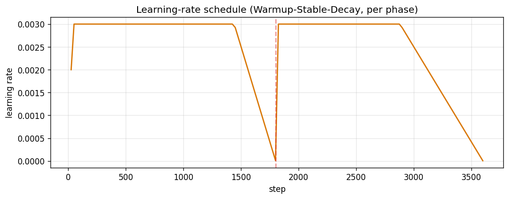{width=82%}

Loss giảm đều và không có spike đáng kể. Mỗi đoạn decay tạo thêm một mức giảm ở cuối
pha, phù hợp với lịch WSD. Các giá trị 1,447 và 1,278 là loss của cửa sổ log cuối, không
phải trường `train_loss` tổng hợp của Hugging Face.

**Chẩn đoán theo scaling law.** Baseline v1 chỉ dùng khoảng 1,7 token/tham số và đạt
2,50/10. Khi giữ nguyên mô hình nhưng tăng ngân sách lên khoảng 600M token, judge tăng
lên 6,00 và loss giảm mạnh. Fit log-log trên loss sau warmup cho R²=0,96; đường cong
chưa tạo plateau trong phạm vi quan sát. Kết quả này ủng hộ giả thuyết under-training
cho cấu hình v1 và tạo cơ sở thực nghiệm để tăng ngân sách trước khi thay kiến trúc.

{width=72%}

Một thay đổi ở giải mã cũng được cô lập. Repetition penalty 1,3 phạt cả việc lặp tên
nhân vật, làm danh tính nhân vật thay đổi giữa truyện; giảm xuống 1,1 tăng điểm nội bộ
6,00 → 6,20 mà không cập nhật trọng số. Kết quả này được giữ như hiệu ứng của decoding,
không gộp vào hiệu ứng tiền huấn luyện.

**Can thiệp phân bố dữ liệu.** Phân tích đầu ra Phase 1 phát hiện cụm `wise old owl`
xuất hiện trong khoảng 90% truyện sinh, trong khi tỷ lệ trong dữ liệu thật là 28%.
Phase 2 giới hạn mẫu chứa cụm này ở 10% và giảm slot dropout của `Teaching` và
`Outcome` từ 0,30 xuống 0,15. Sau can thiệp, tỷ lệ cụm trong đầu ra giảm còn 23%.
Điều này cho thấy lỗi mode collapse cục bộ có thể được xử lý ở phân bố huấn luyện thay
vì tăng thêm ràng buộc khi lấy mẫu.

{width=68%}

PPL held-out giảm 4,18 → 3,56. Mốc 3,56 gần với `exp(1,278)=3,59`, cho thấy khoảng cách
giữa loss cuối và held-out nhỏ trong cách đo của E1. Các metric không cần tham chiếu
cũng được so với truyện thật: Distinct-2 lệch khoảng 4%, Self-BLEU lệch 0,001 và Flesch
79,9 so với 80,0. Những số đo này xác nhận hình dạng thống kê và độ dễ đọc, nhưng không
được dùng thay cho kiểm tra tuân thủ điều kiện.

{width=68%}

{width=86%}

Điểm judge nội bộ tăng theo ba loại can thiệp khác nhau: ngân sách token tạo bước tăng
lớn nhất ở 30M; sửa decoding tạo mức tăng nhỏ; thay phân bố dữ liệu cải thiện tiếp độ
bám điều kiện và giảm khuôn mẫu.

{width=74%}

**Bóc tách hậu huấn luyện và suy luận.** Sau Phase 2, các phương pháp được đánh giá bằng
cùng prompt held-out và baseline đo trong cùng phiên:

| Phương pháp | Cơ chế | Tín hiệu học trong E1 | Có cập nhật trọng số? |
|---|---|---|---|
| DPO — Direct Preference Optimization | tăng xác suất tương đối của truyện được chọn so với truyện bị loại, đồng thời neo vào model tham chiếu | 194 cặp `chosen/rejected` có chênh điểm judge ≥1 | có |
| SFT-on-best — tinh chỉnh có giám sát trên mẫu tốt nhất | chọn truyện tốt nhất trong mỗi nhóm ứng viên rồi tối ưu cross-entropy như target thông thường | 42 truyện thắng tương đối trong nhóm | có |
| RAFT — Reward-Ranked Fine-Tuning | sinh, chấm điểm, lọc theo ngưỡng tuyệt đối rồi SFT lại trên tập được nhận | 200 truyện tự sinh có điểm judge ≥9,0 | có |
| GRPO-lite — tối ưu chính sách tương đối theo nhóm | sinh rollout mới, chuẩn hóa reward trong nhóm cùng prompt, cập nhật REINFORCE và phạt KL so với model gốc | 60 bước × 16 rollout; reward từ judge | có |
| Distillation — chưng cất đầu ra | dùng truyện của model teacher làm target SFT; E1 không dùng soft logits | 600 truyện do Qwen3-4B sinh | có |
| Best-of-N — chọn mẫu khi suy luận | sinh N ứng viên và trả về ứng viên có điểm judge cao nhất | N=3; temperature 0,5/0,8/1,1 | không |

SFT-on-best dùng thứ hạng **tương đối** trong một nhóm nhỏ, còn RAFT dùng ngưỡng
**tuyệt đối** trên toàn tập sinh. `GRPO-lite` là biến thể REINFORCE có baseline theo
nhóm của E1, không phải một triển khai đầy đủ mọi thành phần của GRPO. Tất cả điểm và
kết luận từ đây đến hết tiểu mục là **đánh giá nội bộ E1**; chúng không thuộc vòng chấm
Gemma thống nhất ở Mục 4.

| Can thiệp | Baseline | Kết quả | Diễn giải trong E1 |
|---|---:|---:|---|
| DPO, 194 cặp | 8,02 | 7,88 | không cải thiện |
| SFT trên mẫu tốt nhất | 8,02 | 7,98 | không cải thiện |
| RAFT, 200 mẫu ≥9,0 | 7,78 | 7,60 | không cải thiện |
| GRPO-lite, n=45 | — | +0,09; t=0,54 | hiệu ứng nằm trong nhiễu |
| Distillation, 600 mẫu | 7,94 | 7,57 | giảm 0,37; PPL drift +4,4% |
| Best-of-3 | 7,72 | **8,55** | tăng khoảng 0,8 tại suy luận |

{width=94%}

DPO học phân biệt chosen/rejected trên tập train nhưng không dịch được phân bố held-out.
RAFT và SFT chỉ tăng trọng số cho mẫu vốn đã in-distribution và không có gradient âm để
loại mode yếu. GRPO có exploration và gradient âm, nhưng KL cuối chỉ khoảng
`1e-3` nat/token nên policy gần như không đổi trong ngân sách 60 bước. Distillation là
can thiệp duy nhất tạo drift rõ, nhưng mô hình nhỏ học văn phong teacher theo chiều làm
giảm chất lượng. Ngược lại, Best-of-N không thay đổi phân bố; nó khai thác phần đuôi tốt
đã tồn tại và làm giảm phương sai lựa chọn.

**Độ tin cậy của judge nội bộ.** Cùng checkpoint được chấm lặp cho chênh lệch khoảng
±0,4 điểm ở n=15. E1 vì vậy quy ước chênh lệch dưới 0,5 tại n=15 là chưa đủ kết luận và
xác nhận các kết quả chính ở n=45 với seed bắt cặp. Quy tắc này làm mất hiệu lực hai
kết quả sơ bộ: DPO tăng adherence và GRPO tăng 0,45 điểm.

{width=76%}

**Kiểm tra trong ứng dụng.** Phase 1, Phase 2 và Phase 2+DPO được chạy trên hai chế độ:
sinh tự do và sinh với đủ năm slot. Mỗi ô dùng bốn prompt, seed bắt cặp; đầu ra được
chấm bởi judge Qwen3-4B của ứng dụng và một lượt đọc độc lập bằng Claude. Hai giám khảo
đồng thuận về thứ tự tương đối. DPO thường tạo chuỗi giống Phase 2 trên phần lớn độ dài
và chỉ rẽ nhánh ở đoạn cuối, phù hợp với kết luận rằng cập nhật này không dịch phân bố
đáng kể.

| Biến thể | Sinh tự do: judge / Claude | Năm slot: judge / Claude | Adherence năm slot |
|---|---:|---:|---:|
| Phase 1 | 8,19 / 6,62 | 4,75 / 4,38 | 3,5 |
| Phase 2 | 8,12 / 7,00 | 7,44 / 6,69 | 7,0 |
| Phase 2+DPO | 7,06 / 6,25 | 7,19 / 6,94 | 5,8 |
| 60M | **8,81 / 7,62** | **8,19 / 7,62** | **8,0** |

{width=94%}

**Kiểm chứng bằng tăng quy mô tiền huấn luyện.** `slm-60m` có chính xác 59.560.704
tham số, context 1.024 và được huấn luyện 10.000 bước trên 934M token. Loss cuối 1,058,
PPL held-out 2,87. Trên 45 prompt seed bắt cặp của protocol E1, mô hình 60M tăng
1,017 điểm so với 30M Phase 2, với t=6,53; 36 trường hợp tốt hơn, 5 bằng và 4 thấp hơn.

| Chỉ số nội bộ E1, n=45 | 30M Phase 2 | 60M | Chênh lệch |
|---|---:|---:|---:|
| Điểm tổng thể | 7,939 | **8,956** | **+1,017** |
| Prompt adherence | 7,87 | **9,11** | +1,24 |
| Thắng / hòa / thua | — | — | 36 / 5 / 4 |

Đây là phép so sánh dương rõ nhất trong E1, nhưng không phải một bóc tách đơn biến hoàn
toàn: 60M đồng thời tăng số tham số, context và ngân sách dữ liệu. Kết quả chỉ xác nhận
rằng gói scale-up tiền huấn luyện hiệu quả hơn các cấu hình hậu huấn luyện đã thử; nó
không định lượng riêng đóng góp của từng thành phần.

**Quan hệ với đánh giá thống nhất.** Điểm 8,956 ở trên thuộc judge và prompt contract
nội bộ của E1. Trong vòng chung, runner không thêm token `<|story|>` như khi train và
Gemma chấm theo rubric khác; `slm-60m` đạt 3,30/10. Vì vậy kết quả nội bộ được dùng để
kết luận về can thiệp bên trong E1, còn điểm vòng chung dùng để so sánh hệ thống trên
giao diện triển khai thống nhất. Chênh lệch lớn giữa hai phép đo cũng là bằng chứng rằng
khả năng chuyển giao qua prompt contract là một phần của chất lượng hệ thống.

**Kết luận E1.** Kết quả nội bộ cho thấy chất lượng mặc định của mô hình nhỏ phụ thuộc
chủ yếu vào nền tiền huấn luyện. Khi mô hình 30M được cấp đủ ngân sách token, loss,
perplexity, độ trôi chảy và khả năng bám năm trường đều cải thiện so với pha chẩn đoán
ban đầu. Trong nhóm hậu huấn luyện, DPO, SFT trên mẫu tốt, RAFT và GRPO-lite không tạo
chênh lệch vượt mức nhiễu đo được của judge; distillation từ teacher còn làm giảm chất
lượng. Trái lại, gói tăng quy mô lên 60M, context 1.024 và 934M token tiền huấn luyện
tăng điểm bắt cặp 1,017 trên 45 đề và thắng 36/45 trường hợp. Bằng chứng này ủng hộ việc
đầu tư vào phân bố tiền huấn luyện hơn là tiếp tục tối ưu cục bộ trên vài trăm mẫu hậu
huấn luyện.

Best-of-N làm rõ một khía cạnh khác của phân bố sinh. Một lần lấy mẫu từ mô hình 30M
đạt trung bình 7,72, trong khi chọn tốt nhất trong ba ứng viên đạt 8,55. Mô hình vì vậy
đã gán xác suất khác không cho các truyện tốt, nhưng chưa tập trung đủ xác suất vào
chúng để một lần sinh mặc định đạt chất lượng ổn định. Các phương pháp hậu huấn luyện
đã thử không nội hóa được lợi ích này: dữ liệu preference tự sinh có biên chất lượng
nhỏ, tập mẫu tốt quá nhỏ so với prior tiền huấn luyện, còn teacher data lệch phân bố
so với năng lực học trò. Kết quả không phủ định DPO, RAFT hay distillation nói chung;
nó giới hạn kết luận ở kích thước dữ liệu, tín hiệu judge và cấu hình tối ưu của E1.

So sánh 30M với 60M cũng không phải bóc tách riêng số tham số, vì số tham số, cửa sổ
ngữ cảnh và ngân sách token thay đổi đồng thời. Do đó không thể suy ra một ngưỡng
capacity phổ quát từ phép đo này. Kết luận hợp lệ là toàn bộ gói scale-up cải thiện rõ
phân bố sinh mặc định, trong khi các can thiệp hậu huấn luyện chi phí thấp đã thử
không tạo mức cải thiện tương đương. Việc tự đo nhiễu judge khoảng ±0,4 điểm còn cho
thấy các chênh lệch nhỏ phải được chấm lặp hoặc đánh giá trên mẫu lớn hơn trước khi
coi là hiệu ứng thật.

Điểm 3,30 trong vòng chung không phủ định các bóc tách nội bộ, nhưng bộc lộ một giới
hạn triển khai: artifact được huấn luyện với token `<|story|>` trong khi runner chung
không truyền token đó. E1 vì vậy chứng minh được hiệu quả của scale-up trong đúng hợp
đồng huấn luyện, nhưng chưa chứng minh khả năng giữ chất lượng khi giao diện prompt
thay đổi. `slm-60m` được chọn làm đại diện E1 vì là checkpoint trực tiếp tốt nhất của
hướng này; best-of-N được xem là lớp tìm kiếm lúc suy luận, không được trộn vào chất
lượng một lần sinh của checkpoint. Mẫu định tính và trường hợp thay thế điều kiện được
trình bày ở Mục 2.7.

### 2.3 E2 — GPT 63M huấn luyện từ đầu — Đào Đức Tùng (20252612M)

E2 đánh giá ba vấn đề: chất lượng biểu diễn token, khả năng điều kiện hóa theo
`character + moral`, và khả năng chuyển điều kiện thành chuỗi
tính cách→lựa chọn→hệ quả. Toàn bộ checkpoint được huấn luyện từ khởi tạo ngẫu nhiên
hoặc tiếp tục từ checkpoint do chính E2 huấn luyện; không sử dụng mô hình ngôn ngữ đã
tiền huấn luyện làm trọng số khởi đầu. Các điểm trong tiểu mục này thuộc giao thức nội
bộ E2 và chỉ dùng để so sánh các biến thể E2.

**Thiết kế thực nghiệm.** Các biến thể được tổ chức thành các phép kiểm tra nối tiếp
theo giả thuyết, nhưng kết luận chỉ dựa trên so sánh có đối chứng trong từng hàng:

| Nhóm biến thể | Can thiệp được kiểm tra | Đối chứng chính | Kết quả đo được |
|---|---|---|---|
| V1–V3 | tokenizer, quy mô 29,9M→63M và prompt masking | V1/V2; V2/V3 | sửa lỗi ranh giới từ; tăng độ phủ literal và kết thúc sạch |
| V4–V6 | thêm dữ liệu TF1, 189 truyện người viết, 280 truyện nhân quả | checkpoint V3 | lượng dữ liệu bổ sung quá nhỏ hoặc không cải thiện |
| V7–V8 | sinh `plan + story` so với chưng cất trực tiếp story | cùng teacher corpus | bỏ plan giảm exposure mismatch nhưng chưa tạo causal pass |
| V9–V10 | trộn replay với 6.278 rồi 13.270 truyện nhân quả | V8 và V3 | giữ được độ trôi chảy; causal pass không tăng |
| V11 | thêm thẻ ngữ nghĩa `<moral_class>` | cùng trọng số, có/bỏ thẻ | thẻ lớp kích hoạt kiểu truyện ngắn, không tạo planning |
| V12 | tăng riêng số layer: 63M→98M | cùng tokenizer, dữ liệu, seed và lịch train | causal pass +1 điểm %, CI chạm 0 |
| V13 | DPO trên cặp teacher/failure đã khớp độ dài | V12-98M | preference accuracy 54,4%; causal pass không đổi |
| V14 | tám epoch chỉ dùng dữ liệu nhân quả | V3 | fluency giảm; causal pass 0–5% |
| V15 | auxiliary loss ghép story–moral | V3 | matching đạt 75,4%; không chuyển sang sinh tự do |
| V16 | tăng tiền huấn luyện 200k→500k rồi condition/causal | V3 và ba epoch causal | fluency tăng trước causal tuning; causal binding không tăng |

**Chuẩn bị dữ liệu.** TF1-EN-3M được đọc theo luồng, lọc bản ghi tiếng Anh có
`character`, `moral` hợp lệ và thân truyện dài tối thiểu 80 ký tự. Corpus V16 gồm
500.000 bản ghi hợp lệ đầu tiên theo thứ tự nguồn. Pha điều kiện hóa lọc tiếp những
truyện có cụm nhân vật xuất hiện nguyên văn, thu được 108.487 hàng: 103.063 train và
5.424 validation với seed 42. Prefix chứa `character + moral`; target là thân truyện
và `</story>`. Nhãn của toàn bộ token prefix được đặt `-100`, nên gradient chỉ đến từ
phần truyện.

Corpus nhân quả được xây riêng để kiểm tra lỗi thiếu liên kết ngữ nghĩa. Teacher 31B
sinh truyện theo chuỗi conflict→choice→consequence; một judge 26B chỉ nhận mẫu đạt
ngưỡng về nhân vật, liên kết sự kiện, bài học và kết thúc. Trong 11.458 mẫu mới được
chấm, 7.665 mẫu đạt strict-pass. Sau khi gộp 6.278 mẫu strict từ V8 và loại trùng, tập
train nhân quả có 13.270 hàng, phủ 100 bài học. Hai tập đánh giá cố định gồm moral chưa
thấy và cặp `character–moral` holdout; screen dùng 20 đề, đánh giá đầy đủ dùng 100 đề
khi cấu hình vượt cổng.

**Tokenizer.** V1 dùng BPE 8.192 token mà không có pre-tokenizer. Khoảng trắng bị học
như ký tự thông thường, dẫn đến các từ vỡ như `par ty` và `w o ven`. Từ V2, tokenizer
được cố định thành Metaspace BPE 16.384 token: khoảng trắng được mã hóa bằng sentinel
trước BPE và phục hồi khi decode. Phép round-trip trên văn bản held-out không làm thay
đổi chuỗi.

V1 và V2 đồng thời khác quy mô mô hình, vocabulary và số bước train; vì vậy biểu đồ
dưới đo hiệu quả của **gói sửa cấu hình**, không cô lập riêng tokenizer. Distinct-1 và
Distinct-2 tăng, Self-BLEU giảm, còn Flesch gần như giữ nguyên. Kết hợp với việc lỗi vỡ
từ biến mất, kết quả xác nhận chất lượng bề mặt được cải thiện mà không làm văn bản khó
đọc hơn.

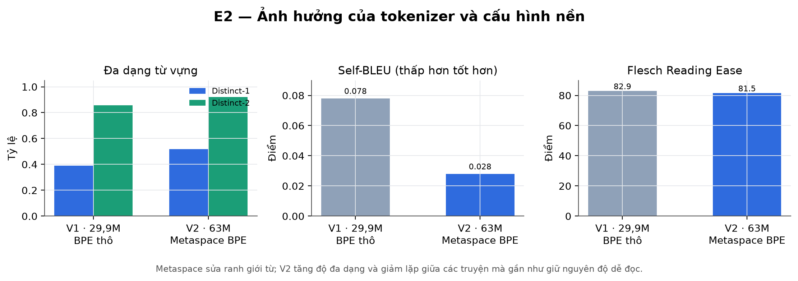{width=96%}

**Kiến trúc và ba pha train.** “GPT 63M” là một `GPT2LMHeadModel` tự khởi tạo với đúng
62.985.984 tham số, không phải một checkpoint GPT có sẵn. Mô hình gồm embedding token
`16.384 × 768`, embedding vị trí học được cho 1.024 vị trí, bảy khối decoder và một
LayerNorm cuối. Mỗi khối có causal self-attention 12 head (64 chiều/head) và MLP
GELU-new `768 → 3.072 → 768`; output head dùng chung trọng số với token embedding.
Input điều kiện hóa có dạng
`<char>…</char><moral>…</moral><story>`; mô hình sinh token truyện cho tới
`</story>`, và loss chỉ tính trên phần truyện. Toàn bộ V16 chạy trong một suất A100 có
thời lượng 100 phút:

| Pha | Dữ liệu | Epoch/bước | LR | Weight decay | Loss cuối |
|---|---:|---:|---:|---:|---:|
| Tiền huấn luyện | 500.000 | 2 / 15.625 | `5e-4` | 0,1 | 1,386 |
| Điều kiện hóa | 103.063 | — / 1.611 | `1e-4` | — | 1,325 |
| Chỉ-nhân-quả | 13.270 | 3 / 624 | `3e-6` | — | train 2,451; val nhân quả 2,394; val replay 1,597 |

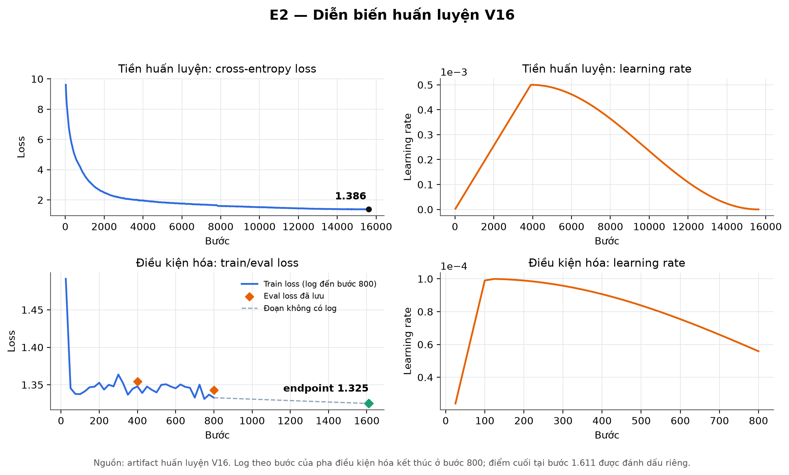{width=96%}

Biểu đồ cho thấy loss của pha tiền huấn luyện giảm nhanh ở giai đoạn đầu rồi dần ổn
định. Sang pha điều kiện hóa, train loss và eval loss tiếp tục giảm, còn tốc độ học
thay đổi đúng theo lịch warmup–decay đã thiết kế. Không quan sát thấy dao động bất
thường hoặc dấu hiệu phân kỳ. Kết quả này xác nhận quá trình tối ưu diễn ra ổn định,
nhưng chưa đủ để kết luận mô hình đã học được quan hệ nhân quả: loss phản ánh mức độ
phù hợp với phân bố token huấn luyện, chứ không trực tiếp đo việc các điều kiện đầu vào
có thực sự chi phối diễn biến truyện hay không.

**Hiệu quả của gói sửa V1→V2.** Sửa tokenizer, tăng vocabulary và tăng mô hình từ
29,9M lên 63M cải thiện đồng thời các chỉ số nội tại:

| Chỉ số nội bộ | 29.9M | 63M | Thay đổi |
|---|---:|---:|---:|
| Distinct-1 | 0.389 | 0.519 | +33% |
| Distinct-2 | 0.857 | 0.922 | +8% |
| Self-BLEU | 0.078 | 0.028 | giảm 64% |
| Flesch | 82.9 | 81.5 | gần như giữ nguyên |

**V3 — điều kiện hóa có mask.** So với V2, V3 giữ nguyên 63M tham số và tokenizer,
nhưng chuyển 103.063 hàng sang mục tiêu chỉ tính loss trên completion. Trên 100 đề,
exact-character tăng từ 18% lên 65%, exact-moral từ 17% lên 86%, exact-both từ 3% lên
55%, và tỷ lệ sinh `</story>` tăng từ 0% lên 100%. Judge nội bộ ban đầu tăng điểm tổng
thể từ 5,06 lên 6,78. Các chỉ số này xác nhận prompt masking dạy mô hình sao chép đúng
hai trường và dừng sạch hơn; chúng chưa cho biết diễn biến có chứng minh bài học hay
không.

Phân tích lỗi sau đó chấm lại 100 thân truyện bằng rubric bảy liên kết. V3 đạt fluency
6,21/10 và dùng đúng nhân vật làm tác nhân ở 96% mẫu, nhưng chỉ 7% có xung đột liên quan
đến bài học, 1% có tính cách chi phối lựa chọn và 0% có diễn biến suy ra được bài học.
Khi chỉ hoán đổi `moral`, cấu trúc conflict/choice/consequence thay đổi trong 73% cặp
nhưng tỷ lệ plot-entails-moral vẫn bằng 0%. Mô hình vì vậy **nhạy với chuỗi token điều
kiện** nhưng chưa dùng điều kiện theo quan hệ được yêu cầu.

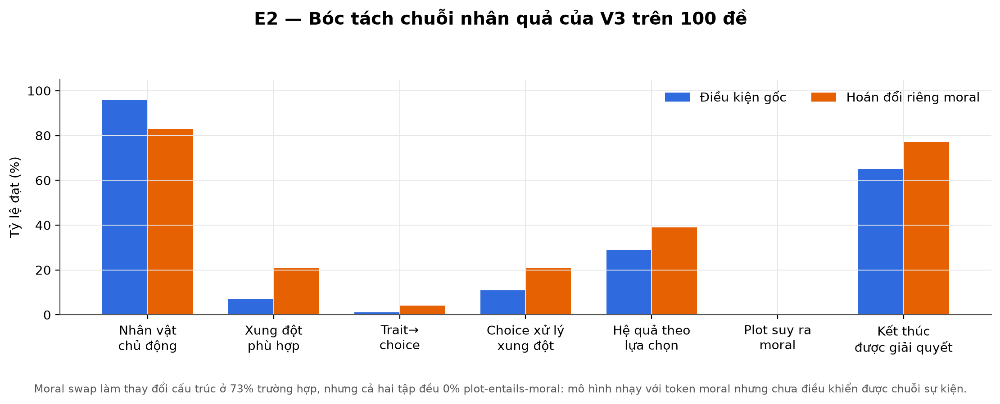{width=96%}

Kết quả này dẫn đến tiêu chí đánh giá E2 gồm ba tầng độc lập:

1. **literal adherence:** nhân vật/bài học có xuất hiện và truyện có kết thúc sạch;
2. **causal binding:** tính cách chi phối lựa chọn, lựa chọn xử lý xung đột và hệ quả
   phát sinh từ lựa chọn;
3. **moral entailment:** bài học phải suy ra từ chuỗi sự kiện, không chỉ được chép ở
   footer.

**Dữ liệu teacher và replay — V7 đến V10.** V7 yêu cầu mô hình sinh cả plan rồi mới
sinh story. Khi suy luận, story lại phụ thuộc vào plan do chính mô hình nhỏ tạo, nên lỗi
ở plan truyền trực tiếp sang phần truyện. V8 loại bỏ plan khỏi output và chưng cất trực
tiếp thân truyện teacher. Teacher targets đạt fluency 7,75 và moral-delivery 8,28,
nhưng checkpoint V8 tốt nhất chỉ đạt 4,65 và khoảng 1,70 khi sinh tự do; teacher-forced
loss thấp không chuyển thành rollout ổn định.

V9 và V10 kiểm tra liệu replay từ V3 có giữ chất lượng bề mặt trong khi học thêm dữ liệu
nhân quả hay không:

| Biến thể | Hỗn hợp huấn luyện | Đánh giá nội bộ | Kết luận trong E2 |
|---|---|---|---|
| V9 | 6.278 causal (25%) + 18.834 replay (75%) | fluency 5,67; moral 2,02; causal-pass 0% | replay phục hồi độ trôi chảy, không tạo liên kết nhân quả |
| V10 | 13.270 causal (25%) + 39.810 replay (75%) | V10/V3 primary 3,60/3,67; causal-pass cùng 2% | tăng gấp đôi causal data không dịch chuyển causal-pass |

V10 huấn luyện 830 bước, LR `3e-6`, cosine decay và batch hiệu dụng 64. Causal
validation loss giảm 3,404→2,968; replay loss giữ gần 1,530. Checkpoint bước 300 được
chọn qua screen, sau đó so mù với V3 trên 100 đề: V3 thắng 40, V10 thắng 36 và hòa 24.
Chênh primary V10−V3 là −0,06 với CI bootstrap 95% [−0,25; 0,125]. Loss trên target
nhân quả giảm rõ nhưng causal-pass không đổi; đây là bằng chứng trực tiếp rằng
validation loss không đủ làm tiêu chí chọn checkpoint cho sinh có điều kiện.

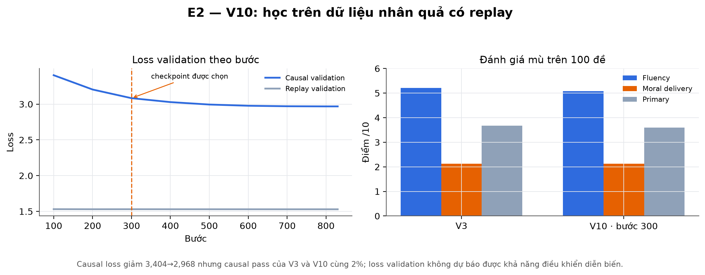{width=96%}

**V11 — thẻ lớp bài học.** 499 câu bài học được gán vào 40 lớp ngữ nghĩa để tăng khả
năng tái sử dụng cấu trúc. Prefix của 70% mẫu causal có thêm
`<moral_class>…</moral_class>`; 30% replay giữ prefix cũ. Bảy checkpoint từ bước
150–1.011 được đánh giá trên cùng 20 đề. Causal validation loss giảm 2,908→2,610, còn
replay loss giữ 1,547; checkpoint bước 600 có điểm screen cao nhất trong V11 nhưng vẫn
thấp hơn V3.

Phép bóc tách dùng **cùng trọng số bước 600**, chỉ thay việc có hay không truyền thẻ
lớp. Khi có thẻ, thân truyện giảm còn 90,8 từ, resolved-ending 5% và primary 2,83.
Khi bỏ thẻ, độ dài trở lại 247,8 từ, resolved-ending 80% và primary 3,65, gần V3
(252,2 từ; 85%; 3,75). Vì trọng số không đổi, khác biệt này được quy cho token điều
khiển: `<moral_class>` chọn style ngắn của corpus teacher thay vì cung cấp một plan
ngữ nghĩa có thể tái sử dụng.

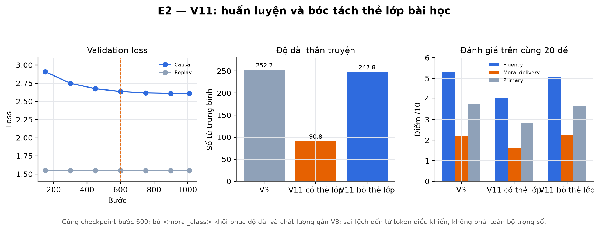{width=98%}

**V12 — bóc tách quy mô.** Hai mô hình 62.985.984 và 98.425.344 tham số được huấn luyện
độc lập với cùng tokenizer, thứ tự dữ liệu, seed, batch, dropout, lịch LR và curriculum
V2→V3. Khác biệt duy nhất là số khối decoder: 7 so với 12. Trên 100 đề bắt cặp, 98M
tăng fluency 0,12 [−0,08; 0,32], primary 0,08 [−0,065; 0,225] và causal-pass một điểm
phần trăm [0; 3]. Cận dưới CI của causal-pass bằng 0, nên dữ liệu không hỗ trợ giả
thuyết rằng mức tăng 63M→98M tự nó giải quyết được causal steering.

**V13 — DPO khớp độ dài.** Tập DPO gồm 391 cặp train và 103 cặp validation. `Chosen`
là truyện teacher strict-pass; `rejected` là lỗi causal của V12-98M trên đúng prompt.
Độ dài trung bình được khớp ở 268,6 và 276,7 token để tránh mô hình học preference qua
độ dài. Sau 39 optimizer step, accuracy phân biệt chosen/rejected trên validation đạt
54,4%, gần mức ngẫu nhiên 50%. Trên 100 đề, fluency tăng 0,11 [0,02; 0,21], primary
tăng 0,06 [−0,005; 0,125], nhưng causal-pass thay đổi 0. DPO cải thiện nhẹ chất lượng
bề mặt mà không điều khiển được liên kết đang thiếu.

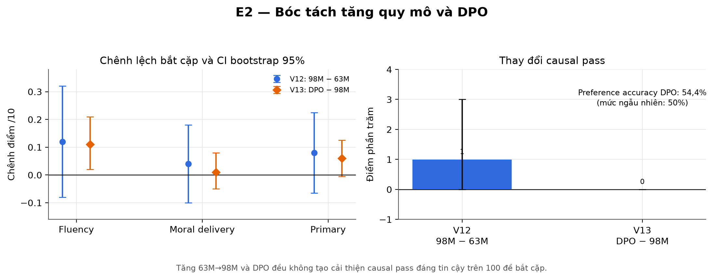{width=96%}

**V14 — tăng mức phơi nhiễm causal.** V14 loại hoàn toàn replay và học tám epoch trên
13.270 truyện nhân quả, giữ checkpoint tại epoch 1, 2, 3, 5 và 8. Baseline V3 có
fluency 6,30 và causal-pass 5%. Các checkpoint V14 có fluency 4,65–4,90,
moral-delivery 1,90–2,70 và causal-pass 0–5%; strict-pass bằng 0 ở mọi mốc. Tăng số
epoch không tạo xu hướng cải thiện causal ổn định, trong khi fluency giảm ít nhất 1,4
điểm. Với corpus và khởi tạo này, causal-LM objective ưu tiên khớp token của tập hẹp hơn
là giữ phân bố ngôn ngữ rộng của V3.

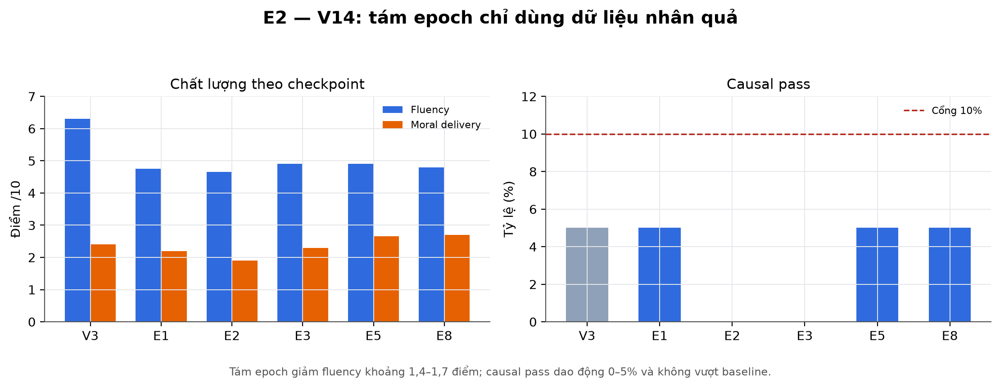{width=96%}

**V15 — auxiliary loss ghép story–moral.** V15 thêm đầu phân loại nhị phân trên trạng
thái cuối để phân biệt moral đúng với moral hoán đổi; trọng số loss phụ là 0,5 và
auxiliary prompt không xuất hiện khi sinh. Accuracy held-out tăng 73,18%→75,44%, cao
hơn mức ngẫu nhiên và vượt cổng biểu diễn 70%. Tuy nhiên, fluency giảm từ 6,20 của V3
còn 4,60–4,85; causal-pass chỉ 0–5% và strict-pass vẫn 0%. Mô hình mã hóa được tín hiệu
ghép cặp ở cuối truyện nhưng tín hiệu này không đủ định hướng quá trình chọn token ở
các bước trước.

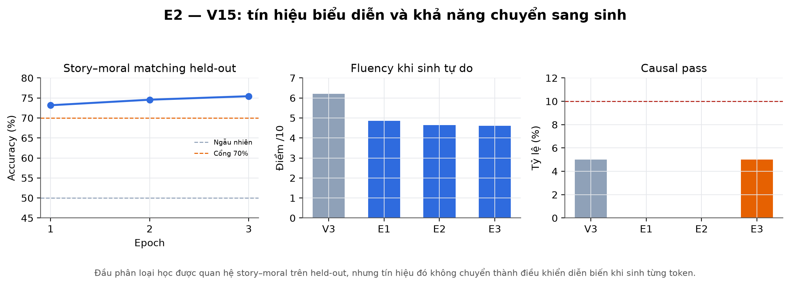{width=96%}

**V16 — tăng ngân sách tiền huấn luyện.** V16 quay lại 63M và khởi tạo ngẫu nhiên,
tăng corpus tiền huấn luyện từ 200.000 lên 500.000 truyện trước khi chạy lại pha
condition và ba epoch causal-only. Màn sàng lọc cố định dùng 20 đề, temperature 0,2,
top-p 0,9, repetition penalty 1,3 và tối đa 420 token. So với V3, checkpoint
`v16-conditioned` tăng fluency 5,90→6,85 và giữ moral-delivery gần như ngang
2,50→2,55. Trait-drives-choice, causal-pass và strict-pass của checkpoint này đều 0%.

Ba checkpoint causal đạt fluency 5,15; 4,55; 5,20 và causal-pass tối đa 5%. Cổng chạy
100 đề yêu cầu causal-pass ≥10% đồng thời fluency không giảm quá một điểm; không cấu
hình nào vượt cổng, nên không chạy full evaluation. `v16-conditioned` được chọn làm
artifact triển khai vì có chất lượng truyện tốt nhất trong V16, không phải vì đạt mục
tiêu causal binding.

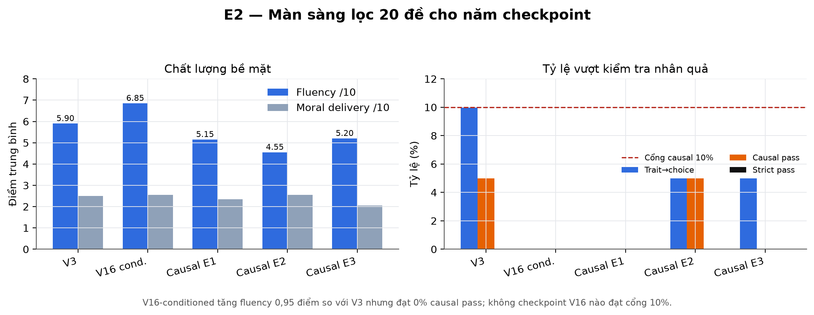{width=96%}

**Kết luận E2.** Các kết quả dương của E2 tập trung ở biểu diễn token, chất lượng ngôn
ngữ và tuân thủ literal. Gói sửa V1→V2 loại bỏ lỗi vỡ từ, tăng Distinct-1/2 và giảm
Self-BLEU mà gần như không làm thay đổi độ dễ đọc. Prompt masking ở V3 nâng
exact-character từ 18% lên 65%, exact-moral từ 17% lên 86%, exact-both từ 3% lên 55%
và tỷ lệ kết thúc bằng `</story>` từ 0% lên 100%. V16 cho thấy tăng dữ liệu tiền huấn
luyện từ 200.000 lên 500.000 truyện tiếp tục cải thiện fluency. Như vậy mô hình 63M
học được ranh giới từ, hình thức prompt và phân bố văn phong khi objective cung cấp tín
hiệu trực tiếp ở cấp token.

Các phép đo chuỗi sự kiện lại cho kết quả khác. V3 dùng đúng nhân vật làm tác nhân ở
96% mẫu nhưng trait→choice chỉ đạt 1% và plot-entails-moral bằng 0%. V10 giảm causal
validation loss từ 3,404 xuống 2,968 mà causal-pass vẫn không khác V3; V15 đạt 75,44%
accuracy ghép story với moral nhưng không chuyển tín hiệu biểu diễn đó thành lựa chọn
token khi sinh. Hai kết quả này tách rõ ba năng lực thường bị gộp: nhận biết quan hệ
story-moral, tái tạo target dưới teacher forcing, và tự xây dựng chuỗi
conflict→choice→consequence trong rollout. E2 cải thiện hai năng lực đầu ở một số cấu
hình nhưng chưa cải thiện ổn định năng lực thứ ba.

Các kết quả âm tiếp tục thu hẹp giả thuyết nguyên nhân. Replay giữ được văn phong nhưng
không tăng causal-pass; thẻ `<moral_class>` chọn kiểu truyện ngắn của teacher thay vì
cung cấp một plan hữu ích; huấn luyện causal-only tới tám epoch làm giảm fluency mà
không tạo xu hướng causal tăng; DPO chỉ đạt preference accuracy 54,4%; tăng riêng từ
bảy lên mười hai layer cho chênh causal-pass một điểm phần trăm với cận dưới CI bằng
0. Vì vậy dữ liệu hiện tại không ủng hộ việc chỉ tăng nhẹ depth, số epoch hay thêm một
auxiliary objective tách rời quá trình giải mã. Một hướng khả dĩ là giám sát trực tiếp
các trạng thái kế hoạch hoặc dùng tín hiệu sequence-level tác động lên rollout, nhưng
E2 chưa kiểm chứng các phương án đó nên không xem đây là kết luận thực nghiệm.

Kết quả cũng không thiết lập giới hạn phổ quát cho mô hình 63M. Các biến thể dùng một
corpus, một họ objective và một dải quy mô hẹp 63M–98M; một kiến trúc khác, dữ liệu có
liên kết nhân quả rõ hơn hoặc ngân sách lớn hơn có thể cho kết quả khác. Đóng góp chính
của E2 là chỉ ra rằng loss thấp, literal adherence cao và story-moral matching tốt vẫn
không đủ chứng minh điều kiện đã chi phối diễn biến. Đánh giá sinh có điều kiện phải đo
riêng các liên kết trait→choice, choice→outcome và plot→moral.

Trong vòng chung, E2 được chạy đúng hợp đồng hai trường `character + moral`, còn đề
chuẩn chứa năm trường. Codec không truyền setting, challenge và outcome vào mô hình,
nên điểm 3,18/10 phản ánh một hệ thống hai điều kiện khi bị đánh giá trên request năm
điều kiện. Điểm này phù hợp để đo mức tương thích của artifact với giao diện chung,
nhưng không phải phép kiểm định thay thế cho các bóc tách V1–V16. `v16-conditioned`
được chọn vì có chất lượng ngôn ngữ tốt nhất trong họ V16; lựa chọn này không đồng
nghĩa checkpoint đã đạt causal binding.

### 2.4 E3 — Bóc tách vị trí LoRA trên SmolLM2-135M — Nguyễn Công Thanh (20252610M)

Ba cấu hình LoRA được so sánh trên cùng SmolLM2-135M, dữ liệu và ngân sách huấn luyện.
Biến thực nghiệm là vị trí tầng và mô-đun được gắn adapter.

**Dữ liệu và mục tiêu.** Tập con 50.000 hàng TF1 được lấy bằng streaming shuffle buffer
10.000, seed 42; cách lấy là xác định và giống nhau giữa các nhánh nhưng gần “xáo nhẹ
phần đầu” hơn một mẫu đều toàn corpus. `system_message + prompt` là context, `fable` là
completion; mọi token context bị mask `-100`, loss chỉ tính trên token truyện và token
kết thúc. Mỗi nhánh học 2 epoch ở context 512. Held-out cố định gồm 500 hàng.

**Kiến trúc và LoRA.** SmolLM2-135M là decoder kiểu Llama với chính xác 134.515.008
tham số: embedding/output head dùng chung vocabulary 49.152 token, 30 khối hidden 576,
GQA 9 query head/3 KV head và MLP SwiGLU `576 → 1.536 → 576`. Model hỗ trợ ngữ cảnh
8.192 token, còn thí nghiệm cố định chuỗi ở 512 token. Base được đóng băng; LoRA chỉ
học cập nhật hạng thấp cho các ma trận được chọn. Cả ba nhánh giữ r=16, α=32, dropout
0,05:

- A: `q_proj,v_proj` ở toàn bộ 30 layer, khoảng 0,92M tham số;
- B: cùng hai projection nhưng chỉ layer 20–29, khoảng 0,31M;
- C: `q,k,v,o,gate,up,down` ở toàn bộ layer, khoảng 4,88M, tức 3,5% model.

AdamW dùng LR đỉnh `2e-4`, cosine decay, warmup 3%, bf16 trên một Colab L4, batch
16 × gradient accumulation 2 = 32, khoảng 3.125 bước/nhánh (≈1.563 bước/epoch × 2
epoch). Đường loss huấn luyện thật của cả ba nhánh được phục hồi từ log W&B (312
điểm/nhánh); learning-rate là lịch cosine theo cấu hình — xác định bởi công thức
warmup 3% + cosine decay về 0, đỉnh 2e-4. Hệ thống tổng hợp không giữ log LR theo
bước, nên panel LR là lịch cấu hình (đúng với scheduler đã chạy vì scheduler là tất
định), không phải đường đo.

{width=98%}

**Perplexity và tính so sánh của nó.** Perplexity held-out = `exp(mean cross-entropy)`
trên 500 hàng cố định, teacher-forced, loss chỉ cộng trên token fable (token context bị
mask `-100` nên không vào mẫu số). Vì cả ba nhánh dùng chung tokenizer GPT-2 BPE của
SmolLM2 (49.152 token) và chung cách mask, perplexity so sánh trực tiếp và công bằng
*trong phạm vi E3*. Nhưng perplexity tính trên token: nó KHÔNG so trực tiếp được với
E1 (BPE 12k), E2 (Metaspace BPE 16k) hay E4/E5 (Llama BPE 128k) vì mẫu số token khác
bản chất. Đây chính là lý do mọi so sánh liên nhóm phải dùng giám khảo LLM chung trên
cùng bộ đề (§4), thay vì đặt cạnh các perplexity khác tokenizer.

**Kết quả held-out và judge.**

| Nhánh | Tầng | Mô-đun | PPL nội bộ | Điểm nội bộ |
|---|---|---|---:|---:|
| Nền | — | — | 9.52 | 5.73 |
| A | toàn bộ | chú ý q/v | 4.82 | 6.70 |
| B | 1/3 tầng cuối | chú ý q/v | 5.46 | 5.94 |
| **C** | **toàn bộ** | **mọi lớp tuyến tính, chú ý + MLP** | **3.84** | **6.87** |

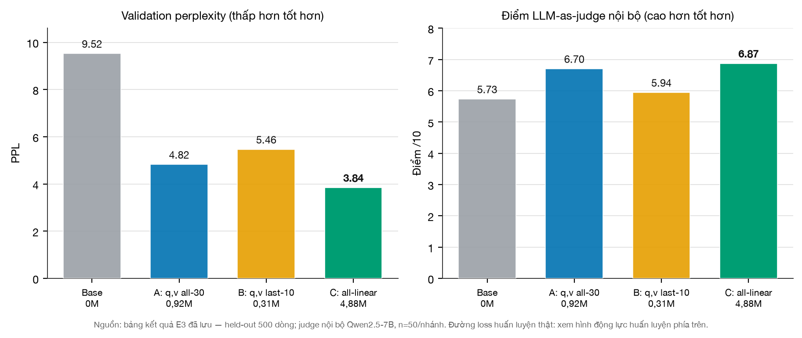{width=96%}

Độ hỗn loạn và giám khảo nội bộ Qwen2.5-7B (n=50/nhánh) cùng xếp C > A > B > nền. So
sánh A/B cho thấy phủ toàn bộ tầng tốt hơn chỉ đặt ở tầng cuối. So sánh A/C cho thấy mở
rộng sang MLP quan trọng hơn chỉ tăng mô-đun chú ý. Tập sinh chẩn đoán có 100 truyện mỗi
nhánh với temperature 0,8, top-p 0,9, repetition penalty 1,3; judge dùng 50 truyện đầu,
greedy và chấm bốn trục. Adapter C được merge, xuất GGUF Q8_0 khoảng 138MB và đăng ký
Ollama.

**Kết luận E3.** Trong ngân sách huấn luyện cố định, vị trí phân bổ LoRA ảnh hưởng rõ
đến chất lượng thích nghi của SmolLM2-135M. Nhánh B chỉ gắn q/v ở một phần ba tầng cuối
đạt PPL 5,46, kém nhánh A gắn q/v trên toàn bộ tầng ở mức 4,82. Khi giữ phạm vi toàn bộ
tầng và mở rộng adapter sang các phép chiếu MLP, nhánh C đạt PPL 3,84 và điểm judge
6,87, cao nhất trong ba nhánh. Kết quả hỗ trợ hai nhận định trong phạm vi E3: cập nhật
xuyên suốt chiều sâu tốt hơn chỉ sửa các tầng cuối, và độ phủ mô-đun attention + MLP
hiệu quả hơn attention-only cho tác vụ này.

Perplexity và judge không hoàn toàn tương đương. Nhánh B nhận được phần lớn mức giảm
PPL so với mô hình nền nhưng prompt-adherence 4,78 lại thấp hơn mức 5,08 của base.
Ngược lại, C dẫn đầu về grammar, moral clarity, adherence và overall; A dẫn đầu về
creativity và Flesch. Do đó PPL phù hợp để đo mức khớp phân bố token held-out, nhưng
không đủ để chọn adapter cho một tác vụ có ràng buộc. Các chỉ số diversity cũng phải
được đọc cùng coherence: output nền hỗn loạn có thể tạo Distinct cao và Self-BLEU thấp
mà không tạo thành truyện sử dụng được.

Thiết kế E3 chưa hoàn thành ma trận 2×2 vì thiếu cấu hình `all-linear × last-third`;
đồng thời mỗi nhánh chỉ có một seed và judge chưa được chấm lặp. Vì vậy chưa thể tách
hoàn toàn hiệu ứng vị trí tầng khỏi số lượng mô-đun và tổng dung lượng adapter, cũng
không nên diễn giải các chênh lệch nhỏ như hiệu ứng phổ quát. Kết luận vững nhất là,
trong ba cấu hình đã chạy, nhánh C cung cấp phân bổ adapter tốt nhất với khoảng 3,5%
trọng số trainable.

Trong vòng chung, E3 đạt 2,81/10 — nằm cùng dải hẹp 2,81–3,30 với E1 (3,30) và E2
(3,18), tách biệt rõ với E4/E5 (9,20 và 8,44). Điểm thấp này không nên quy cho một
nguyên nhân đơn lẻ. Sai khác hợp đồng prompt (runner chung chỉ truyền phần đề, còn
adapter được train với `system_message + prompt`) là một yếu tố kéo prompt-adherence
xuống 1,44; nhưng nó không phải yếu tố duy nhất, vì E1/E2 không hề có mismatch này vẫn
nằm cùng dải điểm với E3. Phần chi phối là các yếu tố cấu trúc đồng thời khác nhau giữa
năm hướng: dung lượng mô hình 135M so với 3B của E4/E5, việc E3 là mô hình pretrain được
tinh chỉnh nhẹ bằng LoRA trên 50k mẫu (so với E1/E2 huấn luyện đầy đủ từ đầu trên corpus
fable), cùng khác biệt về dữ liệu tiền huấn luyện và giao diện điều kiện. Đúng như phần
Tóm tắt đã lưu ý, chênh lệch điểm tổng hợp không quy trực tiếp cho số tham số vì các hướng
khác nhau đồng thời ở nhiều chiều. Vì vậy điểm chung đo artifact E3 trên giao diện triển
khai thống nhất, còn xếp hạng C > A > B > base chỉ có giá trị trong giao thức nội bộ E3.
`tsv3-smollm135-best` (nhánh C) được chọn làm đại diện vì dẫn đầu cả PPL và overall
trong phép so sánh có đối chứng của hướng này.

### 2.5 E4 — Llama 3.2 3B với kiểm soát đầu ra — Nguyễn Thị Phương Liên (20252130M)

Bảy cấu hình trên Llama 3.2 3B được so sánh: mô hình nền, SFT sạch-3k, Failure-LoRA
300 mẫu, prompt nghiêm ngặt, prompt kết hợp hậu xử lý, Base + Repair và
Fluency-SFT 10k.

**Kiến trúc và giao diện sinh.** Hệ thống đại diện dùng trực tiếp
Llama 3.2 3B Instruct Q4_K_M, gồm chính xác 3.212.749.824 tham số, 28 khối hidden
3.072, GQA 24 query
head/8 KV head, MLP SwiGLU 8.192 và Llama BPE 128.256 token. Model gốc hỗ trợ ngữ cảnh
131.072 token nhưng runner khóa ở 2.048. Input gồm system prompt về truyện trẻ em và
user prompt chứa năm trường; output đầu tiên là assistant message tối đa 400 token.
Validator kiểm tra hình thức và độ dài; nếu phát hiện lỗi nghiêm trọng, cùng model nhận
thêm draft và sinh lại tối đa 500 token. Cuối cùng hệ thống chuẩn hóa đúng một dòng
`Moral:`. Vì vậy output báo cáo là sản phẩm của một pipeline quanh model nền, không
phải đầu ra của một checkpoint fine-tune mới.

**Tập dữ liệu thích nghi.**

- Failure-LoRA (tên artifact gốc) có 300 hàng: 24 sai lệch quan sát trên benchmark và
  276 mục TF1 có target đúng, gắn cùng taxonomy. Chia 270/30. Các nhãn sai lệch có thể chồng nhau: 177 thiếu/rỗng
  moral, 117 kết thúc không sạch, 187 moral lệch, 59 thiếu outcome. Công thức huấn luyện
  được tài liệu hóa là QLoRA 4-bit trên Llama 3.2 3B, LoRA r=16/α=16 trên bảy projection,
  context 1.024, batch hiệu dụng 8, 3 epoch, LR `1e-4`, warmup 5%, fp16 và gradient
  checkpointing.
- Fluency-SFT-v1 quét 18.970 hàng TF1 và nhận 10.000; chia 9.000/1.000 với seed 42.
  Lọc 110–280 từ nhưng phân bố được nhận thực tế là 212–280, trung bình 264,3 từ và điểm
  chất lượng heuristic 8,67/10. Lý do loại chính: quá dài 5.556, câu dài 2.722, không an
  toàn 2.092, nhiều moral 624, nhiều câu dài 280, lặp 13 và meta-text 4.

Repo không chứa notebook/checkpoint `trainer_state` của SFT-clean-3k, Failure-LoRA hay
Fluency-SFT-v1. Vì vậy công thức trên là công thức bàn giao của Failure-LoRA; báo cáo
**không thể xác nhận** thời gian train, đường loss/LR thực chạy hoặc gán nó cho hai run
SFT còn lại. Đây là thiếu sót cần bổ sung từ artifact Kaggle nếu muốn tái lập train.

**Chuỗi Base + Repair.** Mô hình nền sinh một lần với seed 5410. Bộ kiểm tra tách lỗi
có thể sửa bằng luật khỏi lỗi nghiêm trọng. Hậu xử lý chuẩn hóa dòng `Moral:`; chỉ khi
phát hiện lỗi nghiêm trọng mới gọi cùng mô hình để rewrite. File kết quả lưu cả
`raw_story`, truyện cuối, hành động sửa, validation trước/sau và latency cộng thêm.
Điều này quan trọng: phương án cuối là **một hệ thống có thể gọi model hai lần**, nên
lượt global đã tính cả độ trễ và lỗi của lượt repair.

Tập kiểm tra nội bộ gồm 25 đề bài. Kết quả tự động cho thấy `Strict + Postprocess` đạt
tỷ lệ có dòng bài học, tỷ lệ khớp đúng bài học và tỷ lệ kết thúc sạch đều 1.00. Đánh giá
thủ công trên 10 đề bài lại chọn `Base + Repair` là hệ thống cân bằng nhất:

| Hệ thống | Trôi chảy | Bám đề bài | Cấu trúc | Bài học | An toàn | Tổng |
|---|---:|---:|---:|---:|---:|---:|
| Base FP16 | 3.40 | 4.00 | 4.00 | 3.70 | 4.80 | 3.98 |
| Đề bài nghiêm ngặt | 3.70 | 4.10 | 3.50 | 3.80 | 4.60 | 3.94 |
| Đề bài + Hậu xử lý | 3.70 | 4.10 | 3.60 | 5.00 | 4.60 | 4.20 |
| **Mô hình nền + Sửa lỗi** | 3.40 | 4.30 | 4.10 | 5.00 | 4.80 | **4.32** |
| SFT độ trôi chảy v1 | 3.00 | 3.70 | 4.00 | 3.70 | 4.80 | 3.84 |

SFT sạch-3k làm yếu độ trôi chảy và phần kết. LoRA 300 không sửa được dòng bài học.
LoRA 10k lọc kỹ vẫn có tỷ lệ `Moral:` rỗng 0,76, clean-ending 0,12 và đạt các chỉ số
thấp hơn `Base + Repair`. Base + Repair tạo đầu ra cho 25/25 đề, moral footer 1,00, exact moral 0,76,
outcome coverage 0,84, clean-ending 1,00; độ dài trung bình 216,8 từ và latency trung
bình 81.575 ms.

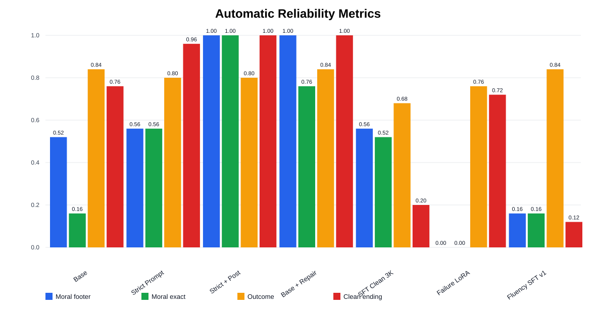{width=96%}

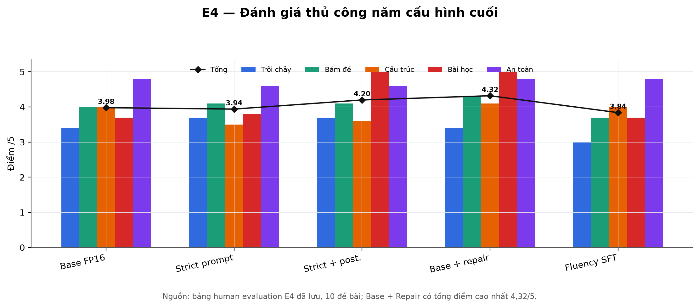{width=96%}

Hai hình cho thấy một khác biệt phương pháp luận: `Strict + Postprocess` có thể đạt
100% ở các kiểm tra định dạng xác định, nhưng `Base + Repair` được người chấm xếp cao
hơn về chất lượng tổng thể. Đóng góp của E4 nằm ở kiểm soát cấp hệ thống; không thể suy
từ tỷ lệ footer hoặc exact-moral rằng checkpoint đã học suy luận nhân quả tốt hơn.

**Kết luận E4.** E4 cho thấy các lỗi của mô hình nền 3B không thuộc cùng một loại và
không cần cùng một cơ chế sửa. Prompt nghiêm ngặt cải thiện exact-character và kết thúc
sạch; hậu xử lý xác định bảo đảm đúng một dòng `Moral:`; repair chỉ được gọi khi
validator phát hiện lỗi nghiêm trọng. Cấu hình Base + Repair đạt 4,32/5 trong đánh giá
thủ công nội bộ, cao hơn Strict + Postprocess 4,20 và Fluency-SFT 3,84. Trong vòng
chung, hệ thống đạt 9,20/10 và đứng đầu năm hướng. Các kết quả nhất quán ở chỗ kiểm
soát tại thời điểm suy luận tăng độ tin cậy mà vẫn giữ năng lực kể chuyện của model
nền.

Ba thử nghiệm fine-tuning cung cấp các kết quả âm có ý nghĩa. SFT Clean 3K làm giảm
độ trôi chảy, cấu trúc và chất lượng kết thúc; Failure-LoRA 300 không sửa được lỗi
footer mục tiêu; Fluency-SFT trên 10.000 mẫu đã lọc vẫn có `Moral:` rỗng ở 76% output
và chỉ đạt clean-ending 12%. Kích thước dữ liệu lớn hơn vì vậy không đủ nếu target
format, phân bố độ dài hoặc template assistant chưa khớp chặt với giao diện sinh.
Những kết quả này không chứng minh SFT hay LoRA kém hiệu quả nói chung; chúng cho thấy
ba công thức dữ liệu và objective cụ thể của E4 không vượt được pipeline dùng model
nền.

So sánh automatic và human evaluation cũng xác định phạm vi của từng chỉ số. Strict +
Postprocess có thể đạt tuyệt đối ở moral footer và clean ending vì đây là các thuộc
tính kiểm tra được bằng quy tắc, nhưng người chấm vẫn ưu tiên Base + Repair về bám đề,
cấu trúc và chất lượng tổng thể. Ngược lại, một điểm exact-moral cao không chứng minh
diễn biến đã sử dụng bài học theo quan hệ nhân quả. Trong ablation chung, repair tăng
tỷ lệ bài học đúng nguyên văn từ 20% lên 100%, nhưng trait→choice giữ 92% và
choice→outcome giữ 100%. Các liên kết cốt truyện đã tồn tại trong bản raw; repair chủ
yếu thực thi hợp đồng đầu ra và sửa sai lệch cục bộ.

Đóng góp của E4 vì vậy nằm ở cách phân bổ biện pháp theo loại lỗi: dùng hậu xử lý cho
ràng buộc cú pháp xác định, dùng validator + rewrite cho lỗi nội dung phát hiện được,
và chỉ fine-tune khi có dữ liệu đủ mạnh để thay đổi hành vi phân bố. Đơn vị đánh giá
phải là toàn bộ pipeline, không phải checkpoint nền. Kết luận còn bị giới hạn bởi 25
đề tự động, 10 đề chấm tay và việc thiếu trainer state của các nhánh fine-tune; ngoài
ra Base + Repair dùng thêm một lượt gọi model ở 5/25 đề nên không giữ cố định compute
suy luận với các hệ thống sinh một lượt.

### 2.6 E5 — QLoRA và lượng tử hóa Llama 3.2 3B — Nguyễn Đình Lê Hoàng (20252737M)

Unsloth QLoRA hạng 16 được áp dụng lên toàn bộ phép chiếu attention và MLP của
Llama 3.2 3B. Biến thực nghiệm là một so với ba epoch; artifact cuối được lượng tử hóa
GGUF Q4_K_M.

**Dữ liệu.** Notebook thực thi `train[:1000]` từ TF1 rồi
`train_test_split(test_size=0.1, seed=42)`, tức lấy 1.000 hàng đầu nguồn rồi xáo/chia
900/100; câu “lấy mẫu ngẫu nhiên 1.000” trong báo cáo thành viên không khớp code.
`system_message`, `prompt`, `fable` được ghép bằng chat template Llama 3. `train_data.json`
và `val_data.json` giữ lại 900/100 hàng. Không có kiểm tra loại prompt chung tương lai
khỏi tập này ngoài so hash chính xác.

**Cấu hình.** Base là `unsloth/Llama-3.2-3B-Instruct-bnb-4bit`: 28 khối hidden 3.072,
GQA 24 query head/8 KV head, MLP SwiGLU 8.192, vocabulary 128.256 và output head dùng
chung token embedding. Kiến trúc gốc hỗ trợ 131.072 token; notebook giới hạn train ở
2.048 và đặt `load_in_4bit=True`. Dữ liệu được đóng gói bằng chat template Llama 3 theo
chuỗi `system → user → assistant → <|eot_id|>`. Notebook không cấu hình collator chỉ
tính loss trên completion, nên cross-entropy được áp dụng lên toàn bộ chuỗi chat đã
đóng gói, không chỉ riêng token truyện. LoRA r=16, α=16, dropout 0, gắn vào
`q,k,v,o,gate,up,down`; Unsloth gradient checkpointing; batch 4 × accumulation 2 = 8;
warmup 5 bước; LR đỉnh `2e-4`; fp16 hoặc bf16 tùy T4 hỗ trợ. Có 24.313.856 tham số khả
huấn, 0,75% model. Hai lượt đo tác động số epoch và chứng minh đường xuất
GGUF Q4_K_M → Ollama → chế độ So sánh:

| Phiên bản | Chu kỳ | Bước | Thời gian | Mất mát huấn luyện cuối | Sản phẩm |
|---|---:|---:|---:|---:|---|
| Fable-300 | 1 | ~113 | ~15 phút | báo cáo thành viên: ~0,492 | GGUF Q4_K_M |
| Fable-1000 | 3 | 339 | ~47 phút | báo cáo thành viên: 0,514 | GGUF Q4_K_M |

**Đường tối ưu ba epoch.** `trainer_state.json` ghi nhận loss window giảm nhanh rồi phẳng:

| Bước/epoch | Train loss window | LR | Validation loss |
|---|---:|---:|---:|
| 5 / 0,04 | 2,147 | `1,60e-4` | — |
| 10 / 0,09 | 1,578 | `1,98e-4` | — |
| 110 / 0,98 | 0,492 | `1,38e-4` | — |
| 113 / 1,00 | — | — | 0,4883 |
| 225 / 2,00 | 0,428 | `6,89e-5` | — |
| 226 / 2,00 | — | — | 0,4528 |
| 335 / 2,97 | 0,396 | `2,99e-6` | — |

LR sau warmup giảm tuyến tính gần về 0. Log checkpoint không có bản ghi eval ở bước
339/epoch 3. Vì thế con số validation 0,451 trong báo cáo gần với val epoch 2 nhưng
không được xác nhận là “val cuối”; con số train 0,514 cũng không phải window cuối 0,396.
Cần giữ cả hai nguồn và không trộn định nghĩa. Cả hai model đã được lượng tử hóa khoảng
2GB; Modelfile dùng temperature 0,8, top-p 0,9, repetition penalty 1,1 và context 2.048.

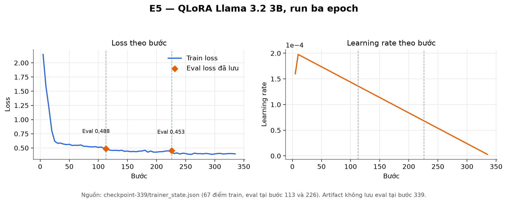{width=96%}

Loss giảm mạnh trong khoảng 30 bước đầu rồi giảm chậm từ khoảng 0,6 xuống 0,4. Hai điểm
validation 0,488 và 0,453 cùng xu hướng với train loss và chưa cho thấy phân kỳ tới cuối
epoch 2. Tuy nhiên, vì không có validation ở epoch 3 và không có trainer state tương ứng
cho run một epoch, các đường này không đủ để quy phần tăng chất lượng cho việc huấn
luyện thêm hai epoch.

**Kết luận E5.** Run ba epoch xác nhận tính khả thi của thích nghi và triển khai cục bộ
Llama 3.2 3B trong ngân sách phần cứng phổ thông. QLoRA chỉ cập nhật 24,31M tham số,
tương đương 0,75% model, hoàn tất 339 bước trong khoảng 47,3 phút trên Tesla T4; sau
merge, artifact GGUF Q4_K_M khoảng 2GB chạy được bằng Ollama. Train loss giảm mạnh ở
đầu run rồi ổn định quanh 0,4; validation loss giảm từ 0,488 ở epoch 1 xuống 0,453 ở
epoch 2 và chưa cho thấy phân kỳ tại mốc được lưu. Đây là bằng chứng về tối ưu ổn định
và khả năng đóng gói, không tự nó là bằng chứng về chất lượng truyện.

Thiết kế một so với ba epoch chưa tạo thành ablation hoàn chỉnh. Artifact không giữ
trainer state của run một epoch, run ba epoch không có validation tại bước 339, và báo
cáo thành viên không lưu điểm chất lượng bắt cặp giữa hai checkpoint. Vì vậy không thể
quy điểm cao của artifact cuối cho hai epoch bổ sung hoặc kết luận ba epoch tốt hơn một
epoch. Tương tự, vòng chung không có một bản Llama 3.2 3B chưa QLoRA được chạy bằng
chính codec E5; đóng góp riêng của adapter so với năng lực đã có của model nền chưa
được cô lập.

Dù vậy, chất lượng cấp hệ thống của artifact cuối được xác nhận trực tiếp. E5 đạt
8,44/10 trên 25 đề, là mô hình sinh một lượt tốt nhất và chỉ thấp hơn pipeline E4 có
validator/repair 0,76 điểm. Khi chuyển từ hai lên năm trường, độ phủ tăng 3,68/5 và
điểm nhất quán với chuỗi sự kiện được yêu cầu tăng 7,28/10. Trong mười cặp
counterfactual chỉ thay trait hoặc outcome, cả 10/10 cặp đều thay đổi lựa chọn hoặc
cách giải quyết theo đúng hướng. Các phép đo này cung cấp bằng chứng mạnh hơn fluency
đơn thuần rằng model sử dụng tổ hợp điều kiện trong tập kiểm thử.

Kết quả E5 vì vậy hỗ trợ hai kết luận tách biệt: QLoRA + GGUF là một quy trình triển
khai 3B khả thi với ít trọng số trainable, và artifact cuối giữ được điều kiện tốt khi
sinh trực tiếp. Kết quả chưa xác định phần cải thiện đến từ QLoRA, số epoch hay model
nền. Để trả lời câu hỏi đó cần chạy base, checkpoint một epoch và checkpoint ba epoch
trên cùng 25 đề, cùng codec, seed và decoding; sau đó chấm bắt cặp cả chất lượng tổng
thể lẫn độ nhạy counterfactual.

### 2.7 Phân tích định tính đầu ra

Các mẫu dưới đây được giữ nguyên tiếng Anh vì tác vụ đích là sinh truyện tiếng Anh.
Bốn mẫu đầu đến từ **đề bài và cấu hình local khác nhau**, nên chỉ minh họa hành vi; mẫu
E5 lấy từ lượt global để lấp khoảng trống output trước đó. So sánh ngang hàng chỉ dùng
toàn bộ 125 truyện ở §4. Dấu `[…]` là phần rút gọn khi trình bày, không phải token model
sinh.

**E1 · `slm-60m`.** Prompt: *a clever skunk; flower field; rivalry in love; ancient
enemies sign a pact; appearances can be deceiving.*

> In a sunny flower field, a clever skunk named Stinky loved to play among the colorful
> blooms. One day, while sniffing around, Stinky met a beautiful butterfly named Lovely.
> They became fast friends and spent their days playing together.
>
> But not everyone was happy about their friendship. A grumpy bear named Growler lived
> on the outskirts of the flower field. […] One day, Stinky saw Growler struggling to
> reach a sweet flower. “Let's work together,” Stinky said. […]
>
> To celebrate their new friendship, Stinky and Growler signed a pact on a piece of
> paper. “We will always look beyond our appearances,” Stinky said. “Appearances can be
> deceiving.” From that day on, Stinky and Growler played together, and the flower
> field became an even happier place.

Đầu ra giữ bối cảnh, kết quả và bài học nhưng thay thử thách “rivalry in love” bằng
xung đột về mùi cơ thể. Trường hợp này được phân loại là thay thế điều kiện và cho thấy
độ tuân thủ phải được chấm theo từng trường, thay vì chỉ dò từ khóa.

**E2 · `v16-conditioned`.** Prompt: *a joyful goose*; moral:
*Changing one's environment cannot change one's inherent nature.*

> In the heart of an enchanted grove, where sunbeams danced through leaves and
> wildflowers bloomed in every color, lived a joyful goose. Her feathers shone like
> polished jewels, and her honks echoed across the forest floor.
>
> One day, while exploring the grove's hidden glade, she stumbled upon a mysterious
> stone. As soon as she touched it, a strange curse fell upon her. From that moment on,
> whenever she tried to fly, she'd stumble. […] With newfound confidence, she spread
> her wings and soared above the grove. To everyone's surprise, she felt free!
>
> Moral: Changing one's environment cannot change one's inherent nature.

Đây là ví dụ điển hình của kết quả V16: văn trôi chảy nhưng diễn biến “đổi hoàn cảnh
không đổi bản chất” chưa được chứng minh bằng lựa chọn/hệ quả. Bản raw còn kết thúc bằng
`Moral: second chances reveals another` và lặp nhiều thẻ `</story>`; harness local đã
thay moral bằng trường yêu cầu trong bản `story`. Runner global không làm việc đó: chỉ
bóc thẻ đặc biệt và giữ nguyên nội dung model sinh.

**E3 · `tsv3-smollm135-best`.** Prompt: *a brave little turtle; quiet pond; sudden
storm; animals work together; teamwork overcomes fear.*

> In the quiet pond, where water lilies swayed gently in the breeze and fish swam
> happily by, a brave little turtle lived among his friends… One day, dark clouds
> gathered over the pond as strong winds howled and loud thunderclaps rumbled… The
> clever rabbit, strong and swift, had been watching from a nearby rock. He suggested
> that they work together to save their friends… The two groups of creatures huddled
> closer and began working together…

Repo nhóm chỉ giữ trích đoạn này, không giữ toàn bộ 100 đầu ra sinh của source repo.
Đầu ra có cấu trúc ngụ ngôn nhưng xuất hiện lệch nhân vật và chuỗi nhiễu `(Figure 1)`.

**E4 · Base + Repair.** Prompt p01: *a small turtle; a quiet pond; cross a busy road;
friends help him cross safely; patience and teamwork matter.*

> In a peaceful pond, lived a little turtle named Terry. One sunny day, he decided that
> adventure called him to explore beyond the water's edge. As he made his way closer to
> where some tall trees stood guard near busy Roady Way, Terry realized it was
> impossible for just one tiny creature like himself to cross.
>
> […] Together with some frogs who climbed trees nearby for high ground view points and
> rabbits carrying sturdy vines on their backs that formed a rope bridge...the whole
> crew got to work making it possible! Under Terry's guidance, carefully constructed
> walkways allowed him the safe passage across Roady Way.
>
> Moral: When friends unite towards one goal with patience in harmony - there is nothing
> big or small they can't accomplish together as best of buddies.

Repair bảo đảm moral hiện diện và đúng ý, nhưng không tự sửa hết câu vụng, dấu ba chấm
hay logic “frog climbed trees”. Điểm thủ công 4,32 là trung bình toàn 10 đề, không phải
điểm riêng của mẫu này.

**E5 · `llama3-fable-1000-q4`.** Lượt global GJ20 yêu cầu một chú rùa thận trọng tìm
đường mới qua vườn cây sau khi đường xe sụp:

> In a hillside orchard, where juicy apples grew on tall trees, lived a careful
> tortoise named Terry. Terry loved to walk along the usual cart path that wound its
> way through the orchard, carrying baskets of fresh fruit to the market.
>
> One sunny day, as the harvest was in full swing, disaster struck! The old cart path
> suddenly collapsed, and the fruit began to roll away. […] Taking a deep breath,
> Terry started to test a new route in small steps. […]
>
> Moral: Careful courage makes room for useful change.

Đây là output thật của checkpoint, không phải target trong `val_data.json`. Truyện có
240 từ trung bình trên 25 đề global; riêng GJ20 có 236 từ và được Gemma chấm 9,00.

## 3. Kết quả theo câu hỏi nghiên cứu

### 3.1 RQ1 — Ảnh hưởng của năng lực nền

E2 và E1 cung cấp bằng chứng về mô hình huấn luyện từ khởi tạo ngẫu nhiên. Cải thiện
tokenizer, tăng token và tăng quy mô đều nâng chất lượng ngôn ngữ, nhưng hai mô hình vẫn
không sử dụng ổn định tổ hợp điều kiện. E4–E5 kế thừa biểu diễn ngôn ngữ từ mô hình đã
tiền huấn luyện nên sai số chủ yếu chuyển sang tuân thủ điều kiện, định dạng đầu ra và
chất lượng thích nghi.

Do đó, tiền huấn luyện từ đầu và PEFT không phải hai phương pháp thay thế trực tiếp:
phương pháp thứ nhất xây dựng biểu diễn nền, còn phương pháp thứ hai thích nghi biểu diễn
đã có. Điểm nội bộ giữa hai nhóm không có tính so sánh khi tokenizer, tập đề và giám
khảo khác nhau.

### 3.2 RQ2a — Ảnh hưởng của dữ liệu và tối ưu

- E2 sửa bộ tách từ rồi tăng tiền huấn luyện; dữ liệu nhân quả từ mô hình giáo viên vẫn
  không tạo được năng lực suy luận.
- E1 vừa tăng token vừa sửa chế độ dữ liệu; mở rộng lên toàn bộ TF1 là can thiệp dương
  rõ nhất.
- E4 ghi nhận rằng 10k hàng đã lọc vẫn có thể học sai định dạng bài học.
- E3 giữ dữ liệu cố định để cô lập vị trí bộ chuyển đổi.
- E5 dùng 1k hàng và thay số chu kỳ, nhưng chưa có kết luận chất lượng để tách thiếu
  khớp với quá khớp.

Kết quả không hỗ trợ việc dùng số hàng làm đại diện trực tiếp cho chất lượng tín hiệu
huấn luyện. Các báo cáo cần chỉ rõ định dạng, vùng tính loss, độ phủ trường và phân bố
lỗi để phân biệt hiệu ứng dữ liệu với hiệu ứng tối ưu.

### 3.3 RQ2b — Vị trí phân bổ năng lực thích nghi

E1 tăng năng lực của toàn mô hình 30M → 60M và thu được lợi ích. E3 giữ mô hình nền cố
định nhưng mở bộ chuyển đổi từ mô-đun chú ý sang chú ý + MLP và cũng thu được lợi ích.
Ở E4/E5, mô hình nền 3B đã cung cấp chất lượng ngôn ngữ đủ cao; phần sai số còn lại liên
quan chủ yếu đến dữ liệu thích nghi, hàm mục tiêu và kiểm soát đầu ra.

Hai kết quả dương cho thấy vị trí phân bổ tham số trainable phải phù hợp với nguồn sai
số: tăng năng lực toàn mô hình khi biểu diễn nền còn yếu; mở rộng adapter sang MLP khi
mô hình nền được đóng băng.

### 3.4 RQ4 — Đóng góp của kiểm soát lúc suy luận

Best-of-N của E1 và hậu xử lý/repair của E4 là hai can thiệp suy luận có cải thiện đo
được. Best-of-N làm giảm phương sai lựa chọn; validator và repair xử lý lỗi định dạng
hoặc vi phạm điều kiện có thể phát hiện. Trong cùng phạm vi ngân sách, nhiều thử nghiệm
DPO, RAFT, GRPO, distillation, SFT và LoRA nhỏ không cải thiện chất lượng kỳ vọng hoặc
làm giảm chất lượng.

Kết quả E3 loại trừ diễn giải “tinh chỉnh luôn không hiệu quả”: LoRA có hiệu quả khi
dữ liệu, mô hình nền và vị trí adapter phù hợp. Kết luận trong phạm vi nghiên cứu là
can thiệp trọng số phụ thuộc chất lượng tín hiệu, trong khi lỗi có đặc tả hình thức nên
được so sánh với một baseline kiểm soát lúc suy luận.

### 3.5 Tính so sánh của các đánh giá nội bộ

| Cấu hình | Dụng cụ nội bộ chính | Phạm vi kết luận |
|---|---|---|
| E1 · Lê Hải Triều (20252611M) | Qwen3-4B chấm 4 trục, hạt giống bắt cặp, n=45; đo nhiễu | xếp hạng các biến thể E1 |
| E2 · Đào Đức Tùng (20252612M) | màn sàng lọc 20 trường hợp, Gemma nội bộ + cổng nhân quả | chọn điểm kiểm tra trong chuỗi V16 |
| E3 · Nguyễn Công Thanh (20252610M) | PPL + Qwen2.5-7B, n=50/nhánh | xếp hạng vị trí LoRA |
| E4 · Nguyễn Thị Phương Liên (20252130M) | luật tự động 25 đề bài + người chấm 10 đề bài | xếp hạng các biến thể E4 |
| E5 · Nguyễn Đình Lê Hoàng (20252737M) | loss + Đánh giá nhanh chưa báo số | chưa đủ kết luận chất lượng |

Bảng không có cột điểm tổng hợp vì các giá trị 8,96; 6,87; 6,85 và 4,32 được tạo bởi
những thang đo khác nhau. Việc xếp hạng E1–E5 từ các điểm nội bộ sẽ vi phạm tính đồng
nhất của phép đo.

## 4. Đánh giá thống nhất và thí nghiệm bóc tách

### 4.1 Môi trường và trạng thái thực nghiệm

Điểm nội bộ không được nhập vào kết quả thống nhất. Năm artifact được nạp trực tiếp
trên cùng máy Apple M4 Pro 24 GiB. Tổng cộng 125 truyện hợp lệ được sinh và chấm trong
vòng đánh giá chung.

### 4.2 Artifact và runtime

| Chặng | Artifact thực chạy | Backend |
|---|---|---|
| E1 | `models/global-bench/slm-60m.gguf` | llama.cpp |
| E2 | `runs/v16/artifacts/conditioning-mlx` | MLX-LM |
| E3 | SmolLM2-135M + adapter C | Transformers/PEFT |
| E4 | Base + Repair trên Llama 3.2 3B Instruct Q4 | llama.cpp + validator/repair |
| E5 | `llama3-fable-1000-q4.gguf` | llama.cpp |

E2 dùng đúng codec train `<char>…</char><moral>…</moral><story>` và chỉ nhận
`character` cùng `teaching`; ba slot `setting`, `challenge` và `outcome` không có kênh biểu diễn trong artifact
này. Runner chỉ bóc thẻ đặc biệt, không thay moral. E1 sinh completion trực tiếp,
`best_of_n=1`. E4 sinh bằng base rồi chạy validator: 5/25 truyện bị rewrite, 19/25 cần
chuẩn hóa dòng moral, tổng cộng 21/25 có ít nhất một hành động. E3 chạy base và adapter
rời bằng PEFT thay vì dựa vào một Ollama model chưa tồn tại trên máy. E5 dùng chat
template nhúng trong GGUF.

### 4.3 Tập đề đánh giá

`results/global_judge/global_prompts_v1.jsonl` chứa 25 đề mới với sáu trường
`prompt_id`, `character`, `setting`, `challenge`, `outcome`, `teaching`; gợi ý độ dài
medium được formatter thêm đồng nhất.

Tập này không tái dùng `lienntp/data/test_prompts.jsonl`, vì 25 đề của E4 đã tham gia
chọn Base + Repair. Kiểm tra chuỗi chính xác không tìm thấy field nào trùng nguyên văn
trong benchmark E4 và train/val artifact hiện có của E1/E5. Kiểm tra đó không phát hiện
paraphrase và không chứng minh đề chưa xuất hiện trong pretraining. Tập đề cũng chưa có
vòng review độc lập của hai thành viên; đây là giới hạn của lượt chạy này.

### 4.4 Giao thức sinh

Mỗi phương án nhận đúng cùng 25 đề và một seed cho mỗi đề:

| Tham số | Giá trị |
|---|---|
| seed | `5410 + chỉ_số_prompt` |
| temperature | 0,7 |
| top-p | 0,9 |
| repetition penalty | 1,1 |
| max new tokens | 400 |
| số mẫu | 1 |
| prompt độ dài | medium, khoảng 200–260 từ |

Không output nào được chọn lại sau khi đọc. E1 có hai lần dừng gần như ngay lập tức:
GJ21 rỗng và GJ23 chỉ sinh `)`. Hai vị trí vẫn nằm trong 125 input judge; completion có
nội dung của E1 vì vậy là 23/25. Bốn phương án còn lại sinh văn bản ở 25/25 vị trí.

“Cùng đề” nghĩa là judge dùng cùng request sáu trường. Formatter chuyển request sang
giao diện model thực sự hỗ trợ: E1, E3, E4 và E5 nhận prompt năm slot; E2 chỉ nhận character và
teaching vì đó là hợp đồng train của V16. Lượt E2 natural-language sai codec được giữ
trong `generations/e1.invalid_prompt.jsonl` nhưng không tham gia bảng cuối.

Thời gian dưới đây là latency generation trung bình theo từng JSON row, không gồm thời
gian nạp model. Thời gian tường từ khi tạo đến khi hoàn tất file lần lượt xấp xỉ 11 giây
(E2), 8 giây (E1), 173 giây (E4), 181 giây (E3) và 144 giây (E5). E4 chậm vì có thể
gọi thêm một lượt rewrite; E3 chậm dù nhỏ vì chạy token-by-token qua Transformers/MPS.

### 4.5 Làm mù và hàm chấm

125 cặp được xáo bằng seed `20260726`, đổi thành `B001`–`B125`. Request gửi judge chỉ
chứa đề và truyện; không chứa candidate ID, tên thành viên, backend, latency hay cờ
repair. Ánh xạ nằm riêng trong `blind_map.private.json`.

Giám khảo chính là `gemma-4-26b-a4b-it` qua Google GenAI, temperature 0, seed
`20260726`, thinking `MINIMAL`. Đây là lượt chấm mới, tách khỏi judge local dù cùng họ
Gemma đã từng được dùng ở E2. JSON schema chỉ nhận bốn số nguyên 1–10:

| Trục lưu trong file | Ý nghĩa |
|---|---|
| `grammar` | ngữ pháp, mạch lạc, văn phong phù hợp trẻ em |
| `creativity` | độ mới và sức sống của truyện |
| `moral_clarity` | moral rõ và được diễn biến chứng minh |
| `prompt_adherence` | bám character, setting, challenge, outcome, teaching và dòng Moral |

Một dry run ban đầu yêu cầu lý do dài cho từng trục đã làm chính Gemma lặp/truncate JSON.
15 kết quả thử được giữ trong `judge_results.blinded.jsonl` để audit nhưng **không tham
gia bảng cuối**. Sau khi rút schema còn bốn điểm số, lượt chính được chạy lại từ đầu cho
toàn bộ 125 input. Lượt compact đầu mất khoảng 5 phút 58 giây theo thời gian tường. Một
lượt score khác dùng E2 sai codec được giữ tại
`judge_scores.pre_e1_formatter_fix.jsonl` và cũng bị loại. Lượt chính cuối chạy lại đủ
125 input, lưu ở `judge_scores.blinded.jsonl`, trong khoảng 4 phút 19 giây. Có các cửa
sổ chờ quota 16.000 input token/phút; latency API trung bình 1,66 giây/truyện, không
tính thời gian chờ quota.

### 4.6 Kết quả định lượng

Overall của một truyện là trung bình bốn trục; điểm phương án là trung bình 25 truyện,
kể cả hai output gần-rỗng của E1. Vì schema judge có miền 1–10, hai output này nhận điểm
1 do Gemma chấm, không bị thay thủ công thành 0.

| Phương án | Có nội dung | Ngôn ngữ | Sáng tạo | Moral | Bám đề | Overall | 95% CI | Từ/truyện | Latency |
|---|---:|---:|---:|---:|---:|---:|---:|---:|---:|
| E4 · Base + Repair | 25/25 | 10,00 | 7,40 | 9,40 | 10,00 | **9,20** | [9,08; 9,30] | 257,9 | 5,86 s |
| E5 · Llama 3.2 3B fable Q4 | 25/25 | 9,88 | 7,04 | 8,56 | 8,28 | **8,44** | [8,04; 8,80] | 240,5 | 6,02 s |
| E1 · SLM 60M | 23/25 | 5,48 | 3,40 | 2,88 | 1,44 | **3,30** | [2,94; 3,64] | 233,5 | 0,34 s |
| E2 · V16 conditioned | 25/25 | 5,92 | 3,20 | 2,52 | 1,08 | **3,18** | [2,80; 3,55] | 275,2 | 0,44 s |
| E3 · SmolLM2 135M + LoRA C | 25/25 | 4,64 | 3,20 | 1,96 | 1,44 | **2,81** | [2,61; 3,01] | 305,0 | 7,67 s |

Khoảng tin cậy trên là bootstrap 10.000 lần theo 25 prompt. So sánh bắt cặp dùng hiệu
overall trên cùng prompt:

| Cặp | Chênh lệch trung bình | CI 95% | Cao hơn/Bằng/Thấp hơn |
|---|---:|---:|---:|
| E4 − E5 | +0,76 | [0,39; 1,17] | 16/6/3 |
| E4 − E1 | +5,90 | [5,56; 6,25] | 25/0/0 |
| E4 − E2 | +6,02 | [5,62; 6,42] | 25/0/0 |
| E4 − E3 | +6,39 | [6,16; 6,61] | 25/0/0 |
| E5 − E1 | +5,14 | [4,57; 5,71] | 25/0/0 |
| E5 − E2 | +5,26 | [4,68; 5,84] | 25/0/0 |
| E5 − E3 | +5,63 | [5,18; 6,06] | 25/0/0 |
| E1 − E2 | +0,12 | [-0,39; 0,62] | 12/4/9 |
| E1 − E3 | +0,49 | [0,09; 0,88] | 17/4/4 |
| E2 − E3 | +0,37 | [-0,05; 0,79] | 13/3/9 |

Các CI mô tả biến thiên theo tập 25 prompt và không điều chỉnh cho 10 phép so sánh. Dù
CI của E4 − E5 không chứa 0, không nên chuyển nó thành tuyên bố phổ quát: chỉ có một
judge, một seed sinh và một lượt chấm.

### 4.7 Phân tích trường hợp GJ20

GJ20 yêu cầu *a careful tortoise*, *a hillside orchard*, đường xe sụp, thử đường mới
từng bước, và moral “Careful courage makes room for useful change.”

- E2 kể mạch lạc về rùa cứu hang cạnh thác nước sau cơn bão nhưng không thể thấy ba
  slot bị codec bỏ, và đổi moral thành “*a little bit of courage opens new paths*”;
  Gemma chấm 3,50.
- E1 viết được một truyện ngữ pháp tương đối ổn về rùa làm đổ giỏ táo, nhưng bỏ sự kiện
  đường sụp, đường mới và dòng `Moral:`; điểm 4,00.
- E4 kể đúng toàn bộ chuỗi đường sụp → thử đường nhỏ từng bước → đưa xe tới chợ, rồi
  hậu xử lý dòng cuối thành đúng moral; điểm 9,25.
- E3 bắt đầu đúng vườn cây nhưng chuyển sang xe rơi xuống ao, cú khôn ngoan và kho báu,
  rồi bị cụt ở “*When we*”; điểm 3,00.
- E5 kể đúng cùng chuỗi sự kiện và tự kết bằng “*Moral: Careful courage makes room for
  useful change.*”; điểm 9,00.

Trường hợp GJ20 minh họa nguồn chênh lệch của `prompt_adherence`. E1 và E3 tạo văn bản
đúng ngữ pháp nhưng thay thế điều kiện bằng mô-típ quen thuộc; E4 và E5 giữ được chuỗi
sự kiện được yêu cầu. Toàn văn của năm đầu ra được lưu trong
`generations/e*.jsonl`.

### 4.8 Phân tích kết quả

E4 là một hệ thống suy luận nhiều bước, không phải checkpoint fine-tune độc lập. So với
E5, E4 sử dụng cùng quy mô nền 3B nhưng bổ sung validator, rewrite có điều kiện và chuẩn
hóa bài học. Vì vậy chênh lệch +0,76 phản ánh cả năng lực mô hình và chi phí hệ thống.
E5 là mô hình sinh trực tiếp có kết quả cao nhất.

E1 có thời gian sinh thấp nhất nhưng không giữ đủ năm điều kiện; hai trường hợp dừng sớm
làm giảm thêm độ tin cậy. E2 chỉ được huấn luyện với character + moral nên điểm tuân thủ
năm trường gần sàn; CI của E1−E2 chứa 0. E3 sinh đủ độ dài nhưng adapter C không duy trì
được điều kiện trong giao thức này; CI của E2−E3 cũng chứa 0. Các metric nội bộ như
fluency, diversity, PPL hoặc vị trí LoRA do đó không thay thế phép đo tuân thủ điều kiện
trên giao diện thống nhất.

Giám khảo không sinh rationale trong lượt chính; chưa có human audit bắt cặp hoặc kiểm
tra ổn định qua nhiều judge/seed. Ngoài ra, E4 gọi mô hình lần thứ hai ở 5/25 đề khi
validator yêu cầu rewrite, trong khi bốn hệ thống đại diện còn lại chỉ gọi một lần. Kết quả phù
hợp để chọn hệ thống triển khai hiện tại nhưng chưa cô lập ảnh hưởng của trọng số, kích
thước mô hình và compute suy luận.

### 4.9 Thí nghiệm bóc tách không huấn luyện lại

Ba thí nghiệm bổ sung tách các thành phần thường bị gộp trong điểm tuân thủ:

1. độ sẵn có của điều kiện đầu vào;
2. khả năng dùng điều kiện để thay đổi chuỗi sự kiện;
3. đóng góp riêng của bước repair trong E4.

E1 và E5 được sinh lại trên cùng 25 đề, cùng seed và decoding, một lần với đủ năm slot
và một lần chỉ có `character + teaching`. Lượt đủ năm slot tái dùng output global đã
khóa; lượt hai slot là 50 output mới. Judge chấm riêng năm biến coverage dạng boolean,
dòng `Moral:`, trait→choice, choice→outcome, độ nhất quán nội tại và độ nhất quán với
chuỗi được yêu cầu.

| Model | Điều kiện đưa vào | Coverage /5 | Ba slot setting/challenge/outcome /3 | Nhân quả theo yêu cầu /10 |
|---|---|---:|---:|---:|
| E1 · 60M | đủ năm slot | 0,48 | 0,32 | 1,44 |
| E1 · 60M | character + teaching | 0,04 | 0,04 | 1,00 |
| E5 · 3B | đủ năm slot | **4,88** | **2,96** | **9,24** |
| E5 · 3B | character + teaching | 1,20 | 0,16 | 1,96 |

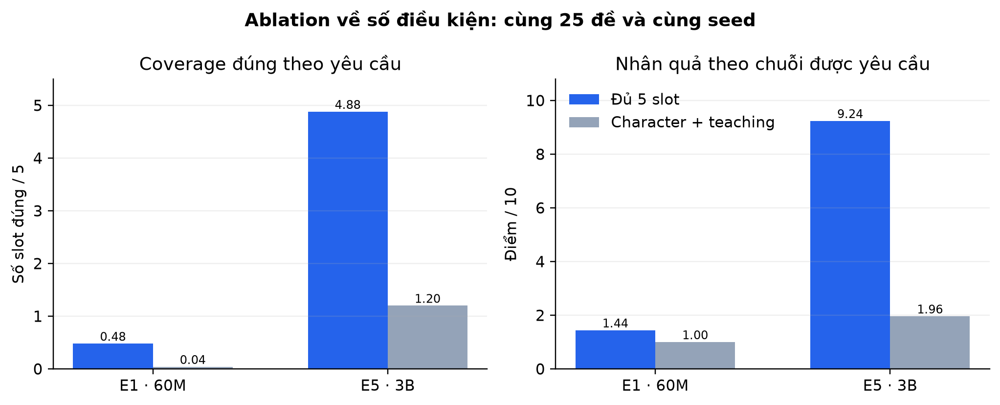{width=92%}

Ở E1, bổ sung ba trường tăng coverage +0,44/5 với CI bootstrap bắt cặp [0,04; 0,92],
nhưng cả hai điều kiện vẫn gần mức sàn. Độ nhất quán nhân quả nội tại không khác rõ
(4,76 so với 5,08; chênh −0,32, CI chứa 0), nghĩa là tính nhất quán nội tại không bảo
đảm tuân thủ chuỗi sự kiện được yêu cầu.

Ở E5, đủ năm slot làm coverage tăng +3,68/5 [3,20; 4,08] và nhân quả theo yêu cầu tăng
+7,28/10 [6,60; 7,92]. Kết quả “E2 hai điều kiện gần E1 năm điều kiện” do đó không
chứng minh hai giao diện tương đương; cả hai SLM nhỏ đều có điểm tuân thủ gần sàn. Khi
mô hình sử dụng được prompt có cấu trúc, ba trường bổ sung làm thay đổi đáng kể đầu ra.

**Counterfactual evaluation.** Mỗi cặp giữ nguyên setting, challenge, các trường còn
lại và seed; chỉ thay một điều kiện để kiểm tra đầu ra có đổi đúng hướng hay không.
Mười cặp gồm năm cặp thay trait và năm cặp thay outcome. Judge chấm liệu mỗi truyện có
khớp biến thể tương ứng và thay đổi điều kiện có thực sự làm đổi lựa chọn hoặc cách
giải quyết hay không.

| Model | Cả hai truyện khớp biến thể | Can thiệp đổi truyện | Counterfactual sensitivity /10 |
|---|---:|---:|---:|
| E1 · 60M | 10% | 10% | 1,70 [1,00; 3,10] |
| E5 · 3B | **100%** | **100%** | **9,40 [8,90; 9,90]** |

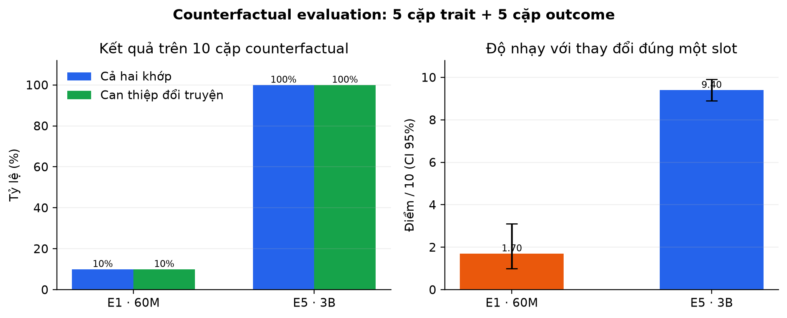{width=92%}

E1 đạt 2,40/10 ở thay đổi trait và 1,00/10 ở thay đổi outcome; E5 đạt 8,80 và 10,00.
Chênh lệch độ nhạy E5−E1 là +7,70 [6,20; 8,70]. Trong giao thức này, E5 phản ứng với
thay đổi điều kiện ở cấp diễn biến thay vì chỉ tái tạo từ khóa. Kết quả không chứng minh
năng lực suy luận nhân quả ngoài miền vì chỉ có 10 cặp, một seed, một Gemma judge và
không có can thiệp lên biểu diễn ẩn.

**E4 trước và sau repair.** Cùng 25 truyện được làm mù và chấm độc lập ở bản raw và
bản cuối. Có 21/25 lượt thực hiện ít nhất một hành động, gồm 5 rewrite và 19 chuẩn hóa
moral (các nhóm chồng nhau).

| Chỉ số | Raw | Sau repair | Chênh bắt cặp |
|---|---:|---:|---:|
| Đúng nguyên teaching ở dòng `Moral:` cuối | 20% | **100%** | +80 điểm % [64; 96] |
| Teaching được thể hiện | 80% | **100%** | +20 điểm % [4; 36] |
| Nhân quả nội tại /10 | 9,16 | **9,56** | +0,40 [0,20; 0,60] |
| Nhân quả theo yêu cầu /10 | 9,00 | **9,64** | +0,64 [0,40; 0,92] |
| Trait→choice / choice→outcome | 92% / 100% | 92% / 100% | 0 / 0 |

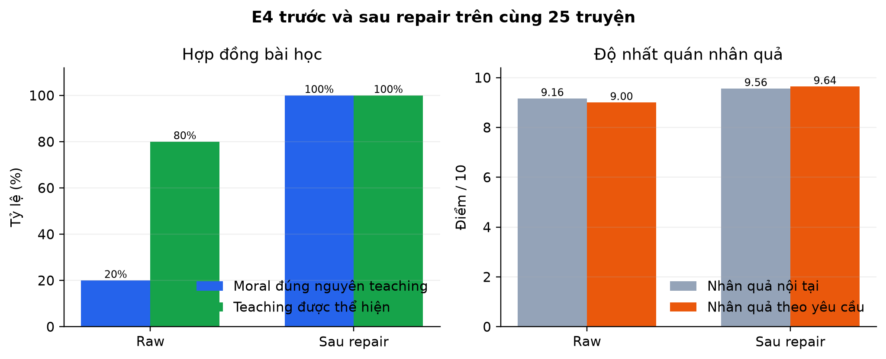{width=92%}

Repair chủ yếu bảo đảm hợp đồng đầu ra và tính đúng của bài học. Tỷ lệ
trait→choice→outcome đã cao ở truyện raw và không thay đổi sau repair; do đó năng lực
này không được quy cho hậu xử lý.

## 5. Thảo luận

### 5.1 Tổng hợp phát hiện

Loss, perplexity và điểm nội bộ của E1–E3 đều cải thiện sau tối ưu, nhưng mức tuân thủ
trên giao thức chung vẫn thấp. Do đó, độ phù hợp phân bố token và chất lượng ngôn ngữ
không phải đại diện thay thế cho khả năng điều kiện hóa có cấu trúc. Sai khác giữa giao
diện train và giao diện đánh giá ở E1/E3 càng cho thấy hợp đồng prompt phải được giữ cố
định khi đo năng lực này.

Thí nghiệm hai so với năm điều kiện phân biệt **điều kiện có mặt** với **điều kiện được
sử dụng**. E1 tạo truyện có mức nhất quán nội tại tương tự ở hai giao diện nhưng gần như
không bám chuỗi sự kiện được yêu cầu. Ngược lại, độ phủ và độ nhất quán nhân quả của E5
tăng đồng thời khi cung cấp đủ năm trường. Vì vậy, một truyện tự nhất quán vẫn có thể
không phụ thuộc vào prompt.

Counterfactual evaluation cung cấp bằng chứng mạnh hơn việc kiểm tra từ khóa: khi chỉ thay
trait hoặc outcome, E5 thay đổi lựa chọn hoặc đường giải quyết tương ứng trong 10/10
cặp, trong khi E1 chỉ đạt 1/10. Kết quả này xác nhận độ nhạy có hướng đối với điều kiện
trong tập kiểm thử, nhưng chưa chứng minh suy luận nhân quả ngoài miền.

Repair của E4 tác động lên một thành phần khác. Nó chuẩn hóa bài học và cải thiện nhẹ
điểm nhất quán, trong khi hai liên kết trait→choice và choice→outcome đã có trong bản
raw và không đổi sau repair. Vì vậy cần báo cáo riêng năng lực sinh của checkpoint,
độ tin cậy của pipeline và chi phí gọi mô hình bổ sung.

### 5.2 Hàm ý lựa chọn hệ thống

Trong giao thức hiện tại, E4 đạt điểm trung bình cao nhất (9,20), còn E5 là mô hình sinh
trực tiếp tốt nhất (8,44). Chênh lệch E4−E5 là +0,76 với CI bootstrap bắt cặp
[0,39; 1,17]. E4 phù hợp khi mục tiêu là độ tin cậy đầu ra và chấp nhận chi phí
validator/repair; E5 phù hợp khi cần một artifact đơn, không có lượt repair bổ sung.

Lựa chọn giữa hai hệ thống phụ thuộc hàm mục tiêu triển khai, không chỉ điểm trung bình:
E4 có độ tuân thủ cao hơn nhưng latency và số lần gọi mô hình lớn hơn; E5 đơn giản hơn
và giữ chất lượng cao mà không cần repair.

### 5.3 Mối đe dọa đối với tính hợp lệ

**Tính hợp lệ nội tại.** E4 được phép gọi mô hình lần thứ hai ở 5/25 đề; do đó phép so
sánh không giữ cố định compute suy luận. Năm hệ thống đại diện cũng khác về tokenizer,
kích thước và dữ liệu tiền huấn luyện, nên kết quả không cô lập hiệu ứng của một biến
duy nhất.

**Tính hợp lệ của phép đo.** Điểm chính đến từ một Gemma judge không sinh rationale.
Chưa có đánh giá thủ công bắt cặp, kiểm tra độ nhất quán liên giám khảo hoặc hiệu chỉnh
thang điểm bằng mẫu do người chấm.

**Tính hợp lệ bên ngoài.** Tập đánh giá gồm 25 đề cùng miền truyện ngụ ngôn tiếng Anh,
một seed sinh và một cấu hình giải mã. Kết luận không được mở rộng sang thể loại khác,
ngôn ngữ khác hoặc năng lực suy luận nhân quả tổng quát.

**Tính tái lập.** E4 và E3 thiếu trainer state, đường loss/LR và thời gian huấn luyện;
E5 thiếu eval cuối epoch 3. Những khoảng trống này không ảnh hưởng việc chạy artifact
cuối nhưng hạn chế khả năng tái lập đầy đủ quá trình huấn luyện.

## 6. Kết luận

Kết quả chính của nghiên cứu là sự phân tách ba mức thường bị gộp thành “bám điều
kiện”: nhắc lại trường đầu vào, duy trì chuỗi sự kiện phù hợp và thay đổi diễn biến khi
điều kiện bị can thiệp. Điểm ngôn ngữ và nhất quán nội tại chủ yếu phản ánh chất lượng
bề mặt hoặc tính hợp lý tự thân; chúng không cho biết điều kiện có chi phối diễn biến
hay không. E5 đạt đồng thời độ phủ cao, độ nhất quán nhân quả cao và counterfactual sensitivity
9,40/10, tạo bằng chứng rằng điều kiện được sử dụng
để chi phối diễn biến trong tập kiểm thử. E1 không đạt kết quả tương ứng dù truyện vẫn
có thể tự nhất quán.

Kết quả E4 xác lập ranh giới giữa năng lực mô hình và độ tin cậy hệ thống. Repair đưa
bài học về đúng hợp đồng và cải thiện điểm cuối, nhưng không tạo thêm liên kết
trait→choice hoặc choice→outcome. Do đó, hệ thống sinh có điều kiện nên báo cáo riêng
chất lượng bản raw, hiệu ứng repair và chi phí suy luận, thay vì quy toàn bộ điểm cuối
cho checkpoint.

Các kết luận trên giới hạn ở 25 đề, một seed và một LLM giám khảo. Đánh giá tiếp theo
cần mở rộng tập counterfactual, dùng nhiều seed, bổ sung chấm mù của con người và kiểm tra
liên giám khảo; trọng tâm là xác nhận độ nhạy có hướng đối với điều kiện, không phải tìm
một ngưỡng tham số phổ quát.

## 7. Tái lập và đóng góp thành viên

### 7.1 Phân công thực nghiệm

| Mã sinh viên | Họ và tên | Đóng góp chính |
|---|---|---|
| 20252611M | Lê Hải Triều | E1: tiền huấn luyện Llama 30M/60M, can thiệp dữ liệu và đánh giá hậu huấn luyện |
| 20252612M | Đào Đức Tùng | E2: GPT 63M huấn luyện từ đầu, tokenizer và điều kiện hóa nhân quả |
| 20252610M | Nguyễn Công Thanh | E3: bóc tách vị trí LoRA trên SmolLM2-135M |
| 20252130M | Nguyễn Thị Phương Liên | E4: SFT/LoRA, validation, hậu xử lý và repair |
| 20252737M | Nguyễn Đình Lê Hoàng | E5: QLoRA Llama 3.2 3B, lượng tử hóa và triển khai |

Nhóm cùng thực hiện giao thức đánh giá thống nhất, phân tích bóc tách và tổng hợp kết
quả. Nhãn E1–E5 được dùng để phân biệt năm hướng tiếp cận độc lập và hệ thống đại diện
của chúng, không biểu thị thứ tự thực hiện, mức điều kiện thực nghiệm hay xếp hạng đóng
góp cá nhân.

### 7.2 Artifact và khả năng tái lập

| Hướng | Cấu hình/log chính | Đầu ra/mẫu | Khoảng trống |
|---|---|---|---|
| E1 · Lê Hải Triều (20252611M) | log repo + Drive `Trieulh/{loss_log_*,ckpt_*/*/trainer_state.json}` | analysis, 19 figure artifact, checkpoint/GGUF | tổng wall-clock 60M qua bốn phiên không được ghi đầy đủ |
| E2 · Đào Đức Tùng (20252612M) | `feat/td:runs/v16/run.json`; Drive `TD/E1-V16/{training-states,repo-evidence}` (tên thư mục artifact cũ) | fixed-screen JSON, 25 generation global, ba model runnable | conditioning trace dừng ở 800; causal chỉ có endpoint |
| E3 · Nguyễn Công Thanh (20252610M) | báo cáo repo; Drive `ThanhNC/{merged,gguf}` | base/best HF + GGUF, cấu hình Ollama | vẫn thiếu log loss/LR, thời gian và raw generation local |
| E4 · Nguyễn Thị Phương Liên (20252130M) | manifest/báo cáo repo; Drive `LienNTP/Models.docx` → `model.zip` | bốn GGUF + Modelfile; CSV đánh giá local/global | archive 7,95 GB không chứa trainer state, loss/LR hay thời gian |
| E5 · Nguyễn Đình Lê Hoàng (20252737M) | notebook; Drive `Hoangndl/models/1000/outputs/checkpoint-339/trainer_state.json` | adapter, GGUF 1/3 epoch + 25 generation global | eval epoch 3 vẫn thiếu trong trainer state; run 1 epoch không có state |
| Vòng chung | `scripts/global_benchmark.py`; `results/global_judge/global_prompts_v1.jsonl` | 125 generation, 125 Gemma score, `summary.json` | chưa có human audit/judge thứ hai |
| Ablation | `scripts/ablation_benchmark.py`; `results/ablation_judge/protocol.json` | 90 generation mới, 190 score từng truyện, 20 score cặp | 10 cặp counterfactual, một seed và một Gemma judge |
| Hình theo track | `scripts/plot_track_artifacts.py` | E2 loss/LR + screen; E3 ablation; E4 human eval; E5 loss/LR; E4 automatic dùng SVG gốc | E3/E4 không có trainer state nên không có loss curve thực |

Ứng dụng chung đọc mô hình từ `config/models.json`. Runner global nạp artifact trực tiếp
để loại phụ thuộc vào Ollama state cục bộ. `summary.json` lưu model digest, cấu hình
sinh, model judge, seed làm mù và thống kê; năm generation JSONL cùng
`judge_scores.blinded.jsonl` là nguồn thẩm quyền của bảng xếp hạng trên.
`run_manifest.json` lưu phiên bản của đề, đầu ra, kết quả chấm và runner.

## Tài liệu tham khảo

1. Nadas, M. và cộng sự. [*TF1-EN-3M: Three Million Synthetic Moral Fables for Training Small, Open Language Models*](https://arxiv.org/abs/2504.20605), 2025. [Bộ dữ liệu](https://huggingface.co/datasets/klusai/ds-tf1-en-3m).
2. Kaplan, J. và cộng sự. [*Scaling Laws for Neural Language Models*](https://arxiv.org/abs/2001.08361), 2020.
3. Hoffmann, J. và cộng sự. [*Training Compute-Optimal Large Language Models*](https://arxiv.org/abs/2203.15556), 2022.
4. Hu, E. J. và cộng sự. [*LoRA: Low-Rank Adaptation of Large Language Models*](https://arxiv.org/abs/2106.09685), 2021.
5. Rafailov, R. và cộng sự. [*Direct Preference Optimization: Your Language Model is Secretly a Reward Model*](https://arxiv.org/abs/2305.18290), 2023.
6. Dong, H. và cộng sự. [*RAFT: Reward rAnked FineTuning for Generative Foundation Model Alignment*](https://arxiv.org/abs/2304.06767), 2023.
7. Hinton, G., Vinyals, O., Dean, J. [*Distilling the Knowledge in a Neural Network*](https://arxiv.org/abs/1503.02531), 2015.
