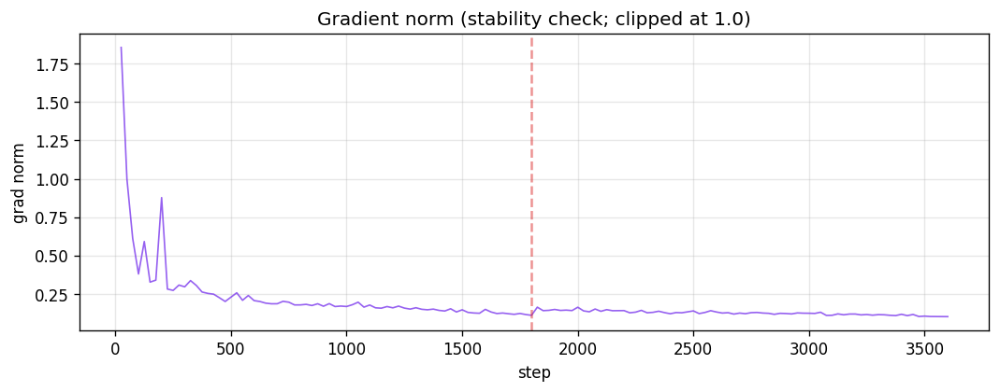
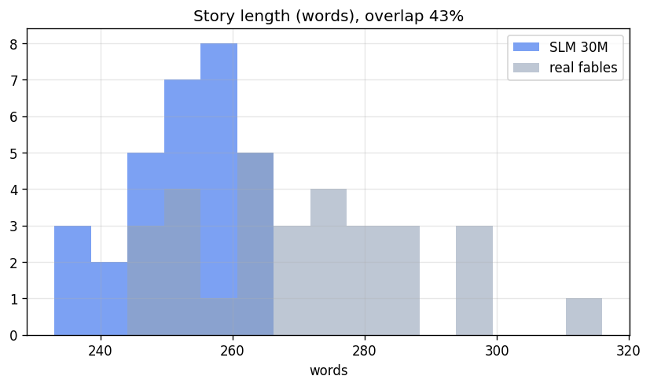
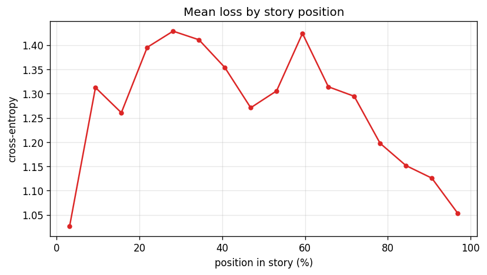
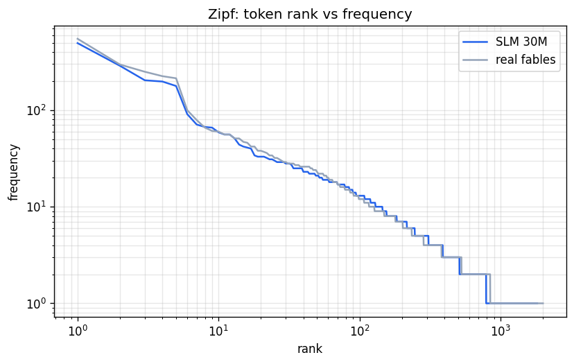
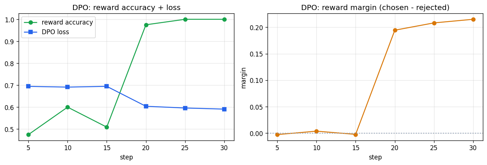
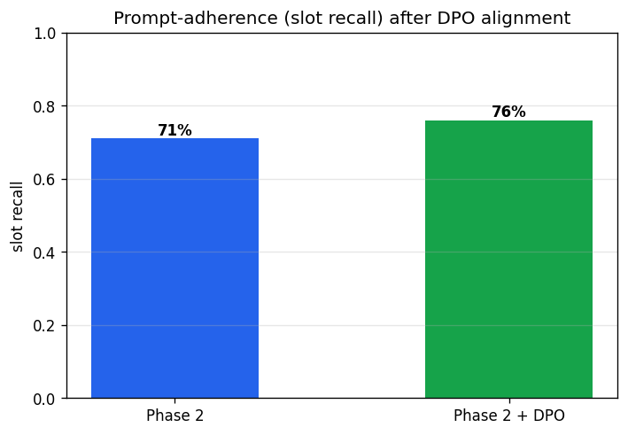
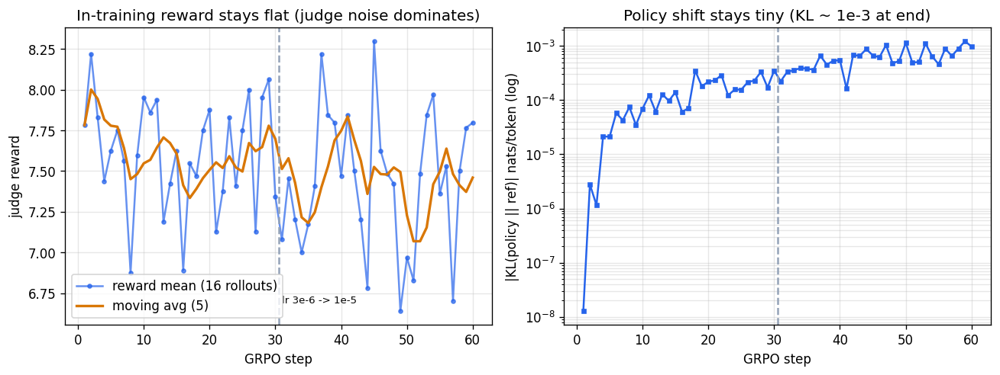
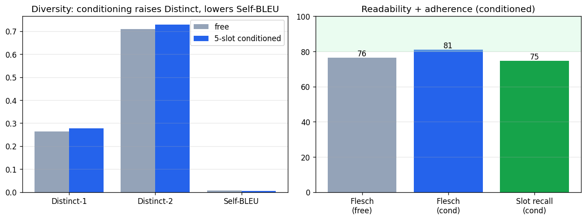
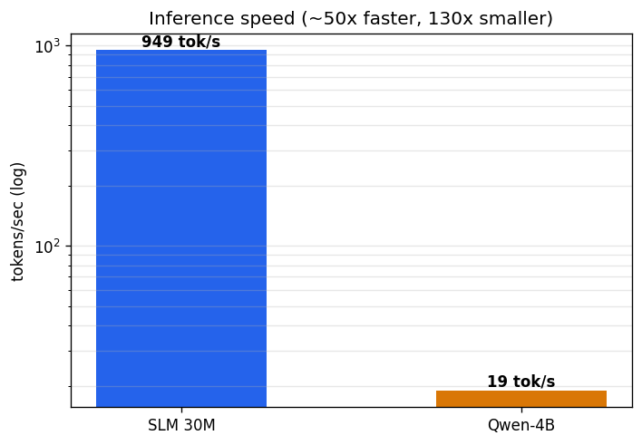

\newpage

## Abstract

We train a **30M-parameter Llama-style language model from scratch** on the TF1-EN-3M
children's-fable corpus and study, end to end and reproducibly, whether such a tiny
model can approach the output quality of a 130x larger instruction-tuned LLM
(Qwen3-4B) on a *constrained* generation task. Following modern scaling-law practice,
we move from a deliberately under-trained baseline (loss 1.8) through a Chinchilla-aware
retraining (loss 1.278, held-out perplexity 3.56) and a targeted data intervention that
cures a template-collapse failure ("wise old owl" generation rate 90% -> 23%). We add an
application-analysis dashboard (intrinsic diversity, readability, Zipf, positional loss)
and close with a **systematic post-training campaign**: four alignment methods sharing one
evaluation protocol - DPO (194 pairs), SFT-on-best, threshold-filtered RAFT (200 stories
judged >= 9.0) and GRPO-lite (REINFORCE with a group baseline, 60 on-policy steps) - are
**all null** on the model's default distribution, while **inference-time best-of-N search
captures a confirmed +0.8 judge-point gain** (7.7 -> 8.55, near the 4B reference at 9.75)
and ships in the app. Along the way we *measure* the LLM-judge's own noise (repeated
evaluations of the same model differ by up to 0.45 at n=15) and show it retroactively
explains two earlier false positives. The final 30M model generates coherent, complete
fables at **~949 tokens/s, roughly 50x faster than the 4B reference**, reaching an
LLM-judge quality of ~7.9/10 as measured under the final protocol (n=45). All parameters,
curves and artifacts are reported from training step 0.

\newpage

## 1. Introduction and thesis

Large language models dominate open-ended text generation, but their size makes them slow
and costly. This project asks a narrower, defensible question: **on a well-scoped task
(children's fables conditioned on five narrative slots), how close can a from-scratch
Small Language Model (SLM) of ~30M parameters get to a 4B instruction-tuned LLM, and at
what efficiency?**

The scientific priority of the project is the *training methodology*, not the app. Every
claim is grounded in published method and evaluated with reproducible metrics. The
narrative of the work is a sequence of hypotheses and measured outcomes:

1. A reduced baseline is intentionally under-trained (diagnosis).
2. Right-sizing the token budget per scaling laws fixes it (Phase 1).
3. A data intervention fixes a specific qualitative failure (Phase 2).
4. Sampling temperature cannot fix prompt-adherence (measured); we hypothesized
   preference optimization could.
5. A four-method post-training campaign (DPO, SFT-on-best, RAFT, GRPO-lite) tests that
   hypothesis rigorously - and refutes it at this scale and feedback budget, while
   inference-time best-of-N search delivers the gain the training methods could not.

## 2. Scientific grounding

- **Autoregressive LM = MLE on the chain rule** `log p(x) = sum_i log p(x_i | x_<i)`
  (course Week 6). We loss-mask the conditioning so the model only maximizes the
  log-likelihood of the *story* tokens.
- **Scaling laws (Kaplan et al. 2020):** test loss falls as a power law in parameters N,
  tokens processed D, and compute C. Under-training = too small a D for a given N.
- **Chinchilla (Hoffmann et al. 2022):** compute-optimal ~20 tokens per parameter.
- **Data-constrained scaling (Muennighoff et al. 2023):** repeating data up to ~4 epochs
  is nearly as good as fresh data.
- **DPO (Rafailov et al. 2023) / RLAIF (Bai et al. 2022):** align a model to preferences
  using pairwise (chosen, rejected) data, here labeled by an AI judge.
- **REINFORCE + baseline (Williams 1992; course Week 10):** policy-gradient RL with
  variance reduction by subtracting a baseline from the reward; normalizing within a
  group of rollouts per prompt yields the GRPO estimator (Shao et al. 2024) used by
  DeepSeek-R1. This grounds our GRPO-lite experiment (Section 9.12).
- **RAFT (Dong et al. 2023):** keep only high-absolute-reward samples and fine-tune on
  them - the design of our threshold-9.0 experiment (Section 9.10).
- **Dataset + evaluation methodology:** TF1-EN-3M (Nadas et al. 2025, arXiv:2504.20605);
  evaluation follows our ADR-0002 (objective metrics + a cross-family LLM-judge panel).

## 3. Dataset

We use `klusai/ds-tf1-en-3m`. Each record has a `prompt` (five scaffold slots: Main
Character, Setting, Challenge, Outcome, Teaching/Moral) and a `fable`. We format each
training example as a **conditional sequence**:

```
<conditioning: the 5 slots + a length hint>
<|story|> <fable text> <|end|>
```

Only the story region contributes to the loss (the conditioning prefix is masked with
`-100`). Key data-pipeline choices:

- **Quality filter:** keep fables of 60-320 words (avoid truncated / rambling extremes).
- **Slot dropout:** during training each slot is randomly blanked so the model learns to
  generate with any subset of the five slots present.
- **Custom BPE tokenizer, vocab 12k**, trained on the fable corpus - keeps the embedding
  table small, which matters at 30M parameters.

## 4. Model and training recipe

The architecture is a standard Llama-style decoder (RoPE, Grouped-Query Attention, RMSNorm,
SwiGLU, tied input/output embeddings).

| Component | Value |
|---|---|
| Parameters | ~36.6M |
| Hidden size / FFN | 512 / 2048 |
| Layers / heads / KV heads | 8 / 8 / 2 (GQA) |
| Vocab / sequence length | 12,000 / 512 |
| Optimizer | AdamW, betas (0.9, 0.95), weight decay 0.1 |
| Grad clip | 1.0 |
| LR schedule | Warmup-Stable-Decay (warmup 2%, decay 20%) |
| Peak LR | 3e-3 |
| Effective batch | 32 x 4 accum = 128 sequences (~33k story tokens/step) |
| Precision | fp16 (T4 GPU) |

**Architectural ceiling.** The model is trained at sequence length 512. With a
conditioning prompt of ~50-110 tokens this leaves ~400-460 tokens for the story, which
caps the maximum coherent fable length. This ceiling later drives the "story completeness"
design (Section 9.6).

## 5. Experiments (from step 0)

| Run | Data | Steps | Final loss | Held-out PPL | Judge (overall) | Notes |
|---|---|---|---|---|---|---|
| v1 (baseline) | 150k | 900 | ~1.80 | - | 2.5 | intentionally under-trained (~1.7 tok/param) |
| Phase 1 | 400k v1 | 1800 | 1.447 | 4.18 | 6.0 | right-sized token budget |
| + sampling fix | - | - | - | - | 6.2 | repeat_penalty 1.3 -> 1.1 (entity drift) |
| Phase 2 | 400k **v2** | 3600 | **1.278** | **3.56** | 7.0 | data intervention (resume 1800 -> 3600) |
| Phase 2 + DPO | 194 pairs | 30 | (loss 1.278) | 3.54 | 7.88 (n=15) | null vs baseline 8.02 (Section 9.8) |
| + RAFT | 200 stories >= 9.0 | 30 | 0.672 (SFT) | 10.64* | 7.60 (n=15, pooled) | null (Section 9.10) |
| + GRPO-lite | 60 steps x 16 rollouts | 30 | on-policy | 10.58* | 8.03 (n=45) | null, KL ~1e-3 (Section 9.12) |
| Best-of-3 (no training) | - | 30 | - | - | **8.55 (n=15)** | deployed in app (Section 9.9) |
| Qwen3-4B (ref) | - | - | - | - | 9.75 | 130x larger, instruction-tuned |

\*Perplexity for the alignment rows is measured on a different held-out slice (raw
`test.jsonl` text) than the 3.5x figures above; only the *relative* drift matters.

Phase 2 uses two data interventions motivated by qualitative analysis (Section 9.4):
cap the "wise old owl" template to 10% of the corpus, and lower the slot dropout for the
Teaching/Outcome slots (0.30 -> 0.15) so the model learns to follow the requested moral.

## 6. Training dynamics





The loss falls smoothly from ~7 to **1.278**. The log-log fit gives an exponent of about
-0.25 with R^2 ~ 0.96, empirical evidence that our from-scratch run follows the scaling-law
power law rather than diverging.

## 7. Language-modeling quality


Held-out perplexity of **3.56** is within 1% of the floor e^(1.278) = 3.59, meaning the
model's held-out behavior matches its training loss - no over-fitting despite the small
size, thanks to the large unique corpus.

## 8. Application analysis (intrinsic, reference-free)

Following ADR-0002, we compute reference-free metrics on generated stories and compare
against real held-out fables.








The generated text matches real fables on diversity (Distinct-2 gap ~4%), repetition
(Self-BLEU gap ~0.001), readability (Flesch 79.9 vs 80.0) and the Zipfian vocabulary
profile - the model has learned the *statistical shape* of the domain, not just surface
fluency.

## 9. Findings by stage

### 9.4 Data intervention: curing template collapse

Qualitative review of Phase 1 revealed **mode amplification**: the phrase "wise old owl"
appears in 28% of *real* fables but the model emitted it in ~90% of generations. Capping
that template to 10% of the corpus (Phase 2) reduced the generation rate to **23%**, below
even the data prior.


### 9.5 Quality progression


### 9.6 Story completeness (a limitation turned into a fix)

The Phase-2 model occasionally cut stories mid-sentence at short lengths. Diagnosis: the
generation cap (300 tokens) was smaller than the model's natural fable length, so it hit
the cap before emitting `<|end|>`. Because the model is trained at sequence length 512,
simply "adding tokens" is not an option beyond ~460. The fix: right-size the per-length
token budget to the architectural ceiling, use `done_reason` to detect true completion vs
cut-off, and trim any residual cut to the last complete sentence. Result: **30/30 test
stories complete** with a real ending.

### 9.7 Prompt-adherence: sampling vs alignment

We measured whether sampling temperature affects slot adherence. On 10 held-out prompts,
temperature 0.7 and 0.8 gave *identical* adherence (69%): **sampling is not the lever**;
adherence is capped by the 30M model's weak conditioning. At the time we hypothesized
preference optimization was the proper fix - the campaign below tests that hypothesis.

### 9.8 DPO preference alignment (RLAIF): an instructive null

We generate two stories per prompt from the Phase-2 model, have an AI judge score them on
the four axes, and keep pairs with a clear preference (margin >= 1.0) as (chosen, rejected)
data - 194 pairs after filtering. We then run **DPO** (ORPO was unavailable in the
installed TRL 1.8; DPO is the canonical equivalent) locally on Apple-Silicon MPS.



The in-training signal looks perfect - reward accuracy 1.0, positive margin, zero
perplexity drift. An early slot-recall probe even suggested +5 points of adherence
(71% -> 76%, Fig. below). **Both impressions failed the rigorous test.** Under the standard
protocol (15 held-out prompts, LLM-judge, fixed seeds), the DPO model scores **7.88 vs the
baseline's 8.02** - a null result. Section 9.11 shows the +5-point probe was within
measurement noise. The mechanism-level explanation: with chosen and rejected drawn from
the *same* model at similar quality, the relative preference signal is too weak to move
the default distribution.



### 9.9 The headroom probe: best-of-N shows capacity is not the ceiling

Is the 30M model *unable* to produce great fables, or merely *inconsistent*? We sample
K=3 candidates per prompt (temperatures 0.5/0.8/1.1) and let the judge pick the best:

| Measure | Value |
|---|---|
| Single-sample mean (15 held-out prompts) | 7.72 |
| **Best-of-3 mean** | **8.55** |
| Individual best samples | up to 9.0-9.5 (4B reference: 9.75) |

The model already *contains* near-reference-quality fables - the binding constraint is
**variance, not capacity**. This result reframed the whole alignment effort: the goal is
not to teach the model something new but to shift probability mass toward its own best
modes. Best-of-N (off / 3 / 5) ships in the app as a user-facing control: the backend
generates N candidates, the judge scores each, and the best is returned with all candidate
scores logged in the Activity Log.

### 9.10 RAFT: threshold-filtered SFT at 5x scale - null

If best-of-N finds the good samples, can we *train on them* and internalize the gain?
Our first SFT-on-best trial (42 stories) was null, but 93% of that corpus already scored
>= 8.5, so the untested variables were **scale** and a strict **absolute threshold** - the
defining features of RAFT (reward-ranked fine-tuning). We built a 200-story corpus in
which *every* story is judged >= 9.0 (mean 9.22; 105 harvested from earlier experiments,
95 newly generated with a 23% prompt acceptance rate), and fine-tuned at lr 2e-5 for 3
epochs with the conditioning loss-masked.

Result: **null again** - 7.60 (pooled over two evaluation runs) vs baseline 7.78, with
perplexity drift +0.5% only. The theoretical reading: best-of-N samples are drawn from
the model's *own* distribution, so supervised fine-tuning on them mostly re-weights modes
the model already prefers; ~60k story tokens against a 600M-token pretraining prior is
also a very small nudge. Crucially, the gradient contains no *negative* component - nothing
pushes probability *away* from mediocre modes.

### 9.11 Measuring the judge itself: the noise that manufactured two false positives

Re-evaluating the *same* RAFT model twice (same protocol, same seeds) returned 7.38 and
7.82 - a 0.44 spread. The same double-measurement on the baseline returned 7.73/7.82, and
on the GRPO model 8.00/8.45. At n=15 prompts, **the judge's own noise is ~+-0.4**, which
retroactively explains both the "DPO +5 adherence" probe (Section 9.8) and an early
"GRPO +0.45" reading (Section 9.12) as sampling artifacts.


Methodological rule adopted for all conclusions in this report: any delta below ~0.5
judge-points at n=15 is treated as noise; decisive comparisons are re-run at n=45 with
paired seeds.

### 9.12 GRPO-lite: on-policy RL with a group baseline - null at this budget

The last untested ingredient class from the course material (Week 10: policy gradients,
REINFORCE, variance reduction with a baseline) is **on-policy RL with an absolute reward
and a negative gradient**. We implemented GRPO-lite: each step samples 4 prompts x 4 fresh
rollouts, scores each rollout with the judge, normalizes the advantage within the group
(`(r - mean)/std` - the Week-10 baseline trick), and applies REINFORCE with a KL penalty
(beta 0.05) against the frozen Phase-2 reference. Sixty steps (~960 judge calls, ~5 h,
lr 3e-6 then 1e-5), checkpoint-resumed across interruptions.



At n=15 the GRPO model read +0.45 above baseline - promising. Applying our own noise rule,
we extended the evaluation to **n=45 paired prompts**: the delta collapsed to **+0.09
(t=0.54; win/tie/loss 17/10/18)**. Null - but a *diagnosable* one: with final KL ~1e-3,
the policy never moved far enough for any effect to be measurable. The honest conclusion
is "GRPO at a ~960-judge-call budget does not shift the distribution", not "GRPO cannot".
The practical blocker is reward cost: at ~15 s per judge call, DeepSeek-R1-scale step
counts are out of reach locally, and a distilled 30M reward model failed its validation
gate (pairwise accuracy 46.7% ~ chance) - the quality signal is not learnable from ~500
noisy labels at this scale.

### 9.13 The campaign in one picture


| Method | Signal | Exploration | Negative gradient | Result |
|---|---|---|---|---|
| DPO (194 pairs) | relative preference | no (static data) | implicit | null (7.88 vs 8.02) |
| SFT-on-best (42) | best-of-batch | no | no | null (7.98 vs 8.02) |
| RAFT (200 >= 9.0) | absolute threshold | no | no | null (7.60 vs 7.78) |
| GRPO-lite (60 steps) | group advantage | yes (on-policy) | yes | null at this budget (+0.09, n=45) |
| **Best-of-N (inference)** | judge selection | yes (test-time) | - | **+0.8, deployed** |

**Central empirical finding of the post-training study:** at 30M scale with weak, noisy
AI feedback, the quality headroom demonstrably *exists at the sample level* but is *not
trainable into the default distribution* by any of the low-cost methods above.
Inference-time search converts that headroom directly; training methods do not.

### 9.14 Free vs conditioned generation

Does conditioning on the five slots merely constrain the model, or does it improve the
output? We compare 20 *free* fables (no slots, only "write a children's fable") against 20
*conditioned* fables (all five slots filled), same model (Phase 2 + DPO) and sampling.

| Metric | Free | 5-slot conditioned |
|---|---|---|
| Distinct-1 / Distinct-2 (diversity) | 0.264 / 0.709 | **0.278 / 0.729** |
| Self-BLEU (repetition, lower better) | 0.007 | **0.005** |
| Flesch reading ease | 76.4 | **80.9** (into children band) |
| Average length (words) | 266 | 267 |
| Completeness | 100% | 100% |
| Slot recall (adherence) | n/a | 75% |



**Finding:** conditioning is not just a control interface. Free generation drifts toward a
narrower set of stock fables (lower diversity, higher self-similarity across the set,
slightly harder readability), whereas the five slots *diversify* the output (they force
different characters/settings/challenges) and *ground* it to the user's request. The
scaffold improves quality, not only controllability.

### 9.15 Efficiency



## 10. Automatic verdict (Phase 2)

Thresholds are heuristics calibrated for this setup (30M params, 12k vocab, TF1). The
dashboard produces a per-metric PASS / WARN / FAIL verdict:

| Metric | Value | Verdict |
|---|---|---|
| Final train loss | 1.278 | PASS |
| Scaling-law fit R^2 | 0.959 | PASS |
| Held-out perplexity | 3.56 (0.99x floor) | PASS |
| Distinct-1 gap vs real | 8% | PASS |
| Distinct-2 gap vs real | 4% | PASS |
| Self-BLEU abs gap | 0.001 | PASS |
| Flesch reading ease | 79.9 | WARN (0.1 below band) |
| Length distribution overlap | 43% | WARN |
| Owl template rate (gen) | 23% | PASS |

**7 PASS / 2 WARN / 0 FAIL.**

## 11. Strengths and limitations

### 11.1 Strengths

- **Coherent, complete, on-domain output.** After the completeness fix, 30/30 test stories
  end with a real resolution; generated text matches real fables on diversity (Distinct-2
  gap ~4%), repetition (Self-BLEU gap ~0.001), readability (Flesch 79.9 vs 80.0) and the
  Zipfian vocabulary profile - the model learned the statistical shape of the domain.
- **Efficiency.** ~949 tokens/s, roughly **50x faster** than the 4B reference at **1/130th**
  the parameters; runs on a laptop with a 39 MB q8 file.
- **Well-generalized language model.** Held-out perplexity 3.56 sits essentially on the
  theoretical floor e^(train loss) - no over-fitting despite the small size.
- **The scaffold improves quality, not only control.** Conditioning on the five slots
  *raises* cross-set diversity, *improves* readability into the children band and *grounds*
  the story to the request (Section 9.9) - versus free generation, which collapses toward a
  narrower set of stock fables.
- **Best-of-N converts headroom into shipped quality.** The +0.8 judge-point gain
  (7.7 -> 8.55) is the study's one confirmed post-training improvement, costs no training,
  and is exposed in the app as a user control with per-candidate score logging.
- **Negative results are measured, not assumed.** Four alignment methods were tested under
  one fixed protocol with paired seeds, repeated measurements and an n=45 confirmation
  step; the judge's own noise was quantified (+-0.4 at n=15) and used to retract two
  early false positives - the evaluation methodology is itself a contribution.
- **Reproducible and defensible.** Every number is tied to a run and a published method;
  the training pipeline, data interventions and evaluation are all scripted.

### 11.2 Limitations

- **Context ceiling (512 tokens):** the model cannot produce coherent fables beyond
  ~300-340 words; the length selector has little effect on the SLM.
- **Prompt-adherence ceiling (~70-80%):** a 30M model has weak conditioning; it reads the
  five slots but still drops one or two (especially abstract Challenge/Outcome) - a
  quantified size/capability trade-off that none of the tested alignment methods moved.
- **The default distribution resists cheap self-feedback.** DPO, SFT-on-best, RAFT and
  GRPO-lite (at a ~960-judge-call budget) all fail to shift default-generation quality;
  only inference-time selection captures the headroom. Improving the *default* output
  likely requires an external teacher or a much larger, cleaner reward budget.
- **The evaluation judge is noisy:** repeated evaluations of the same checkpoint differ by
  up to 0.45 at n=15. All headline deltas in this report respect that noise floor; readers
  should apply the same caution to any small reported difference.
- **Weak length control:** the model has a natural length (~250-280 words) and largely
  ignores the short/medium/long hint.
- **Template / redemption priors:** the model inherits TF1 biases (friendship/kindness
  morals; happy endings; a recurring "wise old owl" mediator), which the data intervention
  reduces but does not eliminate.
- **Local logical slips:** occasional pronoun/reference errors and small non-sequiturs
  within a story - a capacity limit, not a sampling artifact.
- **Single-judge in-app eval:** the per-generation score is a quick indicator; the
  headline conclusions use the offline cross-family judge panel with weighted Cohen's
  kappa and Kendall's tau (ADR-0002).

## 12. Future directions (with feasibility evidence)

Each direction below is paired with concrete evidence from this study that it is likely to
pay off, not just a wish-list item.

- **Train to the full Chinchilla budget (~7,900 steps / ~600M tokens).**
  *Evidence:* at 3,600 steps the loss still lies on the power-law line (R^2 0.96, Fig. 4)
  and has not plateaued; Kaplan/Chinchilla predict continued gains from more tokens.
  *Feasibility:* the 400k unique corpus with <=4-epoch repeat (Muennighoff 2023) supplies
  the tokens; only more T4 time is needed.
- **Knowledge distillation from a larger teacher - now the primary alignment candidate.**
  *Evidence:* the campaign (Section 9.13) shows self-generated data cannot shift the
  default distribution because it is in-distribution by construction; a 4B teacher's
  stories are genuinely off-distribution supervision, which is exactly the missing
  ingredient. The model already reproduces the data's surface statistics (Section 8), so
  the gap is long-range coherence/adherence - what distillation (Hinton 2015) targets.
  *Feasibility:* ~500-1000 teacher stories generate overnight locally via Ollama.
- **Scaled reward-based RL with a cheaper, cleaner reward.**
  *Evidence:* GRPO-lite was null with KL ~1e-3 - the policy never moved at a 960-call
  budget - so the method is untested at scale rather than refuted (Section 9.12). DeepSeek-
  R1 demonstrates the mechanism works given thousands of steps.
  *Feasibility:* requires replacing the ~15 s/call judge: either a stronger local judge
  distilled into a fast scorer trained on far more labels (the 30M scorer failed at ~500
  labels; scaling labels is the testable fix), or rule-based partial rewards (slot recall,
  completeness) that cost microseconds.
- **Stronger evaluation judge and larger eval sets by default.**
  *Evidence:* the measured +-0.4 noise at n=15 (Section 9.11) manufactured two false
  positives; n=45 paired evals resolved both. *Feasibility:* the 36 GB machine runs a 14B
  judge comfortably; n=45-100 evals are an hour of compute.
- **Targeted data debiasing beyond the owl template.**
  *Evidence:* the single "wise old owl" cap already moved the generation rate 90% -> 23%
  (Fig. 10), proving the intervention mechanism works; the same recipe can address the
  happy-ending/redemption prior and other stock phrases.
- **Extended context / explicit length control.**
  *Evidence:* the 512-token ceiling is the direct cause of both the length-control weakness
  and rare truncation (Section 9.6). *Feasibility:* retraining at 1024 tokens or adding
  length-bucket control tokens is a known, bounded change.

## 13. Conclusion

A 30M-parameter model trained from scratch, guided by scaling-law reasoning and a targeted
data intervention, reaches ~7.9/10 fable quality (final protocol, n=45; from 2.5 at the
under-trained baseline) with held-out perplexity 3.56, generating complete, on-domain
stories at ~50x the speed and 1/130th the size of a 4B LLM. A systematic post-training
campaign then delivers the study's sharpest finding: the model's quality headroom is real
at the sample level (best-of-3 reaches 8.55, near the 4B reference at 9.75) but **no
low-cost self-feedback training method - DPO, SFT-on-best, RAFT or budget-limited GRPO -
moves the default distribution**, while inference-time best-of-N captures the gain
directly and ships in the app. The result supports the thesis with an honest boundary:
**for a well-scoped task, a tiny model can rival a large one on the axes that matter, at a
fraction of the cost** - provided the remaining variance is managed at inference time, and
with the size ceiling documented where it shows (length control, residual adherence gap,
alignment resistance).

## 14. Reproducibility

All model code lives under `trieulh/` (isolated from the shared web app):

- Data + training: `trieulh/scripts/prepare_tf1_pretrain.py`, `train_tokenizer.py`,
  `tf1_pretrain/`; notebook `trieulh/notebooks/pretrain_slm_30m_dashboard.ipynb`.
- Alignment campaign: `trieulh/scripts/gen_preference_pairs.py`, `dpo_train_local.py`,
  `headroom_probe.py` (best-of-N), `raft_harvest.py` + `raft_gen_corpus.py` +
  `sft_best_local.py` (RAFT), `rm_train.py` + `rm_train_pairwise.py` (reward-model gate),
  `grpo_train.py` (GRPO-lite), `raft_judge_eval.py` / `grpo_judge_eval.py` /
  `big_judge_eval.py` (the shared evaluation protocol).
- Evaluation: `trieulh/scripts/eval_slm.py`; app metrics `app/metrics.py`, `app/perplexity.py`.
- Experiment log (source of this report): `trieulh/docs/experiments/2026-07-08-slm-training-log.md`.
- Artifacts (Google Drive): checkpoints, HF models (30M, 30M-p2, 30M-dpo), GGUF exports,
  `analysis_*.json`, `loss_log_*.json`, and the dashboard figures.

**Model download.** The final aligned model (Phase 2 + DPO) is packaged as a zip
(GGUF q8 + Ollama Modelfile + HF checkpoint):
<https://drive.google.com/file/d/1tY6dPodSqHunYlYEZDdMOEZ1dJyg2HuD/view?usp=drivesdk>
To run it: unzip, then `ollama create slm-30m-dpo -f Modelfile-30M-dpo`.

## References

1. Nadas et al. (2025). *TF1-EN-3M.* arXiv:2504.20605.
2. Kaplan et al. (2020). *Scaling Laws for Neural Language Models.*
3. Hoffmann et al. (2022). *Training Compute-Optimal LLMs (Chinchilla).*
4. Muennighoff et al. (2023). *Scaling Data-Constrained Language Models.*
5. Rafailov et al. (2023). *Direct Preference Optimization.*
6. Bai et al. (2022). *Constitutional AI: Harmlessness from AI Feedback (RLAIF).*
7. Williams (1992). *Simple Statistical Gradient-Following Algorithms for Connectionist RL (REINFORCE).*
8. Shao et al. (2024). *DeepSeekMath: Pushing the Limits of Mathematical Reasoning (GRPO).*
9. Dong et al. (2023). *RAFT: Reward-rAnked FineTuning for Generative Foundation Model Alignment.*
10. Hinton et al. (2015). *Distilling the Knowledge in a Neural Network.*
