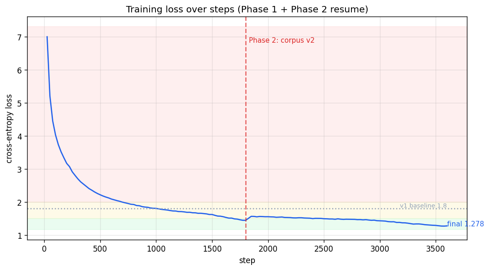
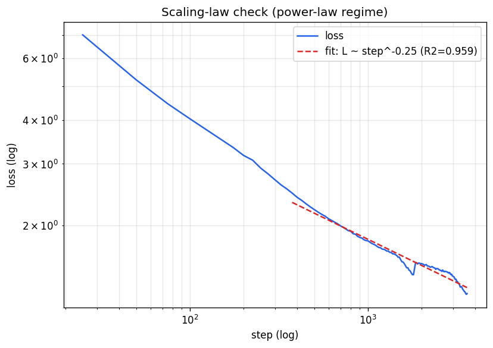
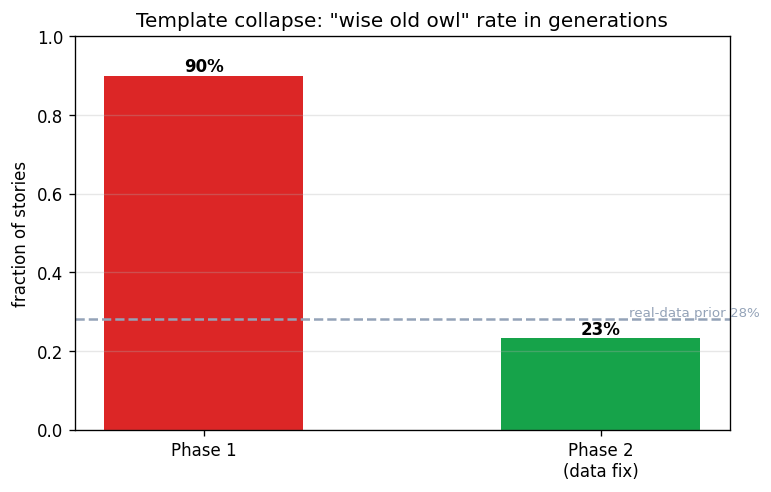
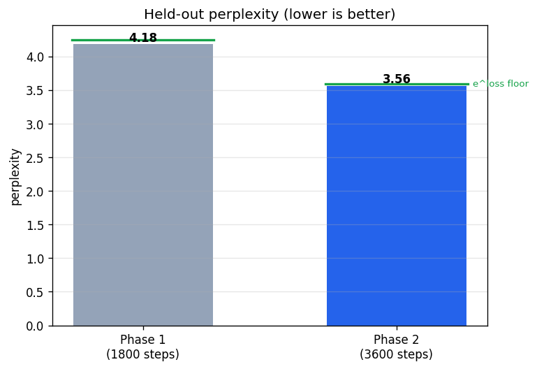
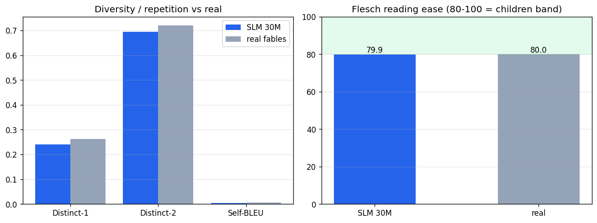
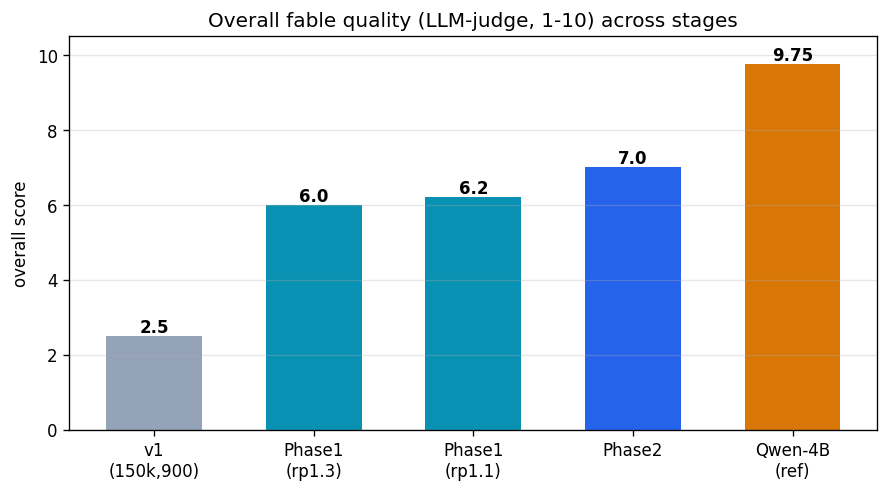
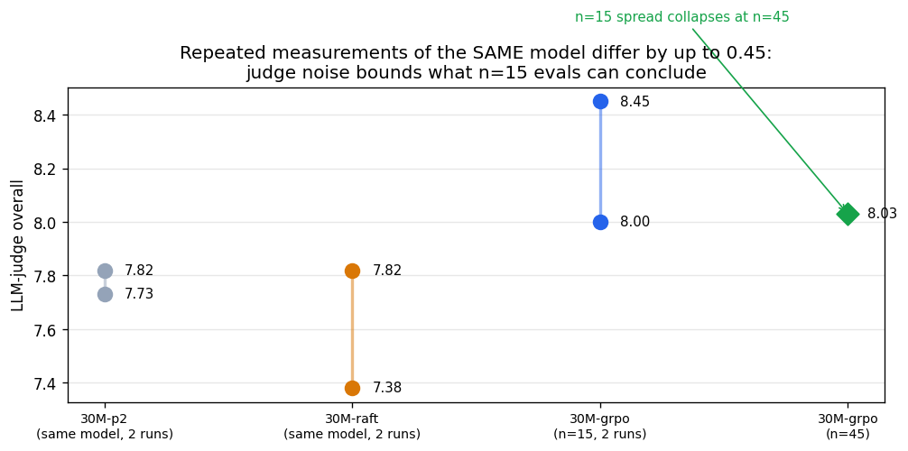
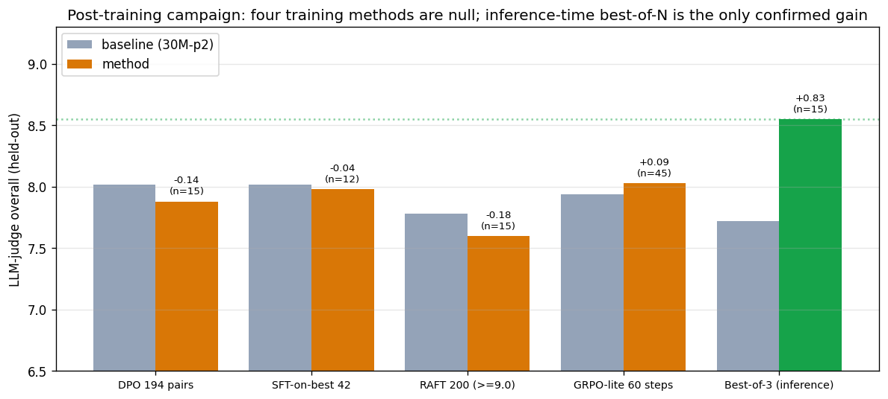
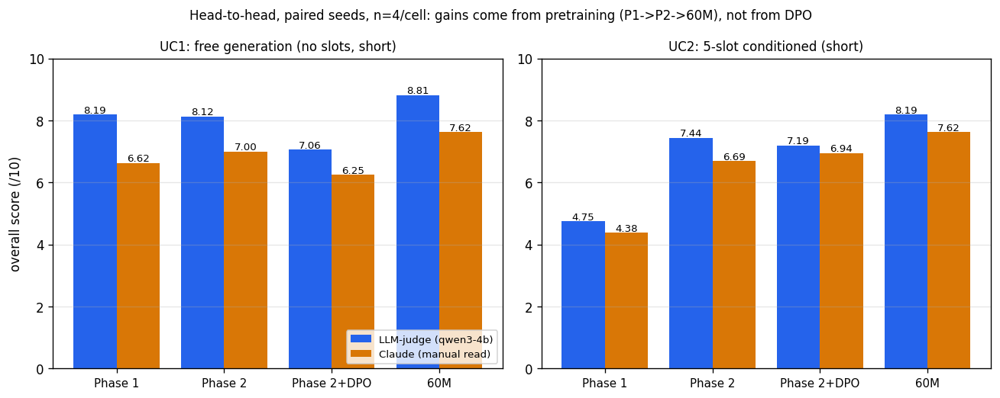

\newpage

## Tóm tắt

Đồ án huấn luyện từ đầu một mô hình ngôn ngữ kiểu Llama 30M tham số trên kho truyện ngụ
ngôn TF1-EN-3M, và trả lời câu hỏi: trên một tác vụ được giới hạn tốt, mô hình nhỏ tiến
gần được đến đâu so với một LLM lớn hơn 130 lần (Qwen3-4B). Quá trình gồm ba giai đoạn
huấn luyện theo timeline (baseline chẩn đoán, cấp đủ ngân sách token theo scaling law,
can thiệp dữ liệu) đưa điểm LLM-judge từ 2.5 lên 7.0/10, tiếp theo là năm phương pháp
post-training được kiểm chứng dưới cùng một protocol (DPO, SFT-on-best, RAFT, GRPO-lite,
distillation): bốn phương pháp null, một phương pháp làm mô hình xấu đi; trong khi tìm
kiếm best-of-N tại thời điểm suy luận thu được +0.8 điểm đã kiểm chứng (7.7 thành 8.55,
sát mốc 9.75 của Qwen-4B) và được triển khai vào ứng dụng. Nghiên cứu cũng tự đo nhiễu
của LLM-judge (+-0.4 điểm ở n=15) và dùng nó để rút lại hai kết luận dương tính giả.
Kết luận trung tâm: dư địa chất lượng của mô hình nhỏ tồn tại ở mức từng mẫu sinh nhưng
không huấn luyện được vào phân bố mặc định bằng phương pháp chi phí thấp; nâng sàn chất
lượng đòi hỏi pretraining tốt hơn. Kết luận này được kiểm chứng thuận chiều ở bước cuối:
một mô hình 60M huấn luyện trên full TF1 (2.34M truyện, seq 1024) đạt **8.96/10
(+1.02 so với 30M, t=6.53, n=45)**, xác nhận rằng đầu tư đúng chỗ là pretraining. Mô hình
sinh truyện trọn vẹn ở ~900 token/giây, nhanh hơn mốc 4B khoảng 50 lần.

## 1. Bài toán và thiết lập

**Câu hỏi nghiên cứu.** Trên tác vụ sinh truyện ngụ ngôn thiếu nhi có điều kiện theo 5
slot tường thuật (Main character, Setting, Challenge, Outcome, Teaching), một SLM 30M
huấn luyện từ đầu đạt bao nhiêu phần chất lượng của Qwen3-4B, và đổi lại hiệu năng gì?

**Cơ sở lý thuyết.** Mô hình autoregressive được huấn luyện bằng MLE trên chain rule
(Week 6); ngân sách token đặt theo scaling law (Kaplan 2020) và mốc Chinchilla ~20
token/tham số (Hoffmann 2022), cho phép lặp dữ liệu tới 4 epoch (Muennighoff 2023). Các
phương pháp cải thiện lần lượt dựa trên DPO (Rafailov 2023), RAFT (Dong 2023), REINFORCE
với baseline (Williams 1992; Week 10) dạng GRPO (Shao 2024), và distillation
(Hinton 2015).

**Dữ liệu.** `klusai/ds-tf1-en-3m`: mỗi bản ghi gồm prompt 5 slot và một truyện. Mẫu huấn
luyện có dạng `<5 slot + gợi ý độ dài> <|story|> <truyện> <|end|>`; chỉ phần truyện đóng
góp vào loss (conditioning được mask). Lọc giữ truyện 60-320 từ; mỗi slot bị che ngẫu
nhiên (slot dropout) để mô hình quen với mọi tập con slot; tokenizer BPE riêng 12k vocab
giữ bảng embedding nhỏ.

**Kiến trúc.** Decoder kiểu Llama (RoPE, GQA, RMSNorm, SwiGLU, tied embeddings):

| Thành phần | Giá trị | Thành phần | Giá trị |
|---|---|---|---|
| Tham số | ~36.6M | Optimizer | AdamW (0.9, 0.95), wd 0.1 |
| Hidden / FFN | 512 / 2048 | Lịch LR | WSD, đỉnh 3e-3 |
| Layer / head / KV | 8 / 8 / 2 (GQA) | Batch hiệu dụng | 128 chuỗi (~33k token/bước) |
| Vocab / seq len | 12.000 / 512 | Precision / grad clip | fp16 (T4) / 1.0 |

Trần seq 512 (trừ prompt còn ~400-460 token cho truyện) là trần cứng cho độ dài truyện,
sẽ xuất hiện lại ở phần giới hạn.

## 2. Timeline huấn luyện và đánh giá

| Giai đoạn | Dữ liệu, bước | Loss | PPL | Judge | Sự kiện chính |
|---|---|---|---|---|---|
| v1 baseline | 150k, 900 | ~1.80 | - | 2.5 | cố ý under-train để chẩn đoán |
| Phase 1 | 400k, 1800 | 1.447 | 4.18 | 6.0 | cấp đủ ngân sách token |
| (sửa sampling) | - | - | - | 6.2 | repeat_penalty 1.3 về 1.1 |
| Phase 2 | 400k v2, 3600 | **1.278** | **3.56** | 7.0 | can thiệp dữ liệu, resume từ 1800 |
| 60M (Mục 3.9) | full TF1 2.34M, 10000 | **1.058** | **2.87** | **8.96** | scale-up kiểm chứng kết luận |
| Qwen3-4B (mốc) | - | - | - | 9.75 | lớn hơn 130 lần |

### 2.1 v1: chẩn đoán under-training

Baseline chạy với ~1.7 token/tham số (so với mốc Chinchilla 20) cho điểm judge 2.5:
truyện rời rạc, lặp và bỏ prompt. Chẩn đoán theo scaling law: mô hình không thiếu
capacity mà thiếu dữ liệu; đây là giả thuyết kiểm chứng được và rẻ hơn nhiều so với đổi
kiến trúc.

### 2.2 Phase 1: cấp đủ ngân sách token

Tăng lên 400k truyện unique, 1800 bước (~600M token qua 4 epoch). Loss giảm từ 7 về
1.447, judge tăng 2.5 lên 6.0, xác nhận giả thuyết under-training. Một chỉnh nhỏ ở
sampling (repeat_penalty 1.3 xuống 1.1, vì mức phạt cao trừng phạt cả tên nhân vật khiến
nhân vật bị đổi giữa truyện) thêm +0.2 điểm.

{width=72%}

**Đọc biểu đồ.** Trục hoành là bước huấn luyện, trục tung là cross-entropy loss: trung
bình âm log-likelihood mỗi token, đo mức "bất ngờ" của mô hình trước token thật; thấp hơn
nghĩa là dự đoán tốt hơn. Đường loss đi theo lịch Warmup-Stable-Decay (WSD): warmup (LR
tăng dần, tránh sốc gradient khi trọng số còn ngẫu nhiên), stable (LR đỉnh 3e-3, giai
đoạn học chính), decay (LR giảm về 0, mô hình "kết tinh" kiến thức nên loss rơi thêm một
nấc rõ ở cuối mỗi phase). Đường cong mượt, không có spike: công thức huấn luyện ổn định.

{width=60%}

**Đọc biểu đồ.** Cả hai trục lấy logarit; nếu loss tuân quan hệ lũy thừa
loss ~ bước^(-k) thì các điểm nằm trên một đường thẳng. R^2 = 0.96 nghĩa là đường thẳng
giải thích 96% biến thiên: lần chạy nằm đúng chế độ power-law mà Kaplan (2020) dự đoán và
**chưa plateau**, tức thêm token vẫn còn lợi. Đây là bằng chứng định lượng cho hướng scale
tiếp ở phần kết luận.

### 2.3 Phase 2: can thiệp dữ liệu có chủ đích

Rà soát định tính Phase 1 phát hiện **template collapse**: cụm "wise old owl" có trong
28% truyện thật nhưng chiếm ~90% truyện sinh ra, vì sampling khuếch đại mode mạnh nhất
của phân bố. Can thiệp trên corpus v2: giới hạn truyện chứa cụm này ở 10%, đồng thời giảm
slot dropout của Teaching/Outcome (0.30 về 0.15) để mô hình thấy moral trong conditioning
thường xuyên hơn và học bám theo nó. Resume từ bước 1800 chạy tiếp đến 3600.

{width=55%}

**Đọc biểu đồ.** Cột là tỉ lệ truyện sinh ra có chứa cụm "wise old owl". Sau can thiệp,
tỉ lệ giảm từ 90% xuống 23%, thấp hơn cả prior 28% của dữ liệu thật: sửa tại nguồn dữ
liệu hiệu quả hơn sửa ở khâu sampling, và cùng công thức áp dụng được cho các khuôn mẫu
khác (happy ending, motif lặp).

{width=55%}

**Đọc biểu đồ.** Perplexity (PPL) = e^loss trên tập held-out, diễn giải trực quan là "số
lựa chọn token tương đương" mà mô hình phân vân; thấp hơn là chắc chắn hơn. PPL 3.56 của
Phase 2 chỉ cách sàn lý thuyết e^1.278 = 3.59 chưa đến 1%: hành vi trên dữ liệu chưa từng
thấy khớp với loss huấn luyện, tức **không overfit** dù mô hình nhỏ, nhờ kho dữ liệu
unique đủ lớn.

{width=75%}

**Đọc biểu đồ.** Các metric không cần văn bản tham chiếu, so truyện sinh với truyện thật
held-out: **Distinct-1/2** là tỉ lệ unigram/bigram khác nhau, đo đa dạng từ vựng (cao =
ít lặp từ); **Self-BLEU** đo độ giống nhau giữa các truyện trong cùng một tập (thấp =
không sinh rập khuôn một kiểu); **Flesch reading ease** đo độ dễ đọc (dải 80-100 phù hợp
thiếu nhi). Truyện sinh khớp truyện thật trên cả ba nhóm (Distinct-2 chênh ~4%, Self-BLEU
chênh 0.001, Flesch 79.9 so với 80.0): mô hình học được **hình dạng thống kê của miền dữ
liệu** chứ không chỉ trôi chảy bề mặt.

**Verdict tự động Phase 2:** 7 PASS / 2 WARN / 0 FAIL (hai WARN: Flesch hụt 0.1 điểm so
dải mục tiêu; overlap phân bố độ dài 43% do mô hình có "độ dài tự nhiên" riêng).

{width=65%}

**Đọc biểu đồ.** Điểm LLM-judge trung bình (thang 10) tại từng mốc của timeline; vạch
tham chiếu là Qwen3-4B (9.75). Bước nhảy lớn nhất (2.5 lên 6.0) đến từ ngân sách token,
bước tiếp theo (6.2 lên 7.0) từ can thiệp dữ liệu. Bài học xuyên suốt: **ở quy mô nhỏ,
dữ liệu và token quyết định, kiến trúc là thứ yếu.**

## 3. Các phương pháp cải thiện sau huấn luyện

Sau Phase 2, hạn chế lớn nhất còn lại là prompt-adherence (~70%, và đã đo được rằng
nhiệt độ sampling không thay đổi nó) cùng độ ổn định chất lượng giữa các lần sinh. Năm
phương pháp được thử lần lượt, tất cả đánh giá dưới **một protocol cố định**: sinh với
seed bắt cặp trên prompt held-out, LLM-judge chấm 4 trục (grammar, creativity, moral,
adherence), so với baseline Phase 2.

### 3.1 DPO trên 194 cặp preference: null

Sinh 2 truyện mỗi prompt từ Phase 2, judge chấm, giữ cặp có margin >= 1.0 làm (chosen,
rejected), huấn luyện DPO cục bộ. Tín hiệu trong lúc train hoàn hảo (reward accuracy đạt
1.0, perplexity không drift) và một phép thăm dò ban đầu còn gợi ý adherence tăng 5 điểm.
Nhưng dưới protocol chuẩn: **7.88 so với 8.02 của baseline, null**; phép thăm dò +5 điểm
về sau được chứng minh nằm trong nhiễu judge (Mục 3.4). Cơ chế: chosen và rejected đều
rút từ cùng một mô hình với chất lượng sàn sàn nhau, tín hiệu preference tương đối quá
yếu để dịch phân bố mặc định.

### 3.2 Thăm dò dư địa bằng best-of-N: +0.8 điểm, được triển khai

Câu hỏi phân định: mô hình **không thể** viết hay, hay chỉ **không ổn định**? Sinh K=3
ứng viên mỗi prompt (nhiệt độ 0.5/0.8/1.1), judge chọn bản tốt nhất: trung bình một mẫu
7.72 tăng lên **8.55**, nhiều mẫu đơn lẻ đạt 9.0-9.5 (mốc 4B: 9.75). Kết luận: ràng buộc
là **phương sai, không phải capacity**; mô hình đã chứa sẵn truyện gần chất lượng tham
chiếu. Best-of-N (tắt/3/5) được đưa vào ứng dụng: backend sinh N bản, judge chấm, trả về
bản tốt nhất kèm log điểm từng ứng viên. Phát hiện này định nghĩa lại mục tiêu các thí
nghiệm sau: không phải dạy mô hình điều mới, mà dồn xác suất về các mode tốt sẵn có.

### 3.3 RAFT, SFT lọc ngưỡng tuyệt đối: null

Nếu best-of-N tìm ra mẫu tốt, huấn luyện trên chúng có nội hóa được mức tăng? Corpus 200
truyện **đều đạt judge >= 9.0** (trung bình 9.22; tỉ lệ prompt đạt ngưỡng chỉ 23%),
fine-tune lr 2e-5, 3 epoch. Kết quả: **7.60 so với 7.78, null**, ppl drift +0.5%. Cơ chế:
mẫu tự sinh là in-distribution nên SFT chỉ tô đậm mode sẵn có; 60k token đặt cạnh prior
pretraining 600M token là cú hích quá nhỏ; và gradient của SFT không có thành phần âm nào
đẩy xác suất ra khỏi các mode tầm thường.

### 3.4 Đo nhiễu của chính judge: rút lại hai dương tính giả

Chấm lại cùng một mô hình hai lần (cùng protocol, cùng seed): RAFT cho 7.38 và 7.82,
baseline 7.73 và 7.82, GRPO 8.00 và 8.45. Suy ra **nhiễu judge ~+-0.4 điểm ở n=15**,
ngang cỡ các hiệu ứng đang cần phát hiện.

{width=62%}

**Đọc biểu đồ.** Mỗi cột dọc là hai lần chấm độc lập của cùng một mô hình; độ dài đoạn
nối hai điểm chính là nhiễu đo được. Điểm kim cương bên phải cho thấy độ trải co lại khi
tăng cỡ mẫu lên n=45. Từ đây báo cáo áp dụng quy tắc: chênh lệch dưới 0.5 điểm ở n=15 coi
là nhiễu; kết luận quan trọng phải xác nhận ở n=45 với seed bắt cặp. Hai kết quả từng
được ghi nhận ("DPO +5 adherence", "GRPO +0.45") bị rút lại theo quy tắc này.

### 3.5 GRPO-lite, RL on-policy với baseline theo nhóm: null ở ngân sách này

Thành phần còn thiếu của các phương pháp trên là **exploration và gradient âm**:
GRPO-lite (dạng REINFORCE + baseline của Week 10) sinh rollout mới mỗi bước, chuẩn hóa
advantage trong nhóm cùng prompt theo `(r - mean)/std`, phạt KL so với mô hình gốc. Chạy
60 bước x 16 rollout (~960 lần gọi judge, ~5 giờ). Ở n=15 đọc được +0.45; mở rộng đúng
quy tắc lên n=45: **co về +0.09 (t=0.54), null**. Chẩn đoán: KL cuối ~1e-3 nats/token,
policy gần như chưa dịch chuyển; kết luận đúng phạm vi là "GRPO ở ngân sách này chưa đủ",
không phải "GRPO sai". Nút chặn là giá reward (judge mất ~15 giây một lần gọi); một
reward model 30M huấn luyện để thay judge đã rớt cổng kiểm định (pairwise accuracy 46.7%,
ngang ngẫu nhiên, với ~500 nhãn).

### 3.6 Distillation từ teacher: dịch chuyển thật, nhưng xuống

Hướng cuối có bằng chứng: 600 truyện do Qwen3-4B sinh theo đúng 5 slot (ràng buộc văn
phong đơn giản, 150-250 từ), SFT 2 epoch. Đây là tín hiệu **off-distribution thật** và là
phương pháp duy nhất làm mô hình dịch chuyển đo được (loss trên văn teacher 2.94 so với
0.67 trên văn tự sinh; ppl drift +4.4%), nhưng theo chiều xấu: **7.57 so với 7.94
(n=45, t=-1.55)**. Mô hình 30M bắt chước văn phong bề mặt của teacher vượt quá capacity
và đánh mất độ trôi chảy bản địa, đúng failure mode "imitation học style, không học
content" (Gudibande 2023).

### 3.7 Toàn cảnh chiến dịch

{width=88%}

**Đọc biểu đồ.** Mỗi cụm hai cột là một thí nghiệm: cột xám là baseline Phase 2 đo trong
cùng phiên đánh giá, cột màu là phương pháp (cột xanh lá: best-of-N); số trên cột là
chênh lệch và cỡ mẫu n. Bốn phương pháp huấn luyện đầu nằm trong biên nhiễu của baseline,
distillation âm rõ, chỉ best-of-N vượt hẳn lên.

| Phương pháp | Tín hiệu | Exploration | Gradient âm | Kết quả |
|---|---|---|---|---|
| DPO (194 cặp) | preference tương đối | không | ngầm | null (7.88 / 8.02) |
| SFT-on-best (42) | best trong batch | không | không | null (7.98 / 8.02) |
| RAFT (200 >= 9.0) | ngưỡng tuyệt đối | không | không | null (7.60 / 7.78) |
| GRPO-lite (60 bước) | advantage nhóm | có | có | null ở ngân sách này (+0.09) |
| Distill teacher (600) | off-distribution | của teacher | không | **âm** (-0.37, ppl +4.4%) |
| **Best-of-N (suy luận)** | judge chọn lọc | có (test-time) | - | **+0.8, đã triển khai** |

### 3.8 Đối đầu ba mô hình trong ứng dụng: chốt mô hình cuối

Kiểm chứng cuối bằng chính API của ứng dụng: Phase 1, Phase 2 và Phase 2+DPO chạy hai
use case (UC1 sinh tự do không slot; UC2 đủ 5 slot), 4 prompt mỗi ô, **cùng seed bắt cặp
giữa ba mô hình**, hai giám khảo độc lập: judge Qwen3-4B của app và Claude (khác họ mô
hình) đọc chấm tay toàn bộ 24 truyện.

{width=88%}

**Đọc biểu đồ.** Hai panel là hai use case; trong mỗi cụm, cột xanh là điểm judge tự
động, cột cam là điểm Claude chấm tay; trục tung thang 10. Hai giám khảo khác họ đồng
thuận về thứ tự xếp hạng, dù judge Qwen chấm hào phóng hơn ~1-1.5 điểm ở sinh tự do,
minh họa thêm cho thiên lệch của judge đơn (Mục 3.4).

| | UC1 judge/Claude | UC2 judge/Claude | Adherence UC2 | Flesch UC1 |
|---|---|---|---|---|
| Phase 1 | 8.19 / 6.62 | 4.75 / 4.38 | 3.5 | 70.8 |
| Phase 2 | 8.12 / 7.00 | 7.44 / 6.69 | 7.0 | 80.8 |
| Phase 2+DPO | 7.06 / 6.25 | 7.19 / 6.94 | 5.8 | 75.4 |
| **60M (Mục 3.9)** | **8.81 / 7.62** | **8.19 / 7.62** | **8.0** | **81.7** |

Bốn quan sát: (1) mức tiến bộ thật là Phase 1 sang Phase 2 và chỉ hiện rõ ở sinh có điều
kiện, nơi Phase 1 trượt slot nặng (một prompt bị sinh thành truyện khác hẳn); (2) với
cùng seed, truyện của Phase 2 và DPO **giống hệt nhau phần lớn độ dài, chỉ rẽ nhánh vài
câu cuối** (5/8 cặp): bằng chứng trực quan cho kết luận DPO không dịch phân bố; (3) hiện
tượng "DPO điểm cao hơn" đôi khi thấy trên giao diện là nhiễu một lần chấm của judge đơn;
(4) mô hình 60M (bổ sung sau khi hoàn thành Mục 3.9) **dẫn đầu cả hai use case theo cả
hai giám khảo**: văn sạch gần như không câu gãy, lần đầu bám đúng chi tiết khó như
"moonlit orchard", chỉ còn sót slot trừu tượng ở một prompt. Xếp hạng cuối theo cả hai
giám khảo: 60M > Phase 2 > Phase 2+DPO ~ Phase 1.

### 3.9 Kiểm chứng kết luận bằng scale: mô hình 60M

Nếu chẩn đoán "nâng sàn phải bằng pretraining" đúng, thì đầu tư vào pretraining phải cho
kết quả dương. Kiểm chứng: huấn luyện từ đầu mô hình **59.6M tham số** (hidden 768, 12
head, **seq 1024**) trên **full TF1 sau lọc: 2.34 triệu truyện, 934M token, không lặp
epoch**, giữ nguyên công thức đã kiểm chứng (tokenizer 12k, WSD, can thiệp dữ liệu v2);
10.000 bước trên Colab T4, checkpoint-resume qua 4 phiên. Loss cuối 1.058, PPL held-out
2.87 (30M: 3.56).

| n=45, seed bắt cặp | 30M-p2 | **60M** | Delta |
|---|---|---|---|
| Judge overall | 7.939 | **8.956** | **+1.017 (t=6.53)** |
| Prompt-adherence | 7.87 | **9.11** | +1.24 |
| Thắng/hòa/thua | - | - | 36/5/4 |

Đây là **phương pháp đầu tiên trong toàn đồ án cải thiện được phân bố mặc định**, với
biên độ gấp đôi quy tắc nhiễu và mức ý nghĩa t=6.53. Ba điểm đáng chú ý: (1) 60M mặc
định (8.96) vượt cả cấu hình 30M + best-of-3 (8.55), thu hẹp khoảng cách với Qwen-4B
còn 0.8 điểm ở kích thước bằng 1/67; (2) adherence 9.11 phá hẳn mức trần ~70-80% mà mọi
phương pháp alignment trên 30M không lay chuyển được, cho thấy trần đó thật sự là
capacity; (3) chuỗi suy luận khép kín: năm kết quả âm của chiến dịch chỉ đúng chỗ cần
đầu tư, và khoản đầu tư đó sinh lời đúng dự đoán. Đánh giá head-to-head trong ứng dụng
(Mục 3.8, bổ sung 60M) xác nhận độc lập: 60M dẫn đầu cả hai use case theo cả judge tự
động lẫn giám khảo đọc tay. **Mô hình cuối của ứng dụng chuyển sang `slm-60m`** (đã nạp
registry, ~900 token/giây); best-of-N vẫn khả dụng phía trên.

## 4. Kết luận

### 4.1 Vì sao mô hình không thể tốt hơn: bốn giới hạn đo được

1. **Phân bố mặc định nằm ở tối ưu cục bộ do pretraining quyết định.** Dữ liệu tự sinh
   (in-distribution) không dịch được phân bố vì thiếu gradient âm; dữ liệu teacher
   (off-distribution) dịch được thì vượt capacity của học trò và làm giảm chất lượng.
   Hai chiều thất bại bổ sung nhau thành một kết luận: không có đường tắt post-training
   chi phí thấp; nâng sàn phải bằng pretraining (nhiều dữ liệu hơn, sạch hơn, mô hình
   lớn hơn).
2. **Tín hiệu phản hồi AI tự tạo quá yếu và nhiễu.** Judge có nhiễu +-0.4 ở n=15 (tự đo),
   từng tạo hai dương tính giả; reward model học từ ~500 nhãn của nó rớt cổng kiểm định.
   Vòng lặp tự cải thiện thiếu tín hiệu sạch để hội tụ.
3. **Capacity 30M chặn adherence và độ bền logic.** Adherence trần ~70-80% (hay rơi các
   slot trừu tượng như Challenge/Outcome), lỗi đại từ và phi logic cục bộ xuất hiện rải
   rác; không phương pháp alignment nào dịch được các con số này.
4. **Trần kiến trúc 512 token** giới hạn truyện ở ~340 từ và làm gợi ý độ dài gần như vô
   hiệu (mô hình có độ dài tự nhiên ~250-280 từ).

Điểm then chốt: giới hạn của 30M là **tính nhất quán, không phải năng lực đỉnh**. Đuôi
phải của phân bố chứa truyện 9.0-9.5 điểm và best-of-N khai thác trực tiếp được nó; ranh
giới này chỉ đo được nhờ chiến dịch kiểm chứng có hệ thống, và bản thân phương pháp đánh
giá (protocol cố định, seed bắt cặp, tự đo nhiễu judge, xác nhận ở n=45) là một đóng góp
độc lập của đồ án.

### 4.2 Trả lời câu hỏi nghiên cứu

Mô hình 30M đạt ~7.9/10 theo protocol cuối (best-of-3: 8.55); bước kiểm chứng 60M trên
full TF1 đạt **8.96/10 mặc định** so với 9.75 của Qwen-4B, ở kích thước bằng 1/67 và tốc
độ ~900 token/giây (nhanh hơn ~50 lần). **Trên tác vụ được giới hạn tốt, mô hình siêu
nhỏ có thể sánh với mô hình lớn trên các trục quan trọng với chi phí bằng một phần
nhỏ**; phần phương sai còn lại quản lý được tại thời điểm suy luận, và con đường nâng
sàn duy nhất được thực nghiệm xác nhận là pretraining (dữ liệu, token, capacity), không
phải post-training chi phí thấp.

### 4.3 Hướng phát triển (kèm bằng chứng khả thi)

- **Scale pretraining: ĐÃ KIỂM CHỨNG** (Mục 3.9): 60M trên full TF1 cho +1.0 điểm judge.
  Đường power-law vẫn chưa plateau ở 10.000 bước, nên 100M hoặc thêm token dự kiến còn
  dư địa; seq 1024 cũng mở đường cho kiểm soát độ dài tốt hơn (chưa đánh giá riêng).
- **Distillation ở quy mô pretraining** (trộn hàng triệu token teacher vào corpus, hoặc
  soft label token-level) thay vì SFT vài trăm truyện đã chứng minh phản tác dụng.
- **RL có quy mô với reward rẻ hơn** (scorer nhanh học từ nhiều nhãn hơn hẳn mức ~500 đã
  thất bại, hoặc reward theo luật như slot recall) để vượt nút chặn 15 giây một lần gọi
  judge.
- **Judge mạnh hơn và n lớn mặc định** cho mọi đánh giá (bài học trực tiếp từ Mục 3.4).

## 5. Tái lập

Mã nguồn nằm dưới `trieulh/` (tách khỏi web app dùng chung): pipeline dữ liệu và huấn
luyện (`prepare_tf1_pretrain.py`, `tf1_pretrain/`, notebook dashboard), chiến dịch
alignment (`dpo_train_local.py`, `headroom_probe.py`, `raft_*.py`, `rm_train*.py`,
`grpo_train.py`, `distill_gen_corpus.py`) và protocol đánh giá resume-safe
(`*_judge_eval.py`). Nhật ký thí nghiệm đầy đủ, nguồn của báo cáo này:
`trieulh/docs/experiments/2026-07-08-slm-training-log.md`. Artifact (checkpoint, mô hình
HF, GGUF, log số liệu, dữ liệu đánh giá) lưu trên Google Drive. Mô hình cuối:
`slm-30m-p2.gguf` (39 MB, q8) kèm `Modelfile-30M-p2`, chạy bằng
`ollama create slm-30m-p2 -f Modelfile-30M-p2`.

## 6. Đối chiếu chéo: LoRA trên một mô hình 135M đã pretrain

> Mục này do một thành viên khác đóng góp (thanhnc, đồ án song song `tinystories_v3`) và
> **không sửa kết luận nào của các mục 1-5**. Hai đồ án dùng chung dataset TF1-EN-3M và
> chung văn phong đích, nhưng đứng ở hai điểm đối lập của không gian thiết kế; mục này đặt
> chúng cạnh nhau để thấy mỗi góc tiếp cận **đo được gì mà góc kia không đo được**. Báo cáo
> đầy đủ: [`thanhnc/report/report.vi.md`](../../thanhnc/report/report.vi.md).

### 6.1 Dựng prior hay kế thừa prior: hai lời giải cho cùng một câu hỏi

Mục 4.1 kết luận rằng sàn chất lượng do pretraining quyết định. Đồ án song song hỏi đúng
câu đó nhưng đổi tiền đề: thay vì tự dựng prior, **kế thừa prior của người khác** (SmolLM2
-135M đã pretrain) rồi chỉ học một cập nhật hạng thấp (LoRA, r=16) trên TF1.

| | 30M/60M from-scratch (báo cáo này) | SmolLM2-135M + LoRA (đồ án song song) |
|---|---|---|
| Prior | tự dựng từ đầu | kế thừa, base bị đóng băng |
| Ngân sách dữ liệu | 934M token, 10.000 bước (60M) | 50k truyện x 2 epoch, ~3.125 bước |
| Tham số cập nhật | 100% (59.6M) | **3.5%** (~4.9M trên nền 134.5M) |
| Phần cứng | Colab T4, 4 phiên resume | 1x L4, vài phút mỗi arm |
| PPL held-out | 2.87 (60M), 3.56 (30M-p2) | 9.52 (chưa fine-tune) xuống **3.84** |
| LLM-judge | 8.96 ở n=45 | chưa chấm (hoãn có chủ đích) |

**Cảnh báo so sánh.** Hai cột PPL **không so trực tiếp được**: tokenizer khác nhau (BPE 12k
tự huấn luyện so với vocab 49.152 của SmolLM2), tập held-out khác nhau, cách mask khác
nhau. Perplexity là đại lượng phụ thuộc tokenizer, nên "2.87 tốt hơn 3.84" là một phát biểu
vô nghĩa nếu đọc thẳng. Thước đo công bằng duy nhất hiện có giữa hai đồ án là **judge trong
ứng dụng**, chấm cùng bộ prompt qua cùng một dụng cụ đo (cả hai mô hình đều đã nằm trong
`config/models.json`).

**Đọc kết quả.** Cả hai đường đều nâng được sàn, với chi phí lệch nhau hàng bậc độ lớn. Điều
đáng chú ý là kết quả này **không mâu thuẫn** với kết luận của Mục 4.1 mà củng cố nó: sàn
vẫn do pretraining quyết định, chỉ là phần pretraining đó có thể **mua sẵn thay vì tự dựng**.
Chiến dịch ở Mục 3 đã chứng minh không có đường tắt post-training chi phí thấp *trên một
prior tự dựng*; đồ án song song bổ sung ô còn thiếu của không gian thiết kế: đổi prior, thì
một lượng nhỏ post-training lại đủ.

### 6.2 Chuyển giao ở mức trọng số, không phải ở mức đầu ra

Mục 3.6 là kết quả âm rõ nhất của chiến dịch: distillation từ Qwen3-4B là **phương pháp duy
nhất dịch chuyển được mô hình**, nhưng dịch theo chiều xấu (7.57 so với 7.94, ppl drift
+4.4%), đúng failure mode của Gudibande (2023). Đồ án song song đi cùng hướng "học từ một mô
hình lớn hơn" nhưng ở một tầng khác: nó **kế thừa trọng số** của một lần pretrain lớn thay
vì bắt chước **đầu ra** của teacher, và kết quả là dương (PPL 9.52 xuống 3.84, Flesch từ
-66.2 lên +52.8, tức từ chỗ gần như không đọc được thành văn hợp lứa tuổi).

Đọc chung hai kết quả cho một phát biểu gọn: **chuyển giao hiệu quả ở mức trọng số, thất bại
ở mức đầu ra.** Đầu ra của teacher chỉ mang được văn phong bề mặt, thứ mà một mô hình nhỏ
bắt chước sẽ vượt capacity; trọng số mang theo phần biểu diễn đã học. Đây là bằng chứng
thuận chiều cho cách đọc Gudibande ở Mục 3.6, đến từ một thí nghiệm độc lập. Cần nói rõ giới
hạn: đây **không phải một so sánh có kiểm soát** (khác mô hình nền, khác lượng dữ liệu, khác
mục tiêu tối ưu), mà là một quan sát nhất quán giữa hai kết quả.

### 6.3 Trục "đặt capacity ở đâu", chỉ hiện ra khi mô hình nền bị đóng băng

Chiến dịch ở Mục 3 thay đổi **dữ liệu** và **hàm mục tiêu**, đều là các đòn bẩy bên ngoài mô
hình. Đó không phải thiếu sót: khi huấn luyện from-scratch, mọi tham số đều học được, nên
"đặt adapter ở layer nào" không phải một câu hỏi có nghĩa. Đóng băng một mô hình nền làm
xuất hiện đúng trục đó, và nó đo được:

| Cấu hình | Adapter đặt ở | Tham số học | PPL |
|---|---|---|---|
| base | không fine-tune | 0 | 9.52 |
| A | `q,v` trên cả 30 layer | ~0.9M (0.68%) | 4.82 |
| B | `q,v` trên 10 layer cuối | ~0.3M (0.23%) | 5.46 |
| C | cả 7 projection tuyến tính, 30 layer | ~4.9M (3.5%) | **3.84** |

Thiết kế cho phép hai phép so sánh đơn biến: **A so với B** giữ nguyên module, chỉ đổi độ
phủ layer; **A so với C** giữ nguyên độ phủ layer, chỉ đổi tập module. Kết quả: phủ hết
layer thắng 1/3 layer cuối (4.82 so với 5.46), nhưng phần thắng lớn hơn hẳn đến từ **độ rộng
module**, tức thêm adapter cho các projection MLP (3.84 so với 4.82).

**Liên quan gì tới báo cáo này.** Nếu sau này cần thích nghi mô hình 60M sang một văn phong
hoặc miền dữ liệu khác mà không muốn pretrain lại, thứ tự ưu tiên đo được nói: gắn adapter
vào **MLP trước, attention sau**. Và với các thí nghiệm mở băng một phần (partial unfreeze)
trên chính mô hình from-scratch, khuôn thiết kế hai phép so sánh đơn biến ở trên áp dụng
nguyên vẹn.

### 6.4 Dụng cụ đo quyết định câu hỏi nào trả lời được

Hai đồ án chọn hai dụng cụ đo khác nhau, và lựa chọn đó quyết định số câu hỏi mỗi bên đủ sức
hỏi.

| | Báo cáo này | Đồ án song song |
|---|---|---|
| Dụng cụ | LLM-judge 4 trục | perplexity teacher-forced, mask completion |
| Chi phí | ~15 giây một lần gọi | miễn phí, không cần API |
| Kiểm soát nhiễu | tự đo nhiễu +-0.4 ở n=15, seed bắt cặp, xác nhận ở n=45 | một seed, ước lượng điểm, không khoảng tin cậy |
| Hệ quả | số arm bị chặn bởi ngân sách judge (Mục 3.5) | so được 4 arm dưới cùng một ngân sách |
| Điểm mù | thiên lệch judge đơn | không biết truyện có hay không |

Hai dụng cụ bổ sung cho nhau theo đúng nghĩa quy trình: **perplexity sàng lọc không gian
thiết kế rẻ, protocol judge mới là thứ xác nhận một kết luận.** Cụ thể, quy tắc ở Mục 3.4
(tự đo nhiễu, seed bắt cặp, xác nhận ở n=45) chính là mảnh còn thiếu của bảng xếp hạng
3.84 / 4.82 / 5.46 phía trên, vốn là ước lượng điểm từ một seed duy nhất; ngược lại, một
bước sàng bằng perplexity có thể giúp chiến dịch ở Mục 3 so nhiều arm hơn trong cùng ngân
sách judge.

Một bài học nhỏ đi kèm, hữu ích cho biểu đồ metric nội tại ở Mục 2.3: trong đồ án song song,
mô hình **chưa fine-tune** lại có Distinct-1 **cao nhất** (0.557) và Self-BLEU **thấp nhất**
(0.007), đơn giản vì văn bản ngẫu nhiên thì đương nhiên không lặp. Các metric đa dạng
reference-free chỉ có nghĩa **sau khi** đã có sàn năng lực; đọc rời chúng, "đa dạng hơn" có
thể chỉ là "kém mạch lạc hơn".

### 6.5 Ba đề xuất rút ra từ việc đặt hai đồ án cạnh nhau

1. **Đo một mốc PEFT trên mô hình nền có sẵn** để định giá đúng kết luận "nâng sàn bằng
   pretraining": cùng judge, cùng bộ prompt, đặt `slm-60m` cạnh một mô hình 135M chỉ học
   3.5% tham số. Đây là phép đo rẻ và là thứ duy nhất trả lời được câu "tự dựng prior đáng
   giá bao nhiêu so với kế thừa".
2. **Báo cáo bits-per-character bên cạnh perplexity** khi số liệu có khả năng bị đặt cạnh
   một mô hình dùng tokenizer khác, để tránh so sánh sai như cảnh báo ở Mục 6.1.
3. **Dùng perplexity làm bước sàng trước judge** trong các chiến dịch sau: nút chặn 15 giây
   một lần gọi judge ở Mục 3.5 là ràng buộc thật, và một chỉ báo rẻ cho phép loại sớm các
   arm không có hy vọng trước khi tiêu ngân sách judge.

## Tài liệu tham khảo

1. Nadas et al. (2025). *TF1-EN-3M.* arXiv:2504.20605.
2. Kaplan et al. (2020). *Scaling Laws for Neural Language Models.*
3. Hoffmann et al. (2022). *Training Compute-Optimal LLMs (Chinchilla).*
4. Muennighoff et al. (2023). *Scaling Data-Constrained Language Models.*
5. Rafailov et al. (2023). *Direct Preference Optimization.*
6. Williams (1992). *REINFORCE.*
7. Shao et al. (2024). *DeepSeekMath (GRPO).*
8. Dong et al. (2023). *RAFT: Reward-rAnked FineTuning.*
9. Hinton et al. (2015). *Distilling the Knowledge in a Neural Network.*
10. Gudibande et al. (2023). *The False Promise of Imitating Proprietary LLMs.*
11. Hu et al. (2021). *LoRA: Low-Rank Adaptation of Large Language Models.* arXiv:2106.09685.
12. Allal et al. (2025). *SmolLM2.* `HuggingFaceTB/SmolLM2-135M`, Hugging Face Hub.
